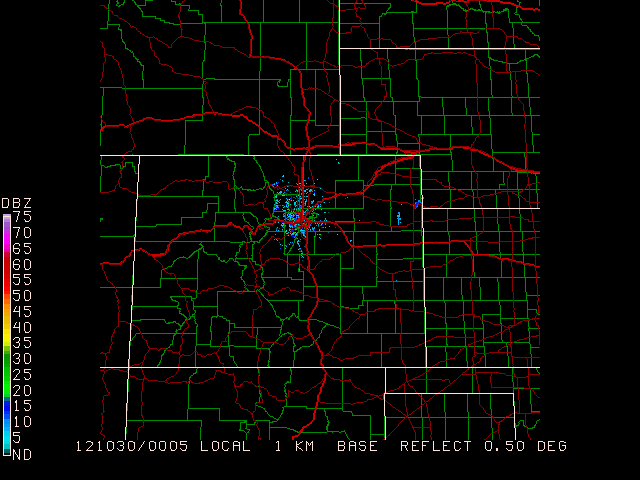
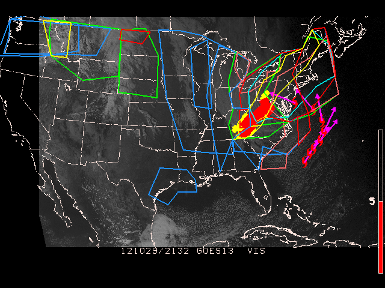

## Exercise #1 (An Introduction)

To begin using the GEMPAK interface, start a programs such as `sflist`:

A list of all current values is followed by with a prompt on the last line.  Type `l` to show the current definitions:

    GEMPAK-SFLIST>l
    SFFILE   = $GEMPAK/data/hrcbob.sfc
    AREA     = WV
    DATTIM   = LAST
    SFPARM   = SKYC;TMPF;WSYM;PMSL;;DWPF;BRBK
    OUTPUT   = T
    IDNTYP   = STID
    GEMPAK-SFLIST>
    

    Run the programs with `r`:

    GEMPAK-SFLIST>r
    PARM = SKYC;TMPF;WSYM;PMSL;DWPF;BRBK                                            

    STN    YYMMDD/HHMM      SKYC     TMPF     WSYM     PMSL     DWPF     BRBK
    BKW    910820/0600      8.00    60.00    61.00  1011.00    59.00  4190.00
    BLF    910820/0600      8.00    57.00    61.00  1010.60    56.00  4180.00
    CRW    910820/0600      8.00    63.00    10.00  1011.20    62.00  3200.00
    ...
    Parameters requested: SFFILE,AREA,DATTIM,SFPARM,OUTPUT,IDNTYP.
    GEMPAK-SFLIST>
    

The parameters defined by `SFPARM` are displayed for `DATTIM = LAST` (0600 UTC) and stations which fall inside the area defined by `AREA` (in this case, an area centered around West Virginia).

After checking that the definition for `SFFILE` has observations to display, exit the program with the command `e`:

    GEMPAK-SFLIST>e

## Exercise #2 (Overlay Satellite Image)

Display the visible satellite image from 18Z and overlay the surface data for the area covered by the image. Plot a standard station model for each location in the data set. The surface data to plot include:

<ol>
<li>sky cover symbol</li>
<li>temperature in Fahrenheit</li>
<li>weather symbol</li>
<li>coded mean sea level pressure</li>
<li>pressure tendency with symbol</li>
<li>dewpoint in Fahrenheit</li>
<li>station ID</li>
<li>wind barbs in knots</li>
</ol>

Therefore, the surface parameters used would be

<tt>
SFPARM   =  skyc; tmpf; wsym; smsl; ptnd; dwpf; stid;; brbk
</tt>

and colors

<tt>
COLORS   =  26; 2; 7; 25; 20; 22; 18; 6
</tt>

    AREA     =  us
    GAREA    =  dset
    SATFIL   =  $GEMPAK/data/VIS_910819_1801
    RADFIL   =  
    IMCBAR   =  
    SFPARM   =  skyc;tmpf;wsym;smsl;ptnd;dwpf;stid;;;brbk
    DATTIM   =  910819/1800
    SFFILE   =  $GEMPAK/data/hrcbob.sfc
    COLORS   =  26;2;7;25;20;22;18;6
    MAP      =  1
    LATLON   =  
    TITLE    =  1
    CLEAR    =  yes
    PANEL    =  0
    DEVICE   =  xw
    PROJ     =  sat
    FILTER   =  1
    TEXT     =  0.75/22//hw
    LUTFIL   =
    STNPLT   =
    CLRBAR   =
    LSTPRM   =
     
`COLORS`, `MAP`, `TITLE`, `FILTER` and `TEXT` control the graphic colors, line thickness, style, text fonts and titles. These map aesthetics allow you to generate very specific graphics. Check the parameter definition pages in the manual for more detail, or with the phelp command at the GEMPAK prompt.

After running **SFMAP**, you can see how the colors match the surface parameters:

	Valid parameters:    SKYC TMPF WSYM SMSL BLNK DWPF STID BLNK BLNK BRBK
	Parameter colors:    26    2    7   25   20   22   18    0    0    6 
	image

## Exercise #3 (Live Data)

Now let's look at data from today. Using an alias for real-time metar observations `SFFILE = metar`, and `DATTIM = 1200`, we can redisplay the map for this morning.

Make note of what the two new definitions are doing to retreive observations:

1. The `SFFILE = metar` definition uses an alias to the latest GEMPAK metar surface file (typically `$GEMDATA/surface/YYYYMMDD_sao.gem`, where **YYYYMMDD** is the current year, month and day, such as **20121028**).
2. `DATTIM = 1200` uses only the 1200 UTC records in **SFFILE**

But how to know the latest available? Exit **SFMAP** and return to the terminal, and execute the command line program sfctime metar and you will see surface reports in today's GEMPAK `surface file` for every twenty minutes:

	GEMPAK-SFMAP>e
	> sfctime metar
	...     
	121028/1740     
	121028/1800     
	121028/1820     
	121028/1840     
	121028/1900 
	>
	
Inside our **SFMAP** session, let's define a new `AREA`, `GAREA`, and `PROJ`:
	
	AREA     = us-
	GAREA    = us
	SFFILE   = metar
	DATTIM   = last
	SATFIL   = 
	CLEAR    = y
	PROJ     = STR/90;-100;0
	GEMPAK-SFMAP>r 

## Exercise #4 (Simple Sounding Map)

Plot stations in the Eastern United States at 850 mb for 1200 UTC today. Plot a standard station model for each location. The upper air data to plot include:

1.  wind barbs in knots
2.  temperature in Celsius
3.  coded height
4.  dewpoint depression in Celsius
5.  station ID

The data are plotted using the specified color list.

     AREA     = us-
     GAREA    = us
     SATFIL   =  
     RADFIL   =  
     IMCBAR   =  
     SNPARM   = brbk:1:2:112;tmpc;;stdz;;dpdc;stid
     DATTIM   = 1200
     LEVELS   = 850
     VCOORD   = pres
     SNFILE   = uair
     COLORS   = 6;2;5;3;18
     MAP      = 1
     MSCALE   = 0
     LATLON   =  
     TITLE    = 1
     CLEAR    = yes
     PANEL    = 0
     DEVICE   = xw
     PROJ     = STR/90;-100;0
     FILTER   = no
     TEXT     = 0.75
     LUTFIL   =  
     STNPLT   =  
    

## Exercise #5 (More Advanced Parameters)

At a height of 500 mb and at 1200 UTC, plot the lifted index (multiplied by 10) and temperatures of less than -15 degrees Celsius.

    SNPARM   =  mark:2;;tmpc<-15;;hght;;;;;lift*10
    DATTIM   =  1200
    LEVELS   =  500
    VCOORD   =  pres
    SNFILE   =  uair
    COLORS   =  2;5;3
    FILTER   =  0
    TEXT     =  .75

## Exercise #6 (NIDS Display)

Display the current NIDS Base Reflectivity image overlain with county boundaries and interstates

1.  Begin by finding the latest NIDS file for KFTG (Front Range Airport, near Denver):

		ls $GEMDATA/nexrad/NIDS/FTG/N0Q/ | tail -1
		N0Q_20121030_0005
		

2.  set `RADFIL` to this latest file available (full path name), set projection to use to radar file, set the graphics area to the entire set:
    
	    radfil = $GEMDATA/nexrad/NIDS/FTG/N0Q/N0Q_20121030_0005
	    proj   = rad
	    garea  = dset
	    map    = 1
	    lutfil = default
	    imcbar = 1

3.  After running **gpmap** to check that the reflectivity scan shows correctly, define the `$mapfil` variable to add roads and county boundaries, and define `map` to specify different colors for each map:
    
    	$mapfil = hicnus.nws + hiisus.nws + hiuhus.nws + hipowo.cia
    	map     = 23         + 15/1/2     + 14/1/1     + 1/1/1
    	GEMPAK-GPMAP>r

## What is this $MAPFIL Variable?

You won't find this variable on any user interface, it is a **hidden variable**. Why? Good question.

`$MAPFIL` defaults to a medium-resolution political boundary map of the world (countries and states), caled `HIPOWO.CIA`.  Alternate maps, such as lakes, rivers and more detailed political boundaries, can be called as well.

The mapfiles themselves are located in the directory `$GEMMAPS`.  The higher the resolution of the map, the longer it takes to draw (best to use low-res for global maps).

You can specify multiple map files using the `+` character to separate each file name:

<pre>`$MAPFIL = file1 + file2 + .... + fileN
`</pre>

 The map files are named by concatenating the **resolution**, **map boundaries**, and **area** with the three-letter source file type. For example, the medium-resolution political world map from GSFC is called `MEPOWO.GSF` (`ME` = medium, `PO` = political boundaries, `WO` = world).

 >  GEMPAK will "remember" the last map file used. If you forgot to reset `$MAPFIL` after some customization, the GEMPAK program will use the last definition you entered (on everything).

 We will explore mapfiles again in this tutorial, but for now, while still in `gpmap`, reset the mapfile to the default:

 <pre>`$mapfil = hipowo.cia
 `</pre>

 

 ## Exercise #7 (Watches and Warnings)

 Using the latest visible satellite image, display
     the latest watches, warnings, international SIGMETs, lightning,
     ATCF tracks, airmets and non-convective and convective sigmets,
     SLS watches, winter storm messages, and all tropical
     disturbances.

 Be sure that `SATFIL` is defined correctly!

 <pre>` MAP      = 1/7
  MSCALE   = 0
  GAREA    = us
  PROJ     = sat
  SATFIL   = $SAT/EAST-CONUS/1km/VIS/VIS_20121029_2132
  RADFIL   =  
  IMCBAR   =  
  LATLON   =  
  PANEL    = 0
  TITLE    = 1
  TEXT     = 1
  CLEAR    = y
  DEVICE   = xw
  LUTFIL   =  
  STNPLT   =  
  VGFILE   =  
  AFOSFL   =  
  AWPSFL   =  
  LINE     =  
  WATCH    = last
  WARN     = last
  HRCN     = all
  ISIG     = last
  LTNG     = last
  ATCF     = last
  AIRM     = last
  GAIRM    =  
  NCON     = last
  CSIG     = last
  SVRL     = last
  BND      =  
  TCMG     =  
  QSCT     =  
  WSTM     = last
  WOU      =  
  WCN      =  
  WCP      =  
  ENCY     =  
  FFA      =  
  WSAT     =  
  ASCT     =  
  TRAK1    =  
  TRAKE    =  
  TRAK2    =  

1.  `WATCH` sets the ending time and the colors for plotting the watches.
2.  `WARN` sets the ending time and the colors for plotting warnings.
3.  `WSTM` sets the ending time and the colors for plotting winter storm warning, watch, and advisory.
4.  `FFA` sets the ending time and the colors for plotting flash flood and areal flood watches.
5.  `CSIG` sets the ending time and the colors for plotting convective sigmets.
6.  `HRCN` sets the ending time and the colors for plotting tropical depressions, storms, and hurricane positions. Optionally, a specific storm name may be entered to display only that specific tropical disturbance.
7.  `ISIG` sets the ending time and the colors for plotting international SIGMETs.
8.  `LTNG` sets the ending time, time increments, colors and markers for plotting lightning data.
9.  `ATCF` sets the time, models and colors for plotting `ATCF` (Automated Tropical Cyclone Forecast) tracks.  As with `HRCN`, a specific storm name may be entered.
10.  `AIRM` sets the ending time and the colors for plotting airmets.
11.  `NCON` sets the ending time and the colors for plotting non-convective sigmets.
12.  `SVRL` sets the ending time and the colors for plotting severe local storms watches.
13.  `WOU` sets the ending time and the colors for plotting the watch outline update (`WOU`).
14.  `WCN` sets the ending time and the colors for plotting the watch county notification(`WCN`).
15.  `WCP` sets the ending time and the colors for plotting the watch corner product.
16.  `ENCY` sets the initial time, colors, model names, and date/time, pressure and marker flags for plotting of the ensemble cyclone tracks.
