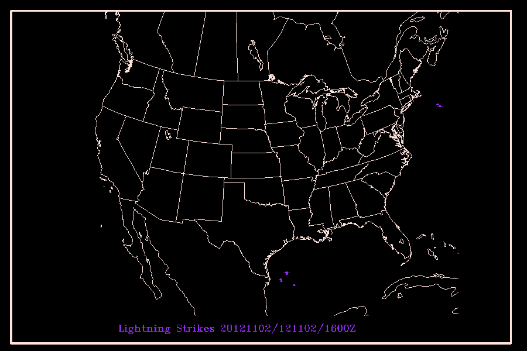
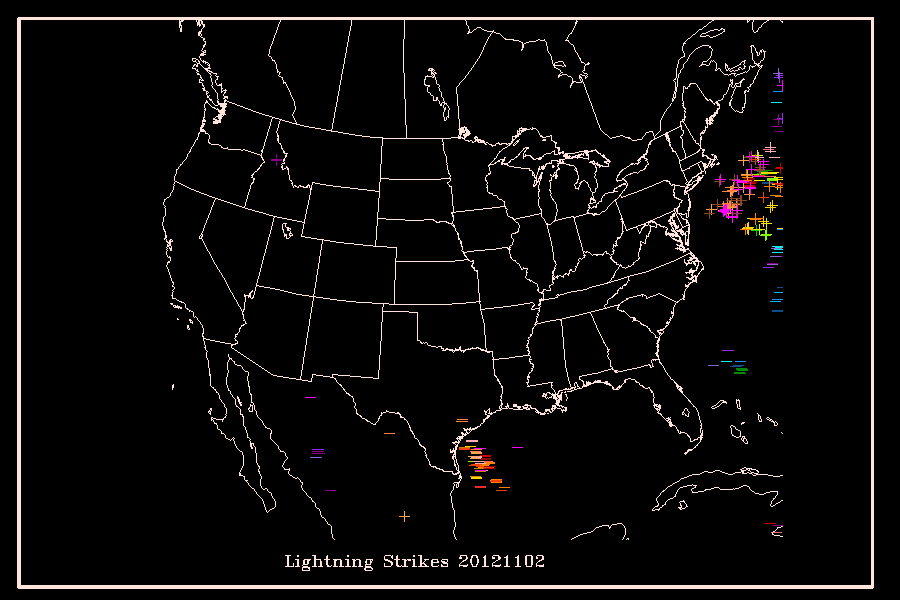
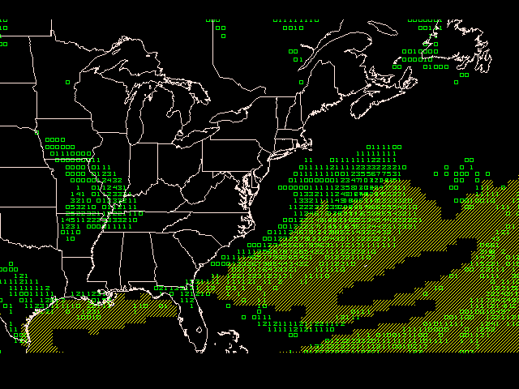

> [GEMPAK Online Tutorial](/software/gempak/tutorial/)

# Additional Exercises

## NLDN Animation

Here we will build an script that may be used either interactively, or as a batch script. While you may not wish to run this script at your site, you should be able to apply your knowledge of GEMPAK and similar principles to either create your own scripts, or to modify those provided with the GEMPAK distribution.

We will build this script in pieces so that you may follow more easily.

### Create Shell Script

Create a shell script to allow the user to interactively (graphically) select the area they wish to use for eventual application:

    #!/bin/csh -f

    gpmap << SELECT
      garea = usnps
      proj = str/90;-100;0 
      map = 6
      title = 5/-1/Select Map Area
      dev = xw|GAREA SELECTION
      clear = y
      \$mapfil = hipowo.gsf
      r

      cursor garea
      e
    SELECT
    gpend

    exit(0)
    

### Modify the Script to Accept an Argument

Now modify the shell script above to be run either interactively, or by specifying the area on the command line with the shell invocation.

    #!/bin/csh -f

    if(x${1} != x) then
       gpmap << SELECT1
          garea = $1
          e
    SELECT1
    else
      gpmap << SELECT2
         garea = usnps
         proj = str/90;-100;0 
         map = 6
         title = 5/-1/Select Map Area
         dev = xw|SELECT_AREA
         clear = y
         \$mapfil = hipowo.gsf
         r

         cursor garea
         e
    SELECT2
      gpend
    endif

    exit(0)
    

### Plot Lightning for Each Time

Expand your script to plot the location of lightning strikes for the desired area for the current hour today. Use MARK to plot a suitably sized circle for each lightning location.

    #!/bin/csh -f

    # set directory of lightning data
    set NLDN=$GEMDATA/nldn
    # set the current year, month day
    set YMD=`date -u '+%Y%m%d'`
    # set the current HOUR
    set HOUR=`date -u '+%H'`
    # get the day of week, month abbrev., day and 4 digit year for title
    set TITLE = `date -u '+%A %B %d, %Y'`

    # There may be more than 1 NLDN file for each hour...we store ours
    # at 30 minute intervals. Alternatively, if more that the maximum number
    # of strikes that can be stored in a single file is exceeded, then
    # an additional file is opened (see the dcnldn template @@).
    # The file naming expected can be one of:
    # YYYYMMDDHHNN_@@_nldn.gem
    # YYYYMMDDHHNN_nldn.gem
    # YYYYMMDDHH_@@_nldn.gem
    # YYYYMMDDHH_nldn.gem
    set FILES=`ls $NLDN/${YMD}${HOUR}*_nldn.gem`

    if($#FILES > 0) then

       foreach FILE ($FILES)
          # Data may be binned hourly, or at other intervals. We assume 5 minute bins.
          # We could use dattim=all (but that will generate a loop using XW
          # instead, plot the data for each time in the file, setting clear=no
          # after the first time in the file.
          set TIMES=`sfctime $FILE`

          foreach TIME ($TIMES)
          sfmap << EOF
          map = 1
          dev = xw|"lightning strikes"
          proj = nps
          area = dset
          filter = no
          garea = us
          clear = yes
          text = 1.2/23/1/hw
          title = 5/-2/Lightning Strikes ${YMD}/${TIME}Z
          panel = .02;.02;.97;.97/1/1/4
          sffile = $FILE
          sfparm = sgnl;mark:15:3:1
          color = 0;30
          dattim = $TIME
          r

          e
    EOF
          end
       end
    endif

    exit(0)
    

Use the `SGNL` parameter stored in the NLDN file to plot stikes with `SGNL < -400` with a `-`, `SGNL > 400` with a `+`, and values from -400 to 400 with a dot.

    …

    foreach TIME ($TIMES)
      sfmap << EOF
      map = 1
      dev = xw|"lightning strikes"
      area = dset
      filter = no
      clear = yes
      garea = us
      text = 1.2/23/1/hw
      title = 1/-2/Lightning Strikes ${YMD}/${TIME}Z
      panel = .02;.02;.97;.97/1/1/4
      sffile = $FILE
      color = 0;30
      dattim = $TIME
      sfparm = sgnl<-400;mark:22:1:1
      r

      clear = no 
      sfparm = sgnl>400;mark:1:1:1
      r

      sfparm = sgnl > -401 < 401;mark:15:2:1
      r

      e
    EOF

    ...
    

Using the result from #3 above, create a gif image for each hour today. Use a different color for each hour.

You'll need to set the above block within a loop for `$HOUR` and increment `$COLOR` with `@ COLOR = $COLOR - 4`.

Limit the animation to the last 2 hours with the inclusion of a definition `set HRSB = 2`:

    #!/bin/csh -f

    # hour setback
    set HRSB = 2
    # This is the directory of our lightning data
    set NLDN=$GEMDATA/nldn
    # set the current year, month day
    set YMD=`date -u '+%Y%m%d'`
    # get the day of week, month abbrev., day and 4 digit year for title
    set INC = 1
    set CURHR = `date -u '+%H'`
    if($CURHR < $HRSB) then
            @ HOUR = 23 - $HRSB - $CURHR
            @ STOP_HOUR = ($CURHR + 23 ) % 23

    else
            @ HOUR = $CURHR - $HRSB
            @ STOP_HOUR = $CURHR
    endif

    @ COLOR=29

    while($HOUR <= $STOP_HOUR)

       if($HOUR < 10) then
          set SFHOUR=0${HOUR}
       else
          set SFHOUR=${HOUR}
       endif

       set FILES=`ls $NLDN/${YMD}${SFHOUR}*_nldn.gem`
       if($#FILES > 0) then

       foreach FILE ($FILES)
          set TIMES=`sfctime $FILE`

         foreach TIME ($TIMES)
             set DEV = 'gif|lightning_'${YMD}'_'${INC}.gif'|900;600'
             if($INC < 10) then
                set DEV = 'gif|lightning_'${YMD}'_0'${INC}.gif'|900;600'
             endif
             sfmap << EOF
             map = 1
             garea = us
             proj = str/90;-100;0
             \$mapfil = hipowo.gsf
             dev = ${DEV}
             area = dset
             filter = no
             clear = y
             text = 1.2/23/1/hw
             title = ${COLOR}/-2/Lightning Strikes ${YMD}/${TIME}Z
             panel = .02;.02;.97;.97/1/1/4
             sffile = $FILE
             color = 0;${COLOR}
             dattim = $TIME
             sfparm = sgnl<-400;mark:22:1:1
             r

             clear = no
             sfparm = sgnl>400;mark:1:1:1
             r

             sfparm = sgnl > -401 < 401;mark:15:2:1
             r

             e
    EOF
             @ INC = $INC + 1
          end # foreach TIME
       end # foreach file
       endif

       @ HOUR = $HOUR + 1
       @ COLOR = $COLOR - 4
       gpend
    end

    # now create an animated GIF
    convert -delay 10 -loop 0 lightning_${YMD}_*.gif lightning.gif

    exit(0)
    

### What if we want all lightning data plotted on the same image?

Modify the script to write the same file `lightning_YYYYMMDD.gif` and move the `gpend` call from the `FILE` loop to the end of the script, and use the entire days' worth o data:

    #!/bin/csh -f

    # This is the directory of our lightning data
    set NLDN=$GEMDATA/nldn
    # set the current year, month day
    set YMD=`date -u '+%Y%m%d'`
    # get the day of week, month abbrev., day and 4 digit year for title
    @ HOUR = 0
    @ STOP_HOUR = 23
    @ COLOR=30

    while($HOUR <= $STOP_HOUR)
       if($HOUR < 10) then
          set SFHOUR=0${HOUR}
       else
          set SFHOUR=${HOUR}
       endif
       set YMD='20121102'
       set FILES=`ls $NLDN/${YMD}${SFHOUR}*_nldn.gem`
       if($#FILES > 0) then

       foreach FILE ($FILES)
          echo "plotting $FILE"
          set TIMES=`sfctime $FILE`

          foreach TIME ($TIMES)
             set DEV = 'gif|lightning_'${YMD}'.gif|900;600'
             sfmap << EOF
             map = 1
             garea = us
             proj = str/90;-100;0
             \$mapfil = hipowo.gsf
             dev = ${DEV}
             area = dset
             filter = no
             clear = n
             text = 1.2/23/1/hw
             title = 1/-2/Lightning Strikes ${YMD}
             panel = .02;.02;.97;.97/1/1/4
             sffile = $FILE
             color = 0;${COLOR}
             dattim = $TIME
             sfparm = sgnl<-400;mark:22:1:1
             r

             sfparm = sgnl>400;mark:1:1:1
             r

             sfparm = sgnl > -401 < 401;mark:15:1:1
             r

             e
    EOF
          end # foreach TIME
       end # foreach file
       endif

       @ HOUR = $HOUR + 1
       @ COLOR = $COLOR - 1
    end

    gpend
    exit(0)

## Creating a Topographic Image

This example utilizes DEM topography data 5 minute topography data to create a topographic image that may be used as a basemap.

For this exercise you will need to download the DEM global 5 minute topography file [`world_topo.5min`](world_topo.5min) to your working directory.

1.  Create a topographic grid for desired area using `GDTOPO`

	     GDFILE   = nam_basemap.gem
	     GAREA    = 10;-140;65;-40
	     GDATTIM  = 070101/0000
	     GVCORD   = none
	     GFUNC    = topo
	     TOPOFL   = world_topo.5min
	     IJSKIP   = 0
	     GEMPAK-GDTOPO>r
    
2.  Create an image from topography/bathymetry data using `GD2IMG`
     Use a 2 part calibration range for band 3.
     Use pixel values 0 to 7 for negative values (-8103 to 0 meters), and pixel values 8 to 95 to represent positive values (0 to 4700 meters).
     The region selected represents a 6 km resolution product.
     
	     GDATTIM  = last
	     GDFILE   = nam_basemap.gem
	     GLEVEL   = 0
	     GVCORD   = none
	     GFUNC    = topo
	     SCALE    = 0
	     PROJ     = str/90;-97;0
	     GRDAREA  = 15;-116;50;-51.95
	     KXKY     = 1002;925
	     CPYFIL   =     SATFIL   = nam_basemap.gini
	     CALINFO  = 99/3/TOPO,0,7,-8103,0;8,95,0,4700
	     WMOHDR   = TICZ99/UPC/
	     GEMPAK-GD2IMG>r
    
3.  Display the composite image in GEMPAK programs as a satellite image and overlay data as desired.
  
		MAP      = 1
		GAREA    = dset
		PROJ     = sat
		SATFIL   = nam_basemap.gini
		LUTFIL   = upc_dem5.tbl
		GEMPAK-GPMAP>r

## Masking Grid Fields

The GFS model provides deterministic output at the 72 hour forecast time for 6 hour accumulated precipitation `P06M` and boundary layer `CAPE` (using an internal function) as shown in `GDPLOT2` using:

    GDFILE   = gfs004
    GDATTIM  = f072
    GLEVEL   = 0        ! 2
    GVCORD   = none     ! hght
    SCALE    = 0
    GDPFUN   = p06m     ! cape(pres@0%none,hght@0%none,tmpc,dwpc)
    TYPE     = f        ! c
    CONTUR   = 3/3
    CINT     = 300
    LINE     = 2/1/1
    FINT     = .25;2.5;6.35;12.7;19.05;25.4;31.75;38.1;44.45;50.8;63.5;76.2;101.6;127;152.4;177.8 
    FLINE    = 0;21-30;14-20;5 
    GAREA    = 25;-100;50;-50
    PROJ     = STR/90;-100;0  
    GEMPAK-GDPLOT2>r
    

The figure above shows areas of precipitation with low CAPE values. We also see several areas with large cape values and little precipitation.

Now plot the areas of greater than .25mm (red contour lines), and CAPE values exceeding 300 J Kg^-2 (yellow shading) in `GDPLOT2` using:

    GDFILE   = gfs004
    GDATTIM  = f072
    GLEVEL   = 0                ! 2
    GVCORD   = none             ! hght
    SCALE    = 0
    GDPFUN   = sgt(p06m,.25)    ! sgt(cape(pres@0%none,hght@0%none,tmpc,dwpc),300)
    TYPE     = p                ! f
    CONTUR   = 3/3
    FINT     =                  ! 100
    FLINE    =                  ! 5/7
    COLORS   = 3
    TEXT     = 0.5
    GEMPAK-GDPLOT2>r
    

Observing the plot above, we can visually detect several regions where precipitation probability and CAPE values might suggest likely areas of thunderstorm activity where the two contour regions intersect. We can quantify the  probability by using the logical operator `AND()` to compute the probability of both conditions as shown below:

    GDFILE   = gfs004
    GDATTIM  = f072
    GLEVEL   = 2
    GVCORD   = hght
    SCALE    = 0
    GDPFUN   = and(gt(p06m,.25),gt(cape(pres@0%none,hght@0%none,tmpc,dwpc),300))
    TYPE     = f
    CONTUR   = 3/3
    CINT     = 
    LINE     = 
    FINT     = .05/.05
    FLINE    = 0;23-13/7
    CLRBAR   = 1
    GEMPAK-GDPLOT2>r

## Hodograph

`SNHODO` draws a hodograph which represents the vertical
distribution of the horizontal wind at a station.  The winds
are plotted in meters/sec.

Plot the `MHX` (Newport, North Carolina) hodograph using height coordinates. Label every 2000 meters from 1000 meters to 24000 meters.

    GEMPAK-SNHODO>
    SNFILE   = uair
    AREA     = @mhx
    LINE     = 1//3
    MARKER   = 1
    BORDER   = 1
    TITLE    = 1
    XAXIS    =  
    YAXIS    =  
    LEVELS   = 1000-24000-2000
    VCOORD   = hght
    DATTIM   = 1200
    CLEAR    = y
    DEVICE   = xw
    PANEL    = 0
    TEXT     = 1/2/1/hw
    GEMPAK-SNHODO>r

## Isentropic Analysis

Isentropic ananlyses allow you to view vertical motion along a theta surface (dry adiabats) to asses vertical motion, and combined with relative humidity, may indicate convection or potential for convection.

First you must create a new grid file with `gdcfil` called `thta.gem`

    GDOUTF   = thta.gem
    PROJ     = 
    GRDAREA  = us
    KXKY     =  
    MAXGRD   = 200
    CPYFIL   = $MODEL/gfs/2012110312_gfs212.gem
    ANLYSS   =  
    GEMPAK-GDCFIL>r
    

Next, interpolate the vertical levels from pressure to isentropic coordinates `THTA` with `gdvint`:

    GDFILE   = $MODEL/gfs/2012110312_gfs212.gem
    GDOUTF   = thta.gem
    GDATTIM  = f018
    GVCORD   = pres/thta
    GLEVEL   = 280-320-10
    MAXGRD   = 200
    GAREA    = us
    VCOORD   = pres
    GEMPAK-GDVINT>r
    

Finally, plot variables on the 280 K theta surface with `gdplot2`:

    GDFILE   = thta.gem
    GDATTIM  = f018
    GLEVEL   = 290          
    GVCORD   = thta
    PANEL    = 0
    SKIP     =  
    SCALE    = 0        
    GDPFUN   = relh         ! pres          ! wnd
    TYPE     = f            ! c             ! B
    CONTUR   = 1
    CINT     =              ! 50            
    LINE     =              ! 5//3
    FINT     = 10/50/90
    FLINE    = 0;21-25-1
    HILO     =  
    HLSYM    =  
    CLRBAR   = 1/V/ll
    WIND     =              !               ! bk31/0.4
    REFVEC   = 10
    TITLE    = 1/-1         ! 1/-2          ! 1/-3
    TEXT     = 0.65/2//hw
    CLEAR    = n
    GAREA    = us
    IJSKIP   = 0            !               ! 3
    PROJ     = str/90;-100;0
    MAP      = 1
    MSCALE   =  
    LATLON   = 0
    DEVICE   = xw
    STNPLT   =  
    SATFIL   =  
    RADFIL   =  
    IMCBAR   =  
    LUTFIL   = 
    STREAM   =  
    POSN     =  
    COLORS   =  
    MARKER   =  
    GRDLBL   =  
    FILTER   = no
    GEMPAK-GDPLOT2>r

## Trenberth Formulation

The [Trenberth Formulation](trenberth_equation.html) is sometimes used as an alternative to the quasi-geostrophic omega equation to infer vertical motion from the advection of geostrophic vorticity within a layer, in one term, rather than from two terms (temperature advection and differential vorticity advection), which may result in small and inaccurate vertical motion estimates when two large terms of opposite sign are present.

Using `gdplot2`, plot 700mb absolute vorticity `avor(wnd)`, 1000-500mb layer thickness `ldf(hght)`, and 1000-500mb thermal wind vectors in m/s `thrm(hght)` for the 18-hr GFS forecast to show regions of 700 mb vorticity advection by the thermal wind, which indicate rising motion in the layer:

    GDFILE   = gfs
    GDATTIM  = f018
    GLEVEL   = 700              ! 500:1000  ! 500:1000
    GVCORD   = pres
    PANEL    = 0
    SKIP     =  
    SCALE    = 5                ! 0 ! 0 
    GDPFUN   = avor(wnd)        ! ldf(hght) ! thrm(hght)
    TYPE     = f                ! c ! A
    CONTUR   = 3
    CINT     =                  ! 60
    LINE     =                  ! 31//3
    FINT     = 2/-4/30
    FLINE    = 28;28-13-1
    HILO     =  
    HLSYM    =  
    CLRBAR   = 1/V/ll
    WIND     = 0 ! ! am31/0.2///0.5
    REFVEC   = 10
    TITLE    = 1/-1             ! 1/-2 ! 1/-3
    TEXT     = 0.65/2//hw
    CLEAR    = n
    GAREA    = us
    IJSKIP   = 0 ! ! 1
    PROJ     = str/90;-100;0
    MAP      = 1
    MSCALE   =  
    LATLON   = 0
    DEVICE   = xw
    STNPLT   =  
    SATFIL   =  
    RADFIL   =  
    IMCBAR   =  
    LUTFIL   = 
    STREAM   =  
    POSN     =  
    COLORS   =  
    MARKER   =  
    GRDLBL   =  
    FILTER   = no

