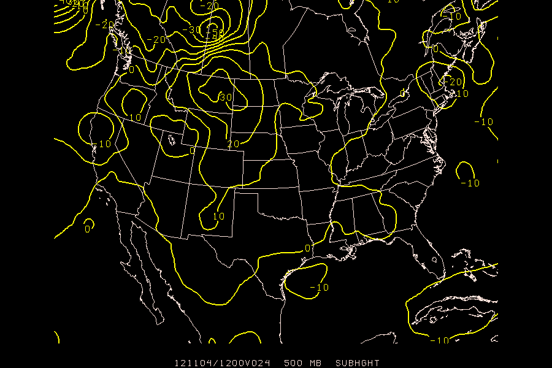
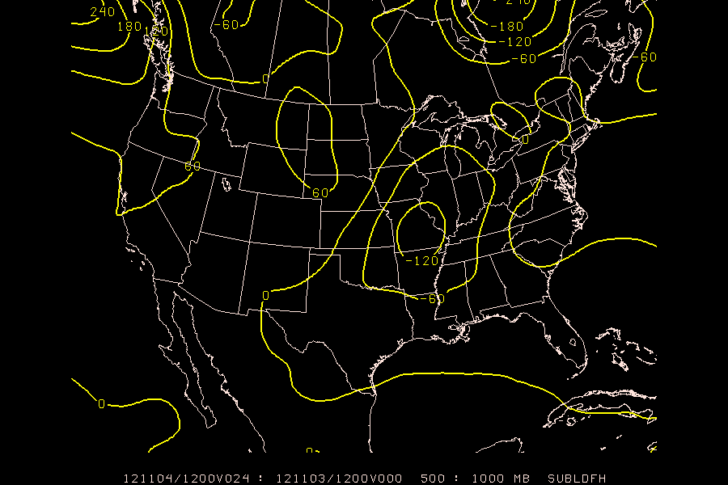
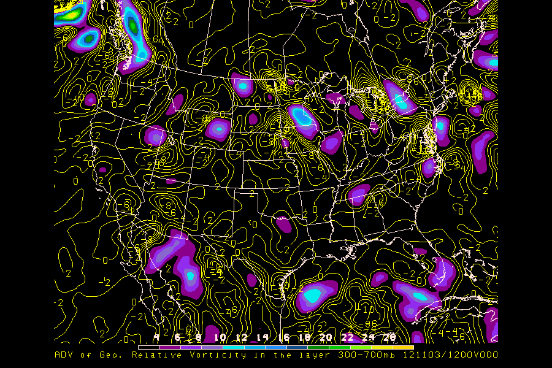
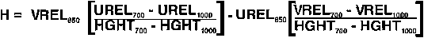

GEMPAK possess a robust set of mathematical and meteorological functions which may be used in the grid programs to generate a wide range of diagnostics.

Formulas can be extended up to 128 characters. When designing complex equations, it is often helpful to develop the equation in pieces, or terms. In these cases, `GDDIAG` can be used to calculate store the terms, for ultimate use in the final expansion.

When storing grids with `GDDIAG`, the variable `GRDNAM` will be used to define a name for the new parameter. If this parameter is left blank, GEMPAK will compose a name based on the variables and functions used in the expression.

#  In-line Modifiers

Many times, a single `GLEVEL`, `GDATTIM`, or even `GVCORD` is not sufficient for calculating all the quantities in a formula. In these cases we need to use in-line modifiers, which allow us to modify the values used for a parameter in a per-variable manner.

* >### ^time

        GDATTIM  = f000
        GLEVEL   = 500:1000
        GVCORD   = pres
        GFUNC    = sub(ldf(hght^f024),ldf(hght))
        
    Notice that the second instance of `hght` is unmodified, which will default to `GDATTIM` (f000). The explicit version of the above would be

    GFUNC    = sub(ldf(hght^f024),ldf(hght^f000))

* >### @level 
    
        GDATTIM  = f000
        GLEVEL   = 500
        GVCORD   = pres
        GFUNC    = adv(vor(geo),thrm(hght@300:700))
    
    In this example, `vor(geo)` defaults to `GLEVEL = 500`.
        
    
* >### %vcord
    

* >### multiple grid files

        GDFILE   = nam + gfs
        GFUNC    = sub(hght, hght+2)
    
    The `+` character is used in `GDFILE` to separate filenames, and when referencing a grid field (`+2` for the second `GDFILE` definition, `+3` for the third, and so on). 

* >### combined

        GFUNC    = sub(ldf(hght^f024@500:1000),ldf(hght+2^f000@500:1000))
    
    Go nuts.

---

# Exercise: Compare models with `gdplot2`

>## Step 1
Plot the difference between 24 hour 500mb height forecast by the GFS and NAM models.  Notice that `CINT = 0` which will enable *automatic contouring*.
    
    GDATTIM  = f024
    GLEVEL   = 500
    GVCORD   = pres
    GFUNC    = sub(hght,hght+2)
    GDFILE   = nam + gfs
    CINT     = 0
    LINE     = 5
    MAP      = 3/1/1
    TITLE    = 1
    DEVICE   = xw
    SATFIL   =       
    RADFIL   =       
    PROJ     = str/90;-100;0
    GAREA    = us
    CLEAR    = YES
    PANEL    = 0
    TEXT     = 1
    SCALE    = 999
    LATLON   = 0
    HILO     =       
    HLSYM    =
    CLRBAR   =       
    CONTUR   = 3/3
    SKIP     = 0
    FINT     =       
    FLINE    =       
    CTYPE    = c
    LUTFIL   = default
    STNPLT   = 

     
>## Step 2
Produce a contour plot of the 1000-500mb change in thickness between the 0 and 24 hour forecast NAM fields. Use the layer difference function `ldf()` along with the subtraction function `sub(X,Y)` (see [`GPARM`](http://www.unidata.ucar.edu/cgi-bin/gempak/manual/variables_index?gparm) for more).
 >
 >Specify the exact times for the paramaters used in the calculation.

    GDATTIM  = f000
    GLEVEL   = 500:1000
    GVCORD   = pres
    GFUNC    = sub(ldf(hght^f024),ldf(hght^f000))
    GDFILE   = nam
    CINT     = 60
    LINE     = 5
    MAP      = 1
    TITLE    = 1
    DEVICE   = xw
    SATFIL   =       
    RADFIL   =       
    PROJ     = str/90;-100;0
    GAREA    = us
    CLEAR    = y
    PANEL    = 0
    TEXT     = 1.3/22/1/hw
    SCALE    =       
    LATLON   = 0
    HILO     =       
    HLSYM    =       
    CLRBAR   =       
    CONTUR   = 3/3
    SKIP     = 0
    FINT     =       
    FLINE    =       
    CTYPE    = c

 
 
>## Step 3
Now contour the advection of 500mb geostrophic relative vorticity by the thermal wind in the 300mb to 700mb layer (i.e. Trenberth's Q-G formula). 
>    
>Functions you'll need to use:
>
>*   advection: `adv()`
>*   vorticity: `vor()`
>*   thermal wind: `thrm()`
>*   use in-line modifiers for `hght@300:700` to calculate the thermal wind
>*   you'll need to adjust the contour interval down from 60 (try `CINT = 2//2`)
        
        GDATTIM  = f000
        GLEVEL   = 500
        GVCORD   = pres
        GFUNC    = adv(vor(geo),thrm(hght@300:700))
        GDFILE   = nam
        CINT     = 2//2
        LINE     = 5
        MAP      = 6
        TITLE    = 5/-2/ADV of Geo. Relative Vorticity in the layer 300-700mb ~
        DEVICE   = xw
        SATFIL   =       
        RADFIL   =       
        PROJ     = str/90;-100;0
        GAREA    = us
        CLEAR    = y
        PANEL    = 0
        TEXT     = 1.3/22/1/hw
        SCALE    =       
        LATLON   = 0
        HILO     =       
        HLSYM    =       
        CLRBAR   = 1/h/lc/.5/.5;.01
        CONTUR   = 3/3
        SKIP     = 0
        FINT     = 2/4
        FLINE    = 0;30-7
        CTYPE    = c/f

 

>## Step 4
>Calculate and plot helicity for the 1000mb - 700mb layer using the formula:
>
>
>
>functions you'll need to use:
>
>*   quotient: `quo(X,Y)`
>*   subtraction: `sub(X,Y)`
>*   multiplication: `mul(X,Y)`
>*   layer difference: `ldf()`
>*   you'll need to adjust the contour interval to `CINT = 5`
> 
> First we must rewrite the formula for helicity in GEMPAK GPARM notation!
> 
> In "psuedocode", the forumla would look like:
>      
>      H =  vrel@850 * (urel@700 - urel@1000)/(hght@700 - hght@1000)
>         - urel@850 * (vrel@700 - vrel@1000)/(hght@700 - hght@1000)
>
> Substituting `ldf()` for the `hght`, `urel` and `vrel` differences, and using our `GLEVEL = 700:1000` definition:
>      
>      H =  vrel@850 * ( ldf(urel) )/( ldf(hght) )
>         - urel@850 * ( ldf(vrel) )/( ldf(hght) )
>
>Factoring out the common denominator:
>       
>        H = ( vrel@850 * ldf(urel)  - urel@850 * ldf(vrel) )
>         % ldf(hght)
>
>Now using the `sub()`, `mul()` and `qou()` mathematical operators:
>    
>       H = quo( sub(mul(vrel@850,ldf(urel)),mul(urel@850,ldf(vrel))), ldf(hght) )
>
>So the full entry to `GDCNTR` would be:
 
      GDATTIM  = f000
      GLEVEL   = 700:1000
      GVCORD   = pres
      GFUNC    = quo(sub(mul(vrel@850,ldf(urel)),mul(urel@850,ldf(vrel))),ldf(hght))
      GDFILE   = nam
      CINT     = 5
      LINE     = 5//2
      MAP      = 1
      TITLE    = 1
      DEVICE   = xw
      SATFIL   =          
      RADFIL   =          
      PROJ     = str/90;-100;0
      GAREA    = us
      CLEAR    = y
      PANEL    = 0
      TEXT     = 1.3/22/1/hw
      SCALE    = 2
      LATLON   = 0
      HILO     =          
      HLSYM    =          
      CLRBAR   = 1/h/lc/.5/.5;.01
      CONTUR   = 3/3
      SKIP     = 0
      FINT     = 2/4
      FLINE    = 0;30-7
      CTYPE    = c
          
 