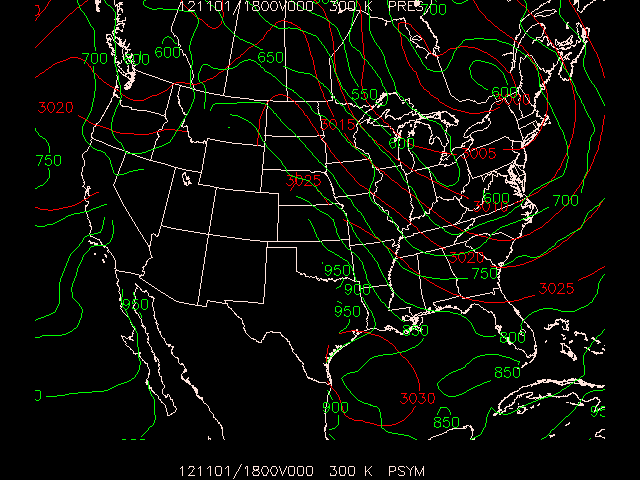

Occasionally, the vertical coordinate on which data are available in there native format is not the optimum coordinate for performing analysis. Similarly, it is possible that data may not be provided at the desired level for analysis.

## GDVINT Input Parameters

GEMPAK provides for interpolating to alternate levels and coordinates through the program `GDVINT`. Additionally, the grid area may be subsetted to a new grid file using `GDVINT`.

    GDFILE   Grid file
    GDOUTF   Output grid file
    GDATTIM  Grid date/time
    GVCORD   Grid vertical coordinate
    GLEVEL   Grid level
    MAXGRD   Maximum number of grids
    GAREA    Graphics area
    VCOORD   Vertical coordinate type

* `GDFILE` is the input file 
* `GDOUTF` is the output file (if `GDOUTF` does not exist, a new file will be created with the maximum number of grids given in `MAXGRD`).

* `GVCORD` specifies the input and output vertical
coordinates separated by a slash.  The coordinates
supported are:

    - `PRES`    --  pressure
    - `THTA`    --  potential temperature
    - `HGHT`    --  height above sea level
    - `SGMA`    --  sigma p
    - `ETA`     --  eta
    - `ZAGL`    --  height above ground level

* When `SGMA` is specified, the pressure on `SGMA=0` is given following a semicolon.  

    For example, if the pressure at `SGMA=0` is 50 mb, the specification
    
        GVCORD = SGMA:50
    

## Exercise #13 (Interpolate to Theta Coordinates)

> Using `GDVINT`, convert last night's 00 UTC ETA analysis to a `THTA` vertical coordinate.

    GDFILE   = $MODEL/gfs/2012110118_thin.gem
    GDOUTF   = theta.grd
    GDATTIM  = f000
    GVCORD   = pres/thta
    GLEVEL   = 280-350-5
    MAXGRD   = 2000
    GAREA    = 15;-150;60;-50
    VCOORD   = pres
    

> Now use `GDINFO` to look at the grids on the 300K surface:

    GDFILE   = theta.grd
    LSTALL   = YES
    OUTPUT   = T
    GDATTIM  = f000
    GLEVEL   = 300
    GVCORD   = thta
    GFUNC    = all

    ...

      NUM       TIME1              TIME2           LEVL1 LEVL2  VCORD PARM
      102     121102/0000F000                        300         THTA PRES        
      103     121102/0000F000                        300         THTA PSYM        
      104     121102/0000F000                        300         THTA AVOR        
      105     121102/0000F000                        300         THTA SPFH        
      106     121102/0000F000                        300         THTA CWTR        
      107     121102/0000F000                        300         THTA SNMR        
      108     121102/0000F000                        300         THTA OMEG        
      109     121102/0000F000                        300         THTA UREL        
      110     121102/0000F000                        300         THTA VREL        
    

> There are some new parameters in our grid file. `PSYM` is Montgomery stream function divided by 100, `SPFH` is specific humidity.
>
> Now construct a plot of Montgomery Stream Function (`PSYM`) on the 300K Theta surface for `F000`.  Overlay pressure contours show vertical motion for air parcels.

    GDFILE   = theta.grd
    GDATTIM  = f000
    GLEVEL   = 300
    GVCORD   = thta
    PANEL    = 0
    SKIP     = l
    SCALE    =  
    GDPFUN   = psym     ! pres
    TYPE     = c
    CONTUR   = 2
    CINT     = 5        ! 50
    LINE     = 2        ! 3
    FINT     = 2/100/220
    FLINE    =  
    HILO     =  
    HLSYM    =  
    CLRBAR   =  
    WIND     = 0
    REFVEC   =  
    TITLE    = @
    TEXT     = 1/2//hw
    CLEAR    = y
    GAREA    = us
    IJSKIP   = 0
    PROJ     = STR/90;-100;0
    MAP      = 1
    MSCALE   = 0
    LATLON   = 0
    DEVICE   = xw
    STNPLT   =  
    SATFIL   =  
    RADFIL   =  
    IMCBAR   =  
    LUTFIL   =  
    STREAM   =  
    POSN     = 0
    COLORS   = 
    MARKER   = 0
    GRDLBL   = 0
    FILTER   = YES

