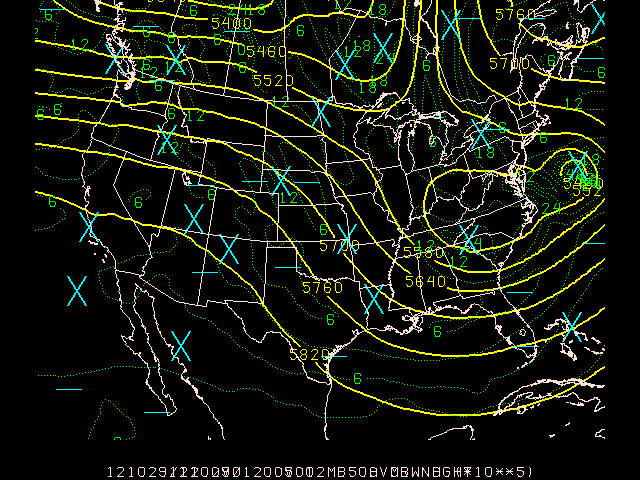
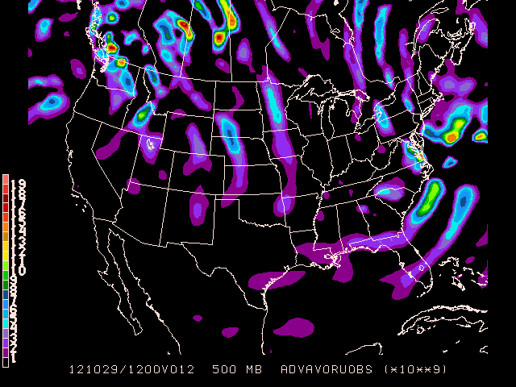
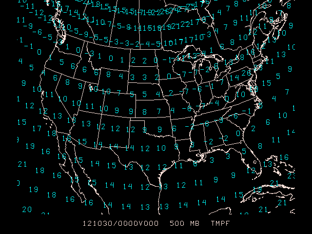
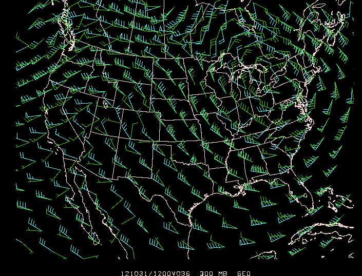
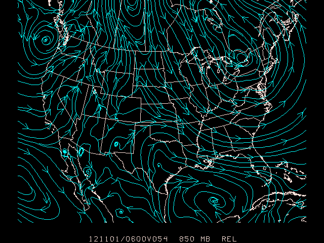
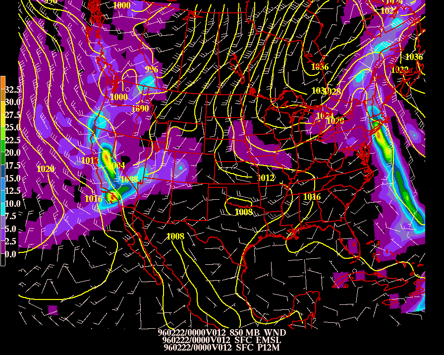

Gridded data may be obtained from numerical model output, or by performing objective analysis on surface or sounding data sets using the OA programs. For now, we will deal with data that is already in gridded form. Later we will see what goes in to converting surface and upper air data into grid files, and learn about the various models available for ingest via the LDM.

## Grid Data Types

Gridded data assumes one of two forms:

1.  **Scalar data** - possess only magnitude (handled by the program `gdcntr`)
2.  **Vector data** - comprised of both magnitude and direction (handled by `gdstream` and `gdwind`)

The program `gdplot2` is designed to handle **both** scalar and vector data.  Think of `gdplot2` as a combination of the capabilities offered by `gdcntr`, `gdstream` and `gdwind` in one program.

Before we look at the `GD` plotting programs, we have to familiarize ourselves with a very useful program called `gdinfo`.

## GDINFO - Grid Info

`gdinfo` lists information about the navigation and fields stored within a GEMPAK grid file.

<pre>
[GDFILE](/cgi-bin/gempak/manual/variables_index?gdfile)    Grid file
[LSTALL](/cgi-bin/gempak/manual/variables_index?lstall)    Full list flag
[OUTPUT](/cgi-bin/gempak/manual/variables_index?output)    Output device/filename
[GDATTIM](/cgi-bin/gempak/manual/variables_index?gdattim)   Grid date/time
[GLEVEL](/cgi-bin/gempak/manual/variables_index?glevel)    Grid level
[GVCORD](/cgi-bin/gempak/manual/variables_index?gvcord)    Grid vertical coordinate
[GFUNC](/cgi-bin/gempak/manual/variables_index?gfunc)     Scalar grid
</pre>

Let's run `gdinfo` for the first time to load the default Hurricane Bob grid:

    gdinfo
    GDFILE    Grid file                         $GEMPAK/data/hrcbob.grd
    LSTALL    Full list flag                    YES
    OUTPUT    Output device/filename            T
    GDATTIM   Grid date/time                    LAST
    GLEVEL    Grid level                        500
    GVCORD    Grid vertical coordinate          PRES
    GFUNC     Scalar grid                       TMPC
    Parameters requested: GDFILE,LSTALL,OUTPUT,GDATTIM,GLEVEL,GVCORD,GFUNC.
    GEMPAK-GDINFO>r

### Grid Navigation

Before listing the requested grids, `gdinfo` will print out the full pathname of the grid file, the grid navigation, analysis block, and number of grids in the file:

     GRID FILE: /Users/gempak/GEMPAK6.7.0/gempak/data/hrcbob.grd                                                    

     GRID NAVIGATION: 
         PROJECTION:          STR                 
         ANGLES:                90.0  -105.0     0.0
         GRID SIZE:           53  45
         LL CORNER:               7.65   -133.44
         UR CORNER:              44.29    -23.75

     GRID ANALYSIS BLOCK: 
         ANALYSIS TYPE:        BARNES
         DELTAN:               3.750
         DELTAX:               2.110
         DELTAY:               0.833
         GRID AREA:             7.65 -133.44   44.29  -23.75
         EXTEND AREA:           7.65 -133.44   44.29  -23.75
         DATA AREA:             7.65 -133.44   44.29  -23.75

     Number of grids in file:   433

     Maximum number of grids in file:    500
    

Un oh, what's this?

     [GDU 2]  Did not find any matching grids.
    

This is because `gdinfo` is looking for grid `TMPC` at `500` mb `PRES` at `GDATTIM = last`, but this grid can not be found.  Let's set `GFUNC = all` and `GDATTIM = first` to see the first grids available:

    NUM       TIME1              TIME2           LEVL1 LEVL2  VCORD PARM
    33     910819/0000F000                        500         PRES TMPK        
    34     910819/0000F000                        500         PRES RELH        
    36     910819/0000F000                        500         PRES HGHT        
    37     910819/0000F000                        500         PRES OMEG        
    38     910819/0000F000                        500         PRES UREL        
    39     910819/0000F000                        500         PRES VREL        

>  Note that if only one parameter is entered, the program searches only for that parameter. In the case above, the grid `TMPC` was being searched for but not found. `gdinfo` does **not** perform grid parameter conversions!
> 
>     If `GFUNC = all` is entered, the program will match all of the parameters in its search.  Entering several parameters separated by semicolons will match those parameters only.

Now that we know what grids are available, we can start plotting the data with `gdcntr`.

## Scalar Plotting

### GDCNTR Input Parameters

`gdcntr` draws contour lines through a scalar grid computed
using the GEMPAK grid diagnostic functions.

<pre>
[GDATTIM](/cgi-bin/gempak/manual/variables_index?gdattim)   Grid date/time
[GLEVEL](/cgi-bin/gempak/manual/variables_index?glevel)    Grid level
[GVCORD](/cgi-bin/gempak/manual/variables_index?gvcord)    Grid vertical coordinate
[GFUNC](/cgi-bin/gempak/manual/variables_index?gfunc)     Scalar grid
[GDFILE](/cgi-bin/gempak/manual/variables_index?gdfile)    Grid file
[CINT](/cgi-bin/gempak/manual/variables_index?cint)      Contour interval/min/max
[LINE](/cgi-bin/gempak/manual/variables_index?line)      Color/type/width/label/smth/fltr/scflg
[MAP](/cgi-bin/gempak/manual/variables_index?map)       Map color/dash/width/filter flag
[MSCALE](/cgi-bin/gempak/manual/variables_index?mscale)    fgc;bgc;mask/units/lat;hide/values/anch/x;y/ln;wd/freq|text_info|t
[TITLE](/cgi-bin/gempak/manual/variables_index?title)     Title color/line/title
[DEVICE](/cgi-bin/gempak/manual/variables_index?device)    Device|name|x size;y size|color type
[SATFIL](/cgi-bin/gempak/manual/variables_index?satfil)    Satellite image filename(s)
[RADFIL](/cgi-bin/gempak/manual/variables_index?radfil)    Radar image filename(s)
[IMCBAR](/cgi-bin/gempak/manual/variables_index?imcbar)    Color/ornt/anch/x;y/ln;wd/freq
[PROJ](/cgi-bin/gempak/manual/variables_index?proj)      Map projection/angles/margins|drop flag
[GAREA](/cgi-bin/gempak/manual/variables_index?garea)     Graphics area
[IJSKIP](/cgi-bin/gempak/manual/variables_index?ijskip)    Iskp;Istrt;Istp/Jskp;Jstrt;Jstp
[CLEAR](/cgi-bin/gempak/manual/variables_index?clear)     Clear screen flag
[PANEL](/cgi-bin/gempak/manual/variables_index?panel)     Panel loc/color/dash/width/regn
[TEXT](/cgi-bin/gempak/manual/variables_index?text)      Size/fnt/wdth/brdr/N-rot/just/hw flg
[SCALE](/cgi-bin/gempak/manual/variables_index?scale)     Scalar scale / vector scale
[LATLON](/cgi-bin/gempak/manual/variables_index?latlon)    Line color/dash/width/freq/inc/label/format
[HILO](/cgi-bin/gempak/manual/variables_index?hilo)      Color/symbol/rng/rad/cnt/intp
[HLSYM](/cgi-bin/gempak/manual/variables_index?hlsym)     HILO txt size/posn/font/wdth/hw
[CLRBAR](/cgi-bin/gempak/manual/variables_index?clrbar)    Color/ornt/anch/x;y/ln;wd/freq|text_info
[CONTUR](/cgi-bin/gempak/manual/variables_index?contur)    Subbox/smooth
[SKIP](/cgi-bin/gempak/manual/variables_index?skip)      Skip_cntr/skip_plt_x;skip_plt_y
[FINT](/cgi-bin/gempak/manual/variables_index?fint)      Fill interval/min/max
[FLINE](/cgi-bin/gempak/manual/variables_index?fline)     Fill colors/fill types
[CTYPE](/cgi-bin/gempak/manual/variables_index?ctype)     Contour type:  C/F
[LUTFIL](/cgi-bin/gempak/manual/variables_index?lutfil)    Enhancement lookup table filename
[STNPLT](/cgi-bin/gempak/manual/variables_index?stnplt)    Txtc/txt attr|marker attr|stnfil#col
</pre>

### Contouring and Filling

Contours may be displayed three different ways:

1.  `CTYPE = c` draws contour lines using input from `CINT` and `LINE`.
2.  `CTYPE = f` draws filled contours using input from `FINT` and `FLINE`.
3.  `CTYPE = f/c` draws both contour lines and filled contours.

    `CINT` specifies the contour interval, minimum value, and maximum value separated with slashes:

        CINT = contour interval / minimum / maximum / ndigits
    

Likewise, `FINT` specified the same intervales, minimum and maximum values for color-filled contours.

### Line Type

`LINE` is the color, line type, line width, line label freqency, smoothing separated by slashes, and flag to suppress small contours.  The individual values in each group are separated by semicolons:

     colr1;..;colrn/type1;..;typen/width1;..;widthn/labl1;..;labln/smth/fltr

For example:

    LINE = 1;2 / 7;8 / 4;5 / 2 / 2

assigns colors 1 and 2 to alternate lines, dashing patterns 7 and 8 to alternate lines, line widths 4 and 5 to alternate lines, and labels every other line.  Smoothing level 2 is used on all lines.

>  If any specification is missing, a default of 1 is used, except for smoothing, which defaults to 0, or no smoothing.

There are ten distinct line types:

1.  solid
2.  short dashed
3.  medium dashed
4.  long dash short dash
5.  long dash
6.  long dash three short dashes
7.  long dash dot
8.  long dash three dots
9.  medium dash dot
10.  dotted

### Exercise #9 (Simple Gridded Contours)

Use `gdcntr` to plot 500mb heights for last nights 0000 UTC GFS forecast valid at 1200 UTC this morning, using the standard 60 m contour interval.

     GDATTIM  = 0000f12
     GLEVEL   = 500
     GVCORD   = pres
     GFUNC    = hght
     GDFILE   = gfs
     CINT     = 60
     LINE     = 5/1/2
     MAP      = 1
     MSCALE   = 0
     TITLE    = @
     DEVICE   = xw
     SATFIL   =  
     RADFIL   =  
     IMCBAR   =  
     PROJ     = STR/90;-100;0
     GAREA    = us
     IJSKIP   =  
     CLEAR    = yes
     PANEL    = 0
     TEXT     = 1
     SCALE    = 999
     LATLON   =  
     HILO     =  
     HLSYM    =  
     CLRBAR   =  
     CONTUR   = 3
     SKIP     = 0
     FINT     = 0
     FLINE    = 10-20
     CTYPE    = C
     LUTFIL   =  
 STNPLT   = 

Now overlay 500mb absolute vorticity ontop of the 500mb map we just plotted.  Remember the check the `CLEAR` setting so the graphics area isn't cleared before we plot another layer!

     CLEAR    = no
     GFUNC    = avor(wnd)
     CINT     = 0
     LINE     = 3/10
     TITLE    = 1/-2

Now mark the vorticity centers the old fashioned way, X's for maximas, -'s for minimas, and run again

    hilo = 6;6/X;-
    hlsym = 3/2/22/1/hw

### Exercise #10 (Color-Fill Grid Contours)

With that we've visualized vorticity advection for this morning's forecast from last night.  But why don't we save some work and have GEMPAK compute vorticity advection itself:

    clear = y
    ctype = f
    hilo =
    fline = 0;30-7
    fint = 1/1
    scale = 9                  
gfunc = adv(avor(wnd),wnd) 

### GDMAP - Point Data

`gdmap` plots data computed from GEMPAK grid files on a map.

     GDATTIM  = 0000f12
     GLEVEL   = 500
     GVCORD   = pres
     GFUNC    = tmpf
     GDFILE   = gfs
     GAREA    = us
     IJSKIP   = 2
     COLORS   = 6
     TITLE    = 1/-2
     SCALE    =  
     DEVICE   = xw
     PROJ     = STR/90;-100;0
     CLEAR    = y
     TEXT     = 1
     GRDLBL   = 0

## Vector Plotting

### GDWIND - Wind Vectors

`gdwind` draws wind barbs or arrows at each grid point of a
vector grid.  Vector plots can be drawn for any vector field
computed using the GEMPAK grid diagnostic functions.

As an example, plot 300 and 700 mb wind barbs

     GDATTIM  = 0000f12
     GLEVEL   = 300
     GVCORD   = pres
     GVECT    = geo
     GDFILE   = gfs
     GAREA    = us
     IJSKIP   = 1
     SATFIL   =  
     RADFIL   =  
     IMCBAR   = 1
     SKIP     = /-1
     WIND     = bk6
     REFVEC   =  
     MAP      = 1
     MSCALE   = 0
     LATLON   =  
     PANEL    = 0
     TITLE    = 1
     DEVICE   = xw
     PROJ     = STR/90;-100;0
     CLEAR    = y
     SCALE    =  
     TEXT     = 1
     LUTFIL   =  
     STNPLT   =  
     GEMPAK-GDWIND>r

     CLEAR    = no
     GLEVEL   = 700
     WIND     = bk22
     GEMPAK-GDWIND>r

### GDSTREAM - Streamlines

`gdstream` draws streamlines through any vector grid computed
by the grid diagnostics package. The vector grid is specified
by `GVECT`.

     GDATTIM  = last
     GLEVEL   = 850
     GVCORD   = pres
     GVECT    = wnd
     GDFILE   = gfs
     GAREA    = us
     IJSKIP   =  
     SATFIL   =  
     RADFIL   =  
     IMCBAR   = 1
     LINE     = 6/1
     MAP      = 1
     MSCALE   = 0
     LATLON   =  
     TITLE    = 1
     PANEL    = 0
     TEXT     = 1
     DEVICE   = xw
     PROJ     = STR/90;-100;0
     CLEAR    = y
     WIND     =  
     LUTFIL   =  
     STNPLT   =  
     STREAM   =  

In the examples above, we were able to contour layers on top of each other with the `CLEAR = no` definition.  Now we will learn an easier way to display multiple grids on the same map using `gdplot2`.

## Plotting Scalars and Vectors

### GDPLOT2 Input Parameters

`gdplot2` has the special ability to plot multiple sets of contours, vectors and/or streamlines for each frame.

<pre>
[GDFILE](/cgi-bin/gempak/manual/variables_index?gdfile)    Grid file
[GDATTIM](/cgi-bin/gempak/manual/variables_index?gdattim)   Grid date/time
[GLEVEL](/cgi-bin/gempak/manual/variables_index?glevel)    Grid level
[GVCORD](/cgi-bin/gempak/manual/variables_index?gvcord)    Grid vertical coordinate
[PANEL](/cgi-bin/gempak/manual/variables_index?panel)     Panel loc/color/dash/width/regn
[SKIP](/cgi-bin/gempak/manual/variables_index?skip)      Skip_cntr/skip_plt_x;skip_plt_y
[SCALE](/cgi-bin/gempak/manual/variables_index?scale)     Scalar scale / vector scale
[GDPFUN](/cgi-bin/gempak/manual/variables_index?gdpfun)    Scalar grid or vector grid function
[TYPE](/cgi-bin/gempak/manual/variables_index?type)      GDPLOT2 function processing type
[CONTUR](/cgi-bin/gempak/manual/variables_index?contur)    Subbox/smooth
[CINT](/cgi-bin/gempak/manual/variables_index?cint)      Contour interval/min/max
[LINE](/cgi-bin/gempak/manual/variables_index?line)      Color/type/width/label/smth/fltr/scflg
[FINT](/cgi-bin/gempak/manual/variables_index?fint)      Fill interval/min/max
[FLINE](/cgi-bin/gempak/manual/variables_index?fline)     Fill colors/fill types
[HILO](/cgi-bin/gempak/manual/variables_index?hilo)      Color/symbol/rng/rad/cnt/intp
[HLSYM](/cgi-bin/gempak/manual/variables_index?hlsym)     HILO txt size/posn/font/wdth/hw
[CLRBAR](/cgi-bin/gempak/manual/variables_index?clrbar)    Color/ornt/anch/x;y/ln;wd/freq|text_info
[WIND](/cgi-bin/gempak/manual/variables_index?wind)      Wind symbol/siz/wdth/typ/hdsz
[REFVEC](/cgi-bin/gempak/manual/variables_index?refvec)    Mag;x;y;txtsiz/font/wdth/HW;labl
[TITLE](/cgi-bin/gempak/manual/variables_index?title)     Title color/line/title
[TEXT](/cgi-bin/gempak/manual/variables_index?text)      Size/fnt/wdth/brdr/N-rot/just/hw flg
[CLEAR](/cgi-bin/gempak/manual/variables_index?clear)     Clear screen flag
[GAREA](/cgi-bin/gempak/manual/variables_index?garea)     Graphics area
[IJSKIP](/cgi-bin/gempak/manual/variables_index?ijskip)    Iskp;Istrt;Istp/Jskp;Jstrt;Jstp
[PROJ](/cgi-bin/gempak/manual/variables_index?proj)      Map projection/angles/margins|drop flag
[MAP](/cgi-bin/gempak/manual/variables_index?map)       Map color/dash/width/filter flag
[MSCALE](/cgi-bin/gempak/manual/variables_index?mscale)    fgc;bgc;mask/units/lat;hide/values/anch/x;y/ln;wd/freq|text_info|t
[LATLON](/cgi-bin/gempak/manual/variables_index?latlon)    Line color/dash/width/freq/inc/label/format
[DEVICE](/cgi-bin/gempak/manual/variables_index?device)    Device|name|x size;y size|color type
[STNPLT](/cgi-bin/gempak/manual/variables_index?stnplt)    Txtc/txt attr|marker attr|stnfil#col
[SATFIL](/cgi-bin/gempak/manual/variables_index?satfil)    Satellite image filename(s)
[RADFIL](/cgi-bin/gempak/manual/variables_index?radfil)    Radar image filename(s)
[IMCBAR](/cgi-bin/gempak/manual/variables_index?imcbar)    Color/ornt/anch/x;y/ln;wd/freq
[LUTFIL](/cgi-bin/gempak/manual/variables_index?lutfil)    Enhancement lookup table filename
[STREAM](/cgi-bin/gempak/manual/variables_index?stream)    lines/arrows/stop/slow/scale
[POSN](/cgi-bin/gempak/manual/variables_index?posn)      Position / Text format
[COLORS](/cgi-bin/gempak/manual/variables_index?colors)    Color list
[MARKER](/cgi-bin/gempak/manual/variables_index?marker)    Marker color/type/size/width/hw
[GRDLBL](/cgi-bin/gempak/manual/variables_index?grdlbl)    Grid point label color
[FILTER](/cgi-bin/gempak/manual/variables_index?filter)    Filter data factor
</pre>

### Plotting Multiple Fields

Exclamation points `!` are used in `GDPFUN` to delimit multiple overlays of scalar and vector fields.  All other parameters (except `DEVICE`, `CLEAR` and `LUTFIL`) may contain exclamation points to delimit specifications for the fields defined by `GDPFUN`.  If any parameter contains more specifications than the maximum number of plots specified in `GDPFUN` or `GDFILE`, they will be ignored.  Positions between exclamation points may be left blank.  Most parameters will replace the blank with the previous value (repeat).  A trailing exclamation point will be treated as a blank.  If there is no trailing exclamation point, the last specification will be repeated for subsequent plots.

### Exercise #11 (Scalars and Vectors)

Use `gdplot2` to plot 12-hr precipitation color area contours, overlaid with sea level pressure line contours, and 850 mb wind vectors.  Use the 12hr forecast fields of the most recent GFS model.

    GDPFUN  = p12m      ! emsl      ! wnd  
    GLEVEL  = 0         ! 0         ! 850   
    GVCORD  = none      ! none      ! pres
    TYPE    = f         ! c         ! b
    GAREA   = uslcc
    PROJ    = def  
    CINT    =           ! 4         !
    FINT    = 2.5/2.5   !           !
    FLINE   = 0;30-7
    SCALE   = 0
    TITLE   = 1/-1      ! 1/-2      ! 1/-3
    GEMPAK-GDPLOT2>r        

Each column seperated by exclamation points essentially contains it's own instructions on what to contour or plot and how.  `gdplot2` eliminates the need to run GEMPAK programs multiple times with the `CLEAR = n` option.

In this example there are three fields being plotted:

1.  12-hour precipitation in mm `GDPFUN = p12m` at the surface `GLEVEL = 0` with a fill interval of 2.5 mm, beginning at 2.5 mm `FINT = 2.5/2.5`, each level colored in the range 30-7, with no color drawn for levels lower than 2.5 mm `FLINE = 0;30-7`.
2.  sea level pressure `GDPFUN = emsl` contoured `TYPE = c` every 4 millibars `CINT = 4`.
3.  850mb `GLEVEL = 850` wind `GDPFUN = wnd` barbs `TYPE = b`.

Later on in the workshop tutorial we will revisit multiple fields plotted on the same map using `gdplot2`, and get more in depth with shell scripting to make it happen.