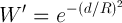
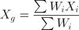
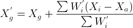
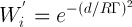
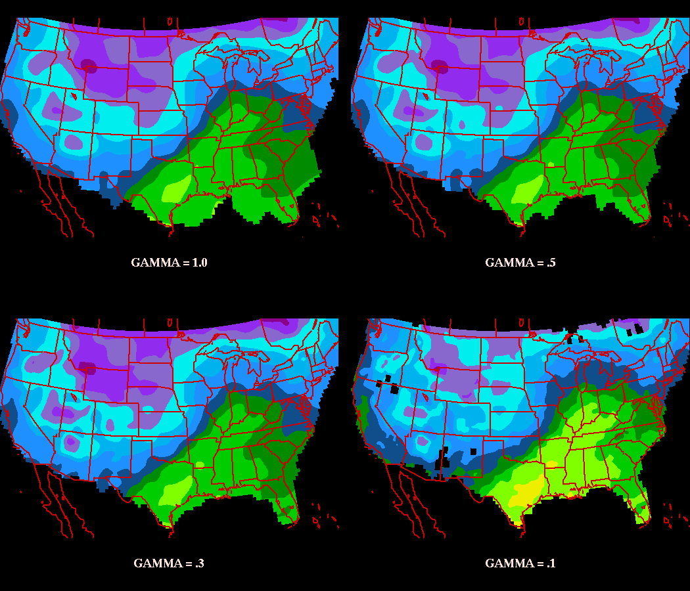
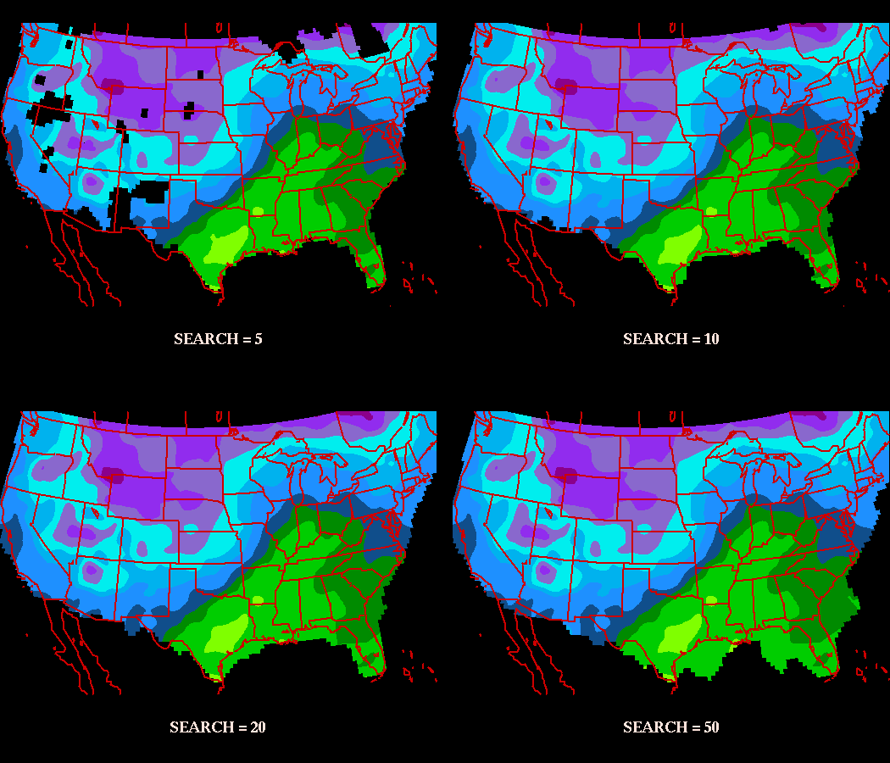
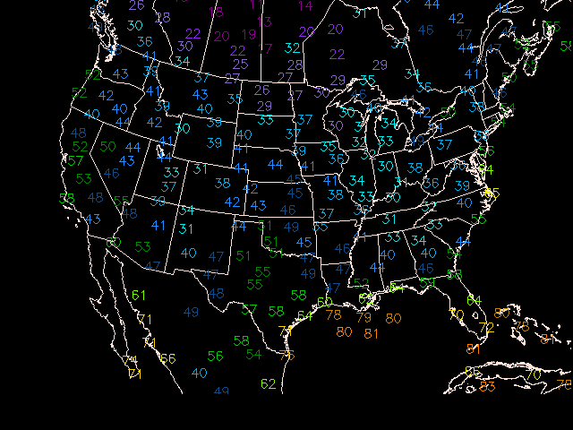

Objective analysis is the process of interpolating data from irregularly
spaced locations to a fixed grid.

GEMPAK grid programs which plot contours and vectors use algorithms which
require data on a rectangular grid. The process of contouring, as well as calculating finite differences, uses the gridpoints to perform the desired operation.

**Numerical model simulations are perfomed using gridpoints**, so that data is
already on a regular grid. However, for standard surface and upperair
measurements the data must first be gridded.

 In addition to simply gridding unevenly-spaced data, objective analysis can filter data. The process of filtering occurs as stations surrounding a nearby grid point receive a relative weight, typically based on the distance they lie
from the gridpoint. The process of assigning weights to grid points
determines the eventual contribution that point will have in the
final value of the gridpoint.

Stations which lie closest to the gridpoint receive the greatest weight,
while those that lie farther away contribute less to the overall value.
In this way, the gridpoint is not representative of a single station, but is instead
a best fit to all the surrounding data.

As a result, the final grid value is a compromise between all the stations which are used to determine the value. The effect of considering several stations leads to smoothing of the data. The final grid point value will range somewhere between the maximum and minimum values of the stations used.

## Barnes Analysis

The Objective Analysis procedure used for GEMPAK is known as a Barnes scheme. For a detailed technical description, see **_Koch, desJardins,and Kocin: Journal of Climate Appl. Meteor., 22, 1487-1503_**.

The Barnes Scheme applies a **Gaussian Weighting function**, in which the weight a station contributes to the overall value of the grid point falls off rapidly with increasing distance from the point. Since the tails of a Gaussian function are infinite, in practice a radius of influence is chosen such that stations outside the circle about the gridpoint are not considered.

 The GEMPAK implementation requires that at least 3 stations be within the radius for a value to be assigned to a grid point.

The depiction above represents the Barnes Analysis process. For each gridpoint, stations within the radius of influence `R` are assigned a weight value `W` using the formula:

where `d` is the distance from the station to the gridpoint.

After the weights are determined, the first guess of the gridpoint is determined by:

This is known as the **first pass** of the scheme. If more than 1 iteration of the scheme is desired (typically 2 passes are preformed), a method known as successive correction is applied. This method interpolates from the new (first pass) grid values back to the original station. The difference in the interpolation from the original value is then used as a correction to the first pass grid point value.

A new parameter called the convergence parameter (Γ) is used to control the amount of smoothing. Each correction step can be represented as:

where (W') is the correction weight parameter:

The convergence parameter (Γ - or `GAMMA` in GEMPAK) ranges between 0 and 1. A value between .2 and .3 is generally assumed.

>  Since the grid point values are essentially weighted averages of surrounding stations, the grid point value will always be less than the maximum, and greater than the minimum values surrounding the point. As a result, there is smoothing occuring within the grid. The purpose of the convergence parameter on successive correction passes is to mitigate oversmoothing of the data.

## Creating Grid Files

Prior to running the objective analysis routines, a grid file must be created in which to store the output grids. Grid files can be created either with `OAGRID` or with `GDCFIL`.

`GDCFIL` is typically used when the user has some knowledge about the data that will be gridded, and is experienced in the selection of the Barnes Analysis parameteres. The program `OAGRID` is designed to query that data that will be gridded, and suggest reasonable values for the parameters used in Barnes Analysis, which if accepted will be used to create the grid file.

Grid files may also be created by using information in existing grid files and copying the navigation and analysis parameters to the newly generated grid file.

`OAGRID` creates a GEMPAK grid file which can be used in a Barnes
objective analysis program.

## OAGRID Input Parameters

<pre>
[GDFILE](/cgi-bin/gempak/manual/variables_index?gdfile)   Grid file
[DELTAN](/cgi-bin/gempak/manual/variables_index?deltan)   Station spacing
[DELTAX](/cgi-bin/gempak/manual/variables_index?deltax)   X spacing
[DELTAY](/cgi-bin/gempak/manual/variables_index?deltay)   Y spacing
[GRDAREA](/cgi-bin/gempak/manual/variables_index?grdarea)      Area covered by grid
[EXTEND](/cgi-bin/gempak/manual/variables_index?extend)   Points to extend grid
[DTAAREA](/cgi-bin/gempak/manual/variables_index?dtaarea)      Data area for OA
[SOURCE](/cgi-bin/gempak/manual/variables_index?source)   Data source (SN or SF)
[SNFILE](/cgi-bin/gempak/manual/variables_index?snfile)   Sounding data file
[SFFILE](/cgi-bin/gempak/manual/variables_index?sffile)   Surface data file
[SNPARM](/cgi-bin/gempak/manual/variables_index?snparm)   Sounding parameter list
[SFPARM](/cgi-bin/gempak/manual/variables_index?sfparm)   Surface parameter list
[DATTIM](/cgi-bin/gempak/manual/variables_index?dattim)   Date/time
[LEVELS](/cgi-bin/gempak/manual/variables_index?levels)   Vertical levels
[MAXGRD](/cgi-bin/gempak/manual/variables_index?maxgrd)   Maximum number of grids
</pre>

The computed station spacing `DELTAN` is the average of the computed and uniform station spacing. This spacing will be used in the Barnes Analysis routines to determine the search radius also known as the radius of influence. A default value of 0 should be used for `OAGRID` to compute and select its own value.

The value of `DELTAN` is used with the selected grid region to compute `DELTAX` and `DELTAX`. If values are given for `DELTAN`, `DELTAX`, and `DELTAY`, `OAGRID` will accept those values for the grid.

The `EXTEND` area is the number of grid rows to extend the `GRDAREA` for the first pass of the Barnes analysis. The purpose of extending the desired grid area is to reduce the edge effects. `DTAAREA` is the region in which station data is considered.

`OAGRID` produces evenly spaced lat/lon (CED) grids. For greater flexibility in choosing the projection, `GDCFIL` may be used.

## GDCFIL

For more experienced users of objective analysis schemes, `GDCFIL` cay be used to create a new grid file or copy grid information from an existing file. `GDCFIL` allows the user the ability to choose the projection and number of grid points the file will contain.

New variables to make note of:

1.  `KXKY` The number of X;Y grid points
2.  `CPYFIL` Used to copy grid file information from an existing grid file. Other variables are ignored if `CPYFIL` is not blank.
3.  `ANLYSS` Grid analysis block, in the form: DELTAN / EXTEND

If the `DELTAN` field in `ANLYSS` is left blank, the `DELTAN` values is assigned as twice the grid spacing computed from the gridarea and `KXKY`.

`CPYFIL` can be used to transfer the grid information from an existing file, or to generate a grid based on one of the known grids in the grid navigation table used for model grids.

## Creating Grids from Surface Data

`OABSFC` may be used to perform and objective analysis on surface data, once a grid file has been created using `OAGRID` and/or `GDCFIL`.

New variables for `OABSFC`:

1.  `DTAAREA`        Area of objective analysis if not same as grid file
2.  `GUESS`          First guess file, if available
3.  `GUESFUN`        First guess field, if available
4.  `QCNTL`          Quality control threshold for first guess
5.  `GAMMA`          Value of the convergence parameter
6.  `SEARCH`         Search radius for stations
7.  `NPASS`          Number of passes in the Barnes Scheme
8.  `OABND`          Bounds file(s) to use for 'blocking' out regions

`DTAAREA` is typically the same area as the grid file, and may be left blank or set to `DATA`. Stations which posses bad data may be eliminated from consideration by appending a tag `/-@station1;station2;etc.` to this variable.

`GUESS` and `GUESFUN` can be used to supply the original guess field as a zeroeth pass of the Barnes analysis. `GUESFUN` may be different than the field to be analyzed. For example, the 10 meter temperature from a model at a specific forecast hour can be used as a first guess for the 2 meter temperature analyzed field. `QCNTL` can be used to create a threshold for rejecting data which deviate from the expected first guess field.

`GAMMA` is a value between 0 and 1. Typically a value between .2 and .3 is used.
`SEARCH` is a value between 1 and 50, such that stations receiving a weight less than `EXP(-SEARCH)` are considered negligible. Typically a value of 20 is used, which corresponds to a weight threshold of approximately 2e-9. A modifier of `/EX` may be used to allow data extrapolation for regions that lack at least 3 station within the search radius.

`NPASS` may be from 1 to 5 passes. 2 passes are recommended.

>  A word of warning! Although objective analysis does filter data so that any singular value does not contribute solely to a grid point value, it does not prevent the contribution of **BAD** data.
> 
> You should always inspect the raw data that is used in objective analysis to determine possible contamination of grid results. When using gridded data, the #1 rule is always, **Garbage in, Garbage out**.

## Creating Grids from Sounding Data

`OABSND` may be used to perform and objective analysis on sounding data, once a grid file has been created using `OAGRID` and/or `GDCFIL`.

New variables for `OABSFC`:

1.  `SNPARM`         Level parameters indicies to be gridded
2.  `STNDEX`         Special entire sounding indices to be gridded
3.  `VCOORD`         Vertical coordinate for levels used
4.  `LEVELS`         Levels on which to perform analysis

>  Note: Due to the large numbers of grids that may be generated when perfoming objective analysis on multiple parameters on multiple levels, you may have to run `OABSND` using several subsets instead of all desired combinations at one in order to avoid running your workstation out of memory!

Upper air stations are typically spaced at greater distances than surface data stations, so the grid spacings should be correspondingly greater for upperair data. Remember that data void regions can cause maximas and minimas to be displaced!

## Exercise #15 (Objective Analysis)

Perform objective analyses for surface temperature as a function of convergence parameter GAMMA. Plot a 4 panel graphic showing the comparison, using the following values:

1.  `GAMMA = 1.0` (maximum smoothing)
2.  `GAMMA = 0.5`
3.  `GAMMA = 0.3` (default)
4.  `GAMMA = 0.1`(minimum smoothing)

You will need to create your grid file `barnes1.grd` and make 3 additional copies.

#### 1. Create Grid File

Start with `OAGRID`:

    GEMPAK-OAGRID>
    GDFILE   = barnes1.grd
    DELTAN   = 0
    DELTAX   = 0
    DELTAY   = 0
    GRDAREA  = us
    EXTEND   = 2;2;2;2
    DTAAREA  = 
    SOURCE   = SF
    SNFILE   = 
    SFFILE   = metar
    SNPARM   = ;TMPC;;HGHT;DWPC;BRBM
    SFPARM   = tmpf;dwpf;pmsl;sped;drct
    DATTIM   = 1200
    LEVELS   = 500
    MAXGRD   = 200
    GEMPAK-OAGRID>r
    

    We're using **live data** by specifying `SFFILE = metar`, as `SOURCE` is set to `SF`.

    After runing, exit the program:

    GEMPAK-OAGRID>e
    

    and make three copies of your file `barnes1.grd`

    cp barnes1.grd barnes2.grd
    cp barnes1.grd barnes3.grd
    cp barnes1.grd barnes4.grd
    

    #### 2. Perform the Barnes Analyses

    GEMPAK-OABSFC>
    SFFILE  = metar
    GDFILE  = barnes1.grd
    SFPARM  = tmpf;dwpf;pmsl;sped;drct
    DATTIM  = 1200
    DTAAREA =                 
    GUESS   =
    GAMMA   = 1
    SEARCH  = 20
    NPASS   = 2
    QCNTL   =         
    OABND   = 
    GDATTIM =
    GFUNC   =
    GLEVEL  = 0
    GVCORD  = none
    GEMPAK-OABSFC>r
    

    Next, change `GDFILE` and `GAMMA` to the next value:

    GDFILE  = barnes3.grd
    GAMMA   = 0.5
    GEMPAK-OABSFC>r
    

    Do the same for `GAMMA = 0.3` and `GAMMA = 0.1`, saving to the other two barnes analysis grid files.

    #### 3. Plot The Surface Grid

    Plot the four new surface grids using `GDCNTR`, and using setting different panels for each using the `PANEL` variable.

    > gdcntr

    gdattim = last
    glevel  = 0
    gvcord  = none
    gfunc   = tmpf
    gdfile  = barnes1.grd
    panel   = ul
    clear   = y
    garea   = #35;-93;12;27
    proj    = lea/35;-100;0
    fline   = 30-7
    ctype   = f
    fint    = 5
    title   = 1/-1/GAMMA = 1.0
    GEMPAK-GDCNTR>r   

    clear = n
    panel = ur
    gdfile = barnes2.grd
    title = 1/-1/GAMMA = .5
    GEMPAK-GDCNTR>r

    panel = ll
    gdfile = barnes3.grd
    title = 1/-1/GAMMA = .3
    GEMPAK-GDCNTR>r

    panel = lr
    gdfile = barnes4.grd
    title = 1/-1/GAMMA = .1
    GEMPAK-GDCNTR>r
    

    

    #### 4. Adjusting Search Radius

    Now perform objective analyses of surface temperature using search values of 5, 10, 20 and 50 (`GAMMA = 0.3`). Plot a 4 panel graphic to compare search radii.

    Lets recycle our first grid file from the first run:

    > gddelt

    gdfile = barnes1.grd
    gdnum  = list
    GEMPAK-GDDELT>r

    Enter  to delete grids or type EXIT:

    GEMPAK-GDDELT>e
    

    Now make 3 more copies of the file again:

    cp barnes1.grd barnes2.grd
    cp barnes1.grd barnes3.grd
    cp barnes1.grd barnes4.grd
    

    Now perform the Barnes Analyses:

    > oabsfc
    SFFILE   = metar
    GDFILE   = barnes1.grd
    SFPARM   = tmpf
    DATTIM   = 1200
    DTAAREA  = 
    GUESS    = 
    GAMMA    = .3
    SEARCH   = 5
    NPASS    = 2
    GEMPAK-OABSFC>r

    GEMPAK-OABSFC>gdfile = barnes2.grd
    GEMPAK-OABSFC>search = 10
    GEMPAK-OABSFC>r

    GEMPAK-OABSFC>gdfile = barnes3.grd
    GEMPAK-OABSFC>search = 20
    GEMPAK-OABSFC>r

    GEMPAK-OABSFC>gdfile = barnes4.grd
    GEMPAK-OABSFC>search = 50
    GEMPAK-OABSFC>r

    GEMPAK-OABSFC>e
    

    Finally, lets plot it up:

    <pre>
        > gdcntr < [barnes_search.dat](http://www.unidata.ucar.edu/software/gempak/tutorial/answers/barnes_search.dat)
    </pre>

    

    

    ## Multi-Panel Display

    Multi-panel displays are composed in a manner very similar to overlays. The first panel is drawn with `CLEAR=YES`, and subsequent panels are drawn with `CLEAR=NO`. The only difference is that the `PANEL` variable is changed to a different region of the window. Of course, you can create multi-panel displays with overlays too!
    PANEL specifies the panel location, panel outline color, line type and width separated with slashes:

      panel location / outline color / line type / width / region
    

    The panel location determines the location of the view region on the graphics device. It may be specified using a number or abbreviation as follows:

        NUMBER  ABBREVIATION    DESCRIPTION
        0       ALL             Entire device
        1       UL              Upper left quadrant
        2       UR              Upper right quadrant
        3       LL              Lower left quadrant
        4       LR              Lower right quadrant
        5       L               Left half
        6       R               Right half
        7       T               Top half
        8       B               Bottom half
    

    An easy 9-panel capability uses abbreviations M1,...,M9 which will be laid out on the page as:

                M1      M2      M3

                M4      M5      M6

                M7      M8      M9
    

    The view region may also be specified as four numbers separated with semicolons, giving the lower left and upper right corners in fractions of the graphics display area. The origin is in the lower left of the display. For example, the lower left quadrant can be given as:

                0;0;.5;.5
    

    If the panel location is unspecified, the current location is unchanged.
    The panel outline color, line type and line width specify the values used to draw a box around the specified region. The valid regions are `VIEW`, `PLOT` and `DEVICE`. If the color is 0 or unspecified, no box is drawn.

    

    ## Exercise #16 (Surface File from Gridded Data)

    

    ### Creating the Surface File

    `SFCFIL` creates a new GEMPAK surface file.

    SFOUTF   = metar.sfc
    SFPRMF   = tmpc;dwpc;sped;drct;pmsl
    STNFIL   = sfstns.tbl
    SHIPFL   = no
    TIMSTN   = 15/100
    SFFSRC   = AIRW|TEXT
    GEMPAK-SFCFIL>r
    

    

    ### GDGSFC

    `GDGSFC` computes grid data and interpolates to stations in a GEMPAK surface file.

    INPUT PARAMETERS

    <pre>
    [GDFILE](/cgi-bin/gempak/manual/variables_index?gdfile)       Grid file
    [GDATTIM](/cgi-bin/gempak/manual/variables_index?gdattim)      Grid date/time
    [GVCORD](/cgi-bin/gempak/manual/variables_index?gvcord)       Grid vertical coordinate
    [GLEVEL](/cgi-bin/gempak/manual/variables_index?glevel)       Grid level
    [GFUNC](/cgi-bin/gempak/manual/variables_index?gfunc)        Scalar grid
    [SCALE](/cgi-bin/gempak/manual/variables_index?scale)        Scalar scale / vector scale
    [SFFILE](/cgi-bin/gempak/manual/variables_index?sffile)       Surface data file
    [SFPARM](/cgi-bin/gempak/manual/variables_index?sfparm)       Surface parameter list
    </pre>

    The program computes the requested grid data from the given
    grid file.  `GFUNC` can be any valid GEMPAK grid function.  The
    other grid related parameters are used to specify the grid
    to calculate.

    The output surface file, `SFFILE`, must already exist.  The
    output parameter, `SFPARM`, must also exist in the surface file.

    The program reads each successive station from the surface file
    and overwrites the existing data with the interpolated data from
    the grid.

    #### Interpolate Grid data into the surface file

    With `GDGSFC`:

    GDFILE   = gfs
    GDATTIM  = 0000f012
    GVCORD   = none
    GLEVEL   = 0
    GFUNC    = tmpc
    SCALE    =  
    SFFILE   = metar.sfc
    SFPARM   = tmpc
    GEMPAK-GDGSFC>r
    

    #### Map The Surface Temperature

    With `SFMAP`:

    AREA     = us-
    GAREA    = us
    SATFIL   =  
    RADFIL   =  
    IMCBAR   =  
    SFPARM   = tmpf
    DATTIM   = 1200
    SFFILE   = metar.sfc
    COLORS   = (20-95-5/30-14//U)
    MAP      = 1
    MSCALE   = 0
    LATLON   = 0
    TITLE    = @ GFS Forecast Temperatures (F)
    CLEAR    = y
    PANEL    = 0
    DEVICE   = xw
    PROJ     =  
    FILTER   = YES
    TEXT     = 1/2//hw
    LUTFIL   =  
    STNPLT   =  
    CLRBAR   =  
    LSTPRM   = 
    GEMPAK-SFMAP>r

