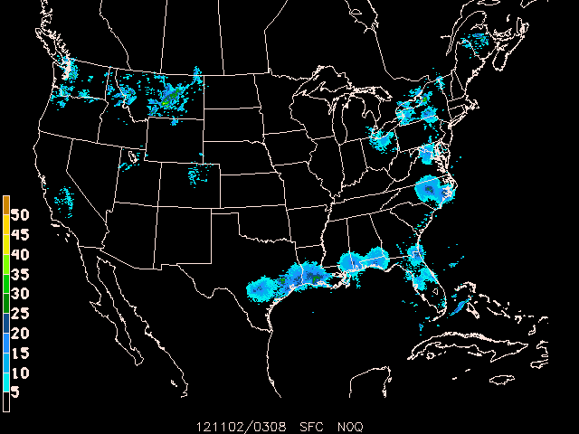
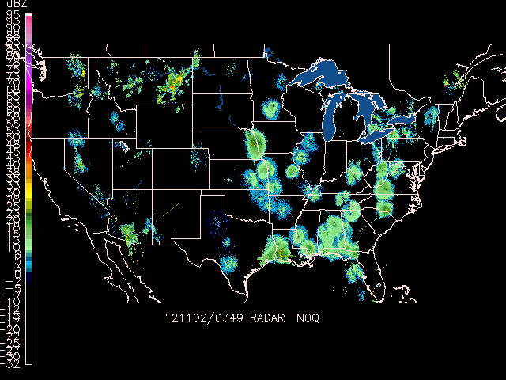
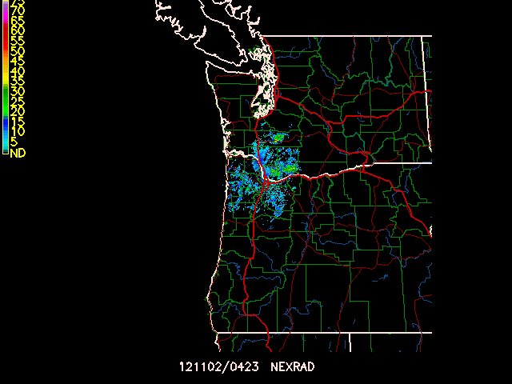
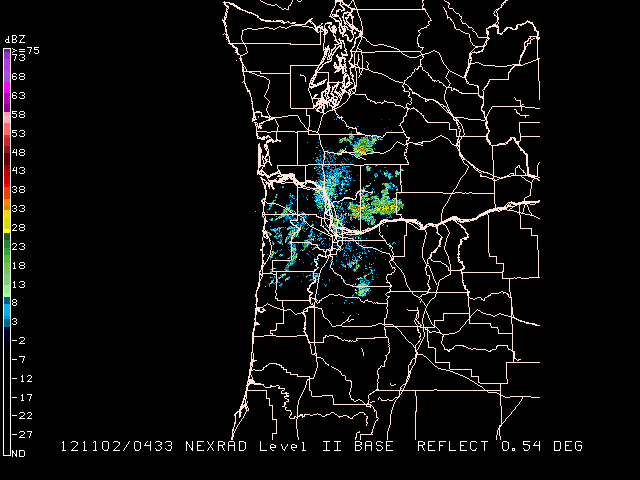
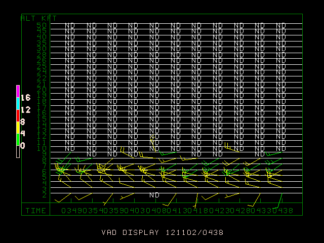
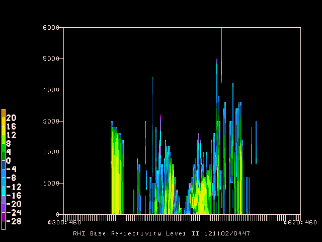

## GDRADR - NEXRAD to Grid

`GDRADR` samples NEXRAD Level III (NIDS) products to a common
grid projection.

`GDFILE` specifies the output grid file. If the file does not already
exist, the file is created using the grid defined by `CPYFIL`,
or if `CPYFIL` is not defined then by `PROJ`, `GRDAREA`, and `KXKY`.

`CPYFIL` may provide either an existing grid file to read the projection
information from, or a grid number (`#nnn`) defined in grdnav.tbl.

`STNFIL` is the station table which supplies radar IDs to be searched
for the composite. If `STNFIL` is blank, then `nexrad.tbl` is used
by default.

`GDPFUN` is a list of data parameters for which composites are created.
The NEXRAD file naming is assumed to be such that the site identifier
and the product type are both present in the directory/file naming
structure.

### Exercise #23 (Create a NEXRAD N0Q Grid)

Create a  National composite of NEXRAD base reflectivity (N0Q). Use the current time with a 30 minute window  for data. Use the `nexrad.tbl` station table.
Create the grid output file using the `YYYYMMDD_radar.gem` file name
template. Accept data only from radars operating in precipitation
mode.

    PROJ     = lcc/25;-103;60
    GRDAREA  = 23.0;-120.0;47.0;-65.0
    KXKY     = 720;500
    GDPFUN   = n0q
    GDFILE   = YYYYMMDD_radr.gem
    RADTIM   = current
    RADDUR   = 30
    RADFRQ   = 
    CPYFIL   =  
    STNFIL   = nexrad.tbl
    MAXGRD   = 1000
    RADMODE  = P
    

    Examine the contents with `GDINFO`:

    GDFILE   = 20121102_radr.gem
    LSTALL   = YES
    OUTPUT   = T
    GDATTIM  = all
    GLEVEL   = all
    GVCORD   = all
    GFUNC    = n0q
    GEMPAK-GDINFO>
    

    Now color-fill the N0Q reflectivity contours with `GDPLOT2`:

    GDFILE   = 20121102_radr.gem
    GDATTIM  = last
    GLEVEL   = 0
    GVCORD   = none
    PANEL    = 0
    SKIP     = l
    SCALE    =  
    GDPFUN   = n0q
    TYPE     = f
    CONTUR   = 2
    CINT     = l
    LINE     =  
    FINT     = 5/5
    FLINE    = 0;30-7
    HILO     =  
    HLSYM    =  
    CLRBAR   = 1
    WIND     = 0
    REFVEC   =  
    TITLE    = @
    TEXT     = 1/2//hw
    CLEAR    = y
    GAREA    = us
    IJSKIP   = 0
    PROJ     = lcc/25;-103;60
    MAP      = 1
    MSCALE   = 0
    LATLON   = 0
    DEVICE   = xw
    STNPLT   =  
    SATFIL   =  
    RADFIL   =  
    IMCBAR   = 1
    LUTFIL   =  
    STREAM   =  
    POSN     = 0
    COLORS   =  
    MARKER   = 0
    GRDLBL   = 0
    FILTER   = YES
    

    

    

    ## NEX2GINI - GINI File from NEXRAD Composite

    `NEX2IMG` samples NEXRAD Level III (NIDS) products to a common
       grid projection, and then creates a GIF format image raster.
       `NEX2IMG` is not limited by the traditional `LLMXGD`
       limitation for grid files.

    

    ### NEX2GINI Input Variables

    <pre>
    [GRDAREA](/cgi-bin/gempak/manual/variables_index?grdarea)    Area covered by grid
    [PROJ](/cgi-bin/gempak/manual/variables_index?proj)       Map projection/angles/margins|drop flag
    [KXKY](/cgi-bin/gempak/manual/variables_index?kxky)       Number of grid points in x;y
    [CPYFIL](/cgi-bin/gempak/manual/variables_index?cpyfil)     Grid file whose navigation is to be used in new grid file | subarea
    [GFUNC](/cgi-bin/gempak/manual/variables_index?gfunc)      Scalar grid
    [RADTIM](/cgi-bin/gempak/manual/variables_index?radtim)     Radar composite current/dattim
    [RADDUR](/cgi-bin/gempak/manual/variables_index?raddur)     Radar time window (minutes prior to RADTIM)
    [RADFRQ](/cgi-bin/gempak/manual/variables_index?radfrq)     Update Frequency
    [STNFIL](/cgi-bin/gempak/manual/variables_index?stnfil)     Station information file
    [RADMODE](/cgi-bin/gempak/manual/variables_index?radmode)    Radar operational mode
    [SATFIL](/cgi-bin/gempak/manual/variables_index?satfil)     Satellite image filename(s)
    [COMPRESS](/cgi-bin/gempak/manual/variables_index?compress)   output in compressed format
    </pre>

    `NEX2GINI` uses a suplemental table `$GEMTBL/unidata/nex2gini.tbl` to specify
    configurations for data to pixel mappings.

    `SATFIL` specifies the output file. If the file already exists,
    it is overwritten.

    `CPYFIL` may provide either an existing grid file to read the projection
    information from, or a grid number (#nnn) defined in grdnav.tbl.

    `PROJ`, `GRDAREA`, and `KXKY` define a grid navigation as in `GDCFIL` if
    CPYFIL is blank.

    `STNFIL` is the station table which supplies radar IDs to be searched
    for the composite. If `STNFIL` is blank, then `nexrad.tbl` is used
    by default.

    `GFUNC` is the data parameter which the composite is created for.
    The NEXRAD file naming is assumed to be such that the site identifier
    and the product type are both present in the directory/file naming
    structure.

    

    ### Exercise #24 (NEX2GINI N0Q Composite)

    Create a 1km National composite of NEXRAD base reflectivity (`N0Q`).
            Use the current time with a 30 minute window for data. Use the `nexrad.tbl` station table. Create the GINI
            output file using the `rad_YYYYMMDD_HHNN` file name template.
            Accept data from radars operating in precipitation and
            clear air mode.

    GRDAREA  = 25;-128;50;-65
    PROJ     = mer
    KXKY     = 4000;2400
    CPYFIL   =  
    GFUNC    = n0q
    RADTIM   = current
    RADDUR   = 5
    RADFRQ   = 0
    STNFIL   = nexrad.tbl
    RADMODE  = PC
    SATFIL   = rad_YYYYMMDD_HHNN
    COMPRESS =  
    GEMPAK-NEX2GINI>r
    

    You now have the `rad_YYYYMMDD_HHNN` in your working directory.

    Display the NEXRAD composite as a satellite image in `GPMAP`:

    MAP      = 1
    MSCALE   = 0
    GAREA    = 25;-128;50;-65
    PROJ     = sat
    SATFIL   = rad_20121102_0349
    RADFIL   = 
    IMCBAR   = 1/V/LL/0.05;0.04/0.925;0.0125/-5
    LATLON   =  
    PANEL    = 0
    TITLE    = 1/-2
    TEXT     = 1/2//hw
    CLEAR    = y
    DEVICE   = xw
    LUTFIL   = upc_ref256.tbl
    STNPLT   =  
    VGFILE   =  
    AFOSFL   =  
    AWPSFL   =  
    LINE     =  
    WATCH    =  
    WARN     =  
    HRCN     =  
    ISIG     =  
    LTNG     =  
    ATCF     =  
    AIRM     =  
    GAIRM    =  
    NCON     =  
    CSIG     =  
    SVRL     =  
    BND      = lakes/24
    TCMG     =  
    QSCT     =  
    WSTM     =  
    WOU      =  
    WCN      =  
    WCP      =  
    ENCY     =  
    FFA      =  
    WSAT     =  
    ASCT     =  
    TRAK1    =  
    TRAKE    =  
    TRAK2    =  
    GEMPAK-GPMAP>r
    

    

    

    ### Exercise #25 (NEX2IMG N0Q Composite)

    `nex2img` operates the exact same way as `nex2gini` , only it outputs the radar data directly to a GIF image.

    To create a composite of NEXRAD base reflectivity (N0Q), use the current time with a 30 minute window for data. Create the GIF output file using the `YYYYMMDD_HHNN.gif` file name template.
            Accept data from radars operating in precipitation and
            clear air mode.

        GRDAREA  = 25;-125;50;-65
        PROJ     = MER
        KXKY     = 4000;2400
        CPYFIL   =  
        GFUNC    = n0q
        RADTIM   = current
        RADDUR   = 30
        RADFRQ   =  
        STNFIL   = nexrad.tbl
        RADMODE  = PC
        RADFIL   = YYYYMMDD_HHNN.gif
        LUTFIL   = upc_rad24.tbl
        GEMPAK-NEX2IMG>r
    

    

    ## GPNIDS - NEXRAD Level III Plotting

    `GPNIDS` plots NEXRAD Level III products.

    `RADFIL` is the NEXRAD Level III input file. A template may
    be specified, with an optional site name and product type
    (eg `NEXRIII|DDC|NWV`). If a site name is provided, it will
    be used to replace the `%SITE%` alias in the template name.
    If a product type is provided, it will be used to replace
    the `%PROD%` alias in the template string if present. Products
    will br plotted in graph or map coordinates depending on
    the type of product. For VAD wind profile products (NVW) the
    display is graph coordinates, while raster and radial images,
    and overlay products (eg mesocyclone, storm track, tvs etc) are
    displayed in map coordinates. The NEXRIII template is provided
    for NEXRAD Level III files.

    

    ### GPNIDS Input Parameters

    <pre>
    [RADFIL](/cgi-bin/gempak/manual/variables_index?radfil)    Radar image filename(s)
    [RADTIM](/cgi-bin/gempak/manual/variables_index?radtim)    Radar composite current/dattim
    [TITLE](/cgi-bin/gempak/manual/variables_index?title)     Title color/line/title
    [PANEL](/cgi-bin/gempak/manual/variables_index?panel)     Panel loc/color/dash/width/regn
    [DEVICE](/cgi-bin/gempak/manual/variables_index?device)    Device|name|x size;y size|color type
    [CLEAR](/cgi-bin/gempak/manual/variables_index?clear)     Clear screen flag
    [TEXT](/cgi-bin/gempak/manual/variables_index?text)      Size/fnt/wdth/brdr/N-rot/just/hw flg
    [COLORS](/cgi-bin/gempak/manual/variables_index?colors)   Color list
    [WIND](/cgi-bin/gempak/manual/variables_index?wind)      Wind symbol/siz/wdth/typ/hdsz
    [LINE](/cgi-bin/gempak/manual/variables_index?line)      Color/type/width/label/smth/fltr
    [CLRBAR](/cgi-bin/gempak/manual/variables_index?clrbar)   Color/ornt/anch/x;y/ln;wd/freq|text_info
    [IMCBAR](/cgi-bin/gempak/manual/variables_index?imcbar)    Color/ornt/anch/x;y/ln;wd/freq
    [GAREA](/cgi-bin/gempak/manual/variables_index?garea)     Graphics area
    [MAP](/cgi-bin/gempak/manual/variables_index?map)       Map color/dash/width/filter flag
    [LATLON](/cgi-bin/gempak/manual/variables_index?latlon)    Line color/dash/width/freq/inc/label/format
    [OUTPUT](/cgi-bin/gempak/manual/variables_index?output)    Output device/filename
    </pre>

    `WIND` can be used to select the type and plot size of barbs or
        arrows for the vectors in the VAD display.

    

    ### Exercise #26 (Level 3 Reflectivity)

    Plot the High Resolition Reflectivity (N0Q) product for RTX:

    RADFIL   = NEXRIII|RTX|N0Q
    RADTIM   = last
    TITLE    = 1/-2
    PANEL    = 0
    DEVICE   = xw
    CLEAR    = Y
    TEXT     = 1/2/2/hw
    COLORS   = 7
    WIND     =  
    LINE     =  
    CLRBAR   =  
    IMCBAR   = 5/v/LL/.005;.6/.4;.01
    GAREA    = dset
    $mapfil  = lorvus.usg + hicnus.nws + hipona.nws + louhus.nws + loisus.nws
    MAP      = 24 + 23 + 1/1/2 + 14 + 15/1/2
    LATLON   = 0
    OUTPUT   = t
    GEMPAK-GPNIDS>r
    

    

    

    ## GPNEXR2 - NEXRAD Level II Plotting

    `GPNEXR2` displays NEXRAD Level II products in ARCHIVE2 format.

    `RADFIL` specifies the input level II file. A template may be
    specified, with an optional site name (eg `NEXRII|KDDC`).
    If a site name is provided, it will be used to replace the `%SITE%`
    alias in the template name. The NEXRII template is provided
    for ARCHIVE2 format files.

    `RADPARM` is the Radar parameter to be displayed.

    Valid values are:

*   `dz` (reflectivity)
*   `vr` (radial velocity)
*   `sw` (spectrum width).

    

    ### GPNEXR2 Input Parameters

    <pre>
    [MAP](/cgi-bin/gempak/manual/variables_index?map)       Map color/dash/width/filter flag
    [GAREA](/cgi-bin/gempak/manual/variables_index?garea)     Graphics area
    [PROJ](/cgi-bin/gempak/manual/variables_index?proj)      Map projection/angles/margins|drop flag
    [RADFIL](/cgi-bin/gempak/manual/variables_index?radfil)    Radar image filename(s)
    [LATLON](/cgi-bin/gempak/manual/variables_index?latlon)    Line color/dash/width/freq/inc/label/format
    [PANEL](/cgi-bin/gempak/manual/variables_index?panel)     Panel loc/color/dash/width/regn
    [TITLE](/cgi-bin/gempak/manual/variables_index?title)     Title color/line/title
    [TEXT](/cgi-bin/gempak/manual/variables_index?text)      Size/fnt/wdth/brdr/N-rot/just/hw flg
    [CLEAR](/cgi-bin/gempak/manual/variables_index?clear)     Clear screen flag
    [DEVICE](/cgi-bin/gempak/manual/variables_index?device)    Device|name|x size;y size|color type
    [LUTFIL](/cgi-bin/gempak/manual/variables_index?lutfil)    Enhancement lookup table filename
    [IMCBAR](/cgi-bin/gempak/manual/variables_index?imcbar)    Color/ornt/anch/x;y/ln;wd/freq|text_info
    [TILT](/cgi-bin/gempak/manual/variables_index?tilt)      Radar beam elevation/tilt number
    [RADPARM](/cgi-bin/gempak/manual/variables_index?radparm)  Radar parameter (dz, vr, sw)
    [RADTIM](/cgi-bin/gempak/manual/variables_index?radtim)    Radar composite current/dattim
    </pre>

    

    ### Exercise #27 (Level 2 Reflectivity)

    Display the most recent reflectivity for KRTX using the sweep with
            mean elevation angle is closest to .5 degrees.

        MAP      = 6/1/1+3/1/2
        GAREA    = dset
        PROJ     = rad
        RADFIL   = NEXRII|KRTX
        LATLON   = 0
        PANEL    = 0
        TITLE    = 31
        TEXT     = 1
        CLEAR    = YES
        DEVICE   = xw
        LUTFIL   = default
        IMCBAR   = 31/V/LL/.005;.05/.85;.01|.7/1/1/hw
        TILT     = .5
        RADPARM  = dz
        RADTIM   = last
        GEMPAK-GPNEXR2>r
    

    

    

    ## GPVAD - NEXRAD Level III Wind Profile

    `GPVAD` plots the NEXRAD Level III wind profile product.

    `RADFIL` is used the same as in `GPNIDS` (eg `NEXRIII|DDC|NWV`).

    <pre>
    [RADFIL](/cgi-bin/gempak/manual/variables_index?radfil)    Radar image filename(s)
    [RADTIM](/cgi-bin/gempak/manual/variables_index?radtim)    Radar composite current/dattim
    [WIND](/cgi-bin/gempak/manual/variables_index?wind)      Wind symbol/siz/wdth/typ/hdsz
    [TITLE](/cgi-bin/gempak/manual/variables_index?title)     Title color/line/title
    [PANEL](/cgi-bin/gempak/manual/variables_index?panel)     Panel loc/color/dash/width/regn
    [DEVICE](/cgi-bin/gempak/manual/variables_index?device)    Device|name|x size;y size|color type
    [CLEAR](/cgi-bin/gempak/manual/variables_index?clear)     Clear screen flag
    [TEXT](/cgi-bin/gempak/manual/variables_index?text)      Size/fnt/wdth/brdr/N-rot/just/hw flg
    [CLRBAR](/cgi-bin/gempak/manual/variables_index?clrbar)    Color/ornt/anch/x;y/ln;wd/freq|text_info
    [OUTPUT](/cgi-bin/gempak/manual/variables_index?output)    Output device/filename
    </pre>

    

    ### Exercise #28 (VAD Time Series)

    Plot the VAD profile for radar location RTX using the NEXRIII
        template for the most recent time. Use wind barbs, and plot the
        RMS bar along the altitude axis.

    RADFIL   = NEXRIII|RTX|NVW
    RADTIM   = last
    WIND     = bk1
    TITLE    = 1/-2/VAD DISPLAY ~
    PANEL    = 0
    DEVICE   = XW
    CLEAR    = y
    TEXT     = 1/1/1/hw
    CLRBAR   = 1/v/cl/.05;.5/.3;.01
    GEMPAK-GPVAD>r
    

    

    

    ## NEXR2RHI - NEXRAD Level II Vertical Cross-Section

    `NEXR2RHI` displays NEXRAD Level II vertical cross sections for
    data in ARCHIVE2 format. This program is adopted from `GDCROSS` to
    create a volume rendering of NEXRAD data along a specified
    axis.

    <pre>
    [CXSTNS](/cgi-bin/gempak/manual/variables_index?cxstns)    Cross-section station line
    [GVCORD](/cgi-bin/gempak/manual/variables_index?gvcord)    Grid vertical coordinate
    [PTYPE](/cgi-bin/gempak/manual/variables_index?ptype)     Plot type/h:w ratio/margins
    [YAXIS](/cgi-bin/gempak/manual/variables_index?yaxis)     Ystrt/ystop/yinc/lbl;gln;tck
    [CINT](/cgi-bin/gempak/manual/variables_index?cint)      Contour interval/min/max
    [SCALE](/cgi-bin/gempak/manual/variables_index?scale)     Scalar scale / vector scale
    [LINE](/cgi-bin/gempak/manual/variables_index?line)      Color/type/width/label/smth/fltr
    [BORDER](/cgi-bin/gempak/manual/variables_index?border)    Background color/type/width
    [TITLE](/cgi-bin/gempak/manual/variables_index?title)     Title color/line/title
    [CLEAR](/cgi-bin/gempak/manual/variables_index?clear)     Clear screen flag
    [DEVICE](/cgi-bin/gempak/manual/variables_index?device)    Device|name|x size;y size|color type
    [TEXT](/cgi-bin/gempak/manual/variables_index?text)      Size/fnt/wdth/brdr/N-rot/just/hw flg
    [PANEL](/cgi-bin/gempak/manual/variables_index?panel)     Panel loc/color/dash/width/regn
    [CLRBAR](/cgi-bin/gempak/manual/variables_index?clrbar)    Color/ornt/anch/x;y/ln;wd/freq|text_info
    [CONTUR](/cgi-bin/gempak/manual/variables_index?contur)    Subbox/smooth
    [FINT](/cgi-bin/gempak/manual/variables_index?fint)      Fill interval/min/max
    [FLINE](/cgi-bin/gempak/manual/variables_index?fline)     Fill colors/fill types
    [CTYPE](/cgi-bin/gempak/manual/variables_index?ctype)     Contour type: C/F
    [RADFIL](/cgi-bin/gempak/manual/variables_index?radfil)    Radar file
    [RADPARM](/cgi-bin/gempak/manual/variables_index?radparm)  Radar parameter (dz, vr, sw)
    [RADTIM](/cgi-bin/gempak/manual/variables_index?radtim)    Radar date/time
    [INTERP](/cgi-bin/gempak/manual/variables_index?interp)    Interpolation flag
     </pre>

    `RADPARM` is the Radar parameter to be displayed. Valid values are
       `dz` (reflectivity), `vr` (radial velocity), `sw` (spectrum width).

    `RADTIM` is a valid GEMPAK date/time string or abbreviation. A time
       range may be specified.

    `INTERP` is a logical variable which determines whether interpolation
       between sweeps will occur.

    `CXSTNS` is the cross section axis (as in `GDCROSS`). A grid coordinate
       can be used with row and colums 1 to 920.

    `GVCORD` is the vertical coordinate of the radar data (always `HGHT`).

    `PTYPE` is the plot type. A value of `LIN` is generally the only
       useful setting.

    

    ### Exercise #29 (Reflectivity RHI)

    Display an East-West RHI which passes through the radar location
        for reflectivity data from KRTX. Display the RHI from 0 to 6km
        using color filled contours. Use a contour interval of 4 dBZ
        with a minimum value of -12 dBZ. Grid point 460;460 is the radar center.
        Interpolate contours between beam scans.

    CXSTNS   = @300;460>@620;460
    GVCORD   = hght
    PTYPE    = lin
    YAXIS    = 0/6000
    CINT     = 0
    SCALE    = 0
    LINE     = 1
    BORDER   = 1
    TITLE    = 1/-2/RHI Base Reflectivity Level II ^
    CLEAR    = YES
    DEVICE   = xw
    TEXT     = .8/1/1/111/hw
    PANEL    = 0
    CLRBAR   = 1
    CONTUR   = 3/2
    FINT     = 4
    FLINE    = 0;30-7
    CTYPE    = f
    RADFIL   = NEXRII|KRTX
    RADPARM  = dz
    RADTIM   = last
    INTERP   = y

