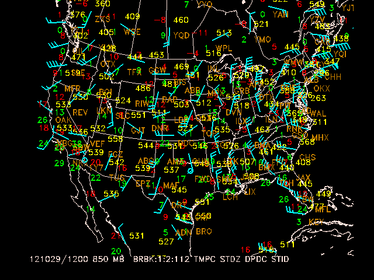
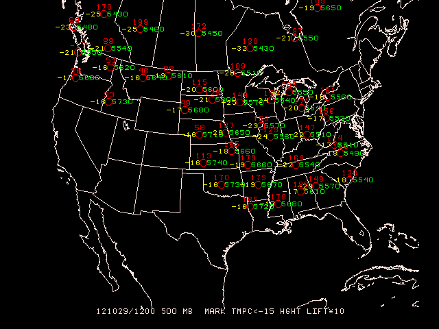

`SNMAP` plots sounding data parameters at station locations
on a map.  Any level or station parameter that can be
computed can be displayed.  Data may be plotted in any valid
GEMPAK projection and may be overlaid on images.

## SNMAP Input Parameters
    
- [AREA](/cgi-bin/gempak/manual/variables_index?area) -    Data area
- [GAREA](/cgi-bin/gempak/manual/variables_index?garea) -   Graphics area
- [SATFIL](/cgi-bin/gempak/manual/variables_index?satfil) -  Satellite image filename(s)
- [RADFIL](/cgi-bin/gempak/manual/variables_index?radfil) -  Radar image filename(s)
- [IMCBAR](/cgi-bin/gempak/manual/variables_index?imcbar) -  Color/ornt/anch/x;y/ln;wd/freq
- [SNPARM](/cgi-bin/gempak/manual/variables_index?snparm) -  Sounding parameter list
- [DATTIM](/cgi-bin/gempak/manual/variables_index?dattim) -  Date/time
- [LEVELS](/cgi-bin/gempak/manual/variables_index?levels) -  Vertical levels
- [VCOORD](/cgi-bin/gempak/manual/variables_index?vcoord) -  Vertical coordinate type
- [SNFILE](/cgi-bin/gempak/manual/variables_index?snfile) -  Sounding data file
- [COLORS](/cgi-bin/gempak/manual/variables_index?colors) -  Color list
- [MAP](/cgi-bin/gempak/manual/variables_index?map) -     Map color/dash/width/filter flag
- [MSCALE](/cgi-bin/gempak/manual/variables_index?mscale) -  fgc;bgc;mask/units/lat;hide/values/anch/x;y/ln;wd/freq\|text_info\|t
- [LATLON](/cgi-bin/gempak/manual/variables_index?latlon) -  Line color/dash/width/freq/inc/label/format
- [TITLE](/cgi-bin/gempak/manual/variables_index?title) -   Title color/line/title
- [CLEAR](/cgi-bin/gempak/manual/variables_index?clear) -   Clear screen flag
- [PANEL](/cgi-bin/gempak/manual/variables_index?panel) -   Panel loc/color/dash/width/regn
- [DEVICE](/cgi-bin/gempak/manual/variables_index?device) -  Device\|name\|x size;y size\|color type
- [PROJ](/cgi-bin/gempak/manual/variables_index?proj) -    Map projection/angles/margins\|drop flag
- [FILTER](/cgi-bin/gempak/manual/variables_index?filter) -  Filter data factor
- [TEXT](/cgi-bin/gempak/manual/variables_index?text) -    Size/fnt/wdth/brdr/N-rot/just/hw flg
- [LUTFIL](/cgi-bin/gempak/manual/variables_index?lutfil) -  Enhancement lookup table filename
- [STNPLT](/cgi-bin/gempak/manual/variables_index?stnplt) -  Txtc/txt attr\|marker attr\|stnfil#col

The order of the input parameters determines their location
on the plot, similar to `sfmap`. A parameter
will be plotted centered at the station if it is the first
parameter in the list. If no parameter is to be displayed
centered on the station location, a semicolon must appear
before the first parameter, or the first parameter must be
either `SPAC` or `BLNK`.

The following chart shows the placement
of the data around the station.  The number indicates the
position of the parameter in the `SNPARM` list:

                8
            2   10  4
            3   1   5
            6   11  7
                9
    

Note that wind symbols and markers are always plotted at the center.

### Run SNMAP

Let's start `snmap` and display the current definitions with `l`:

    snmap

    l
    
Notice that `AREA`, `GAREA` and `SATFIL`, among others, are preserved from the previously-run `sfmap` session.

     AREA     = us-
     GAREA    = dset
     SATFIL   = $SAT/EAST-CONUS/1km/VIS/VIS_20121029_2132
     RADFIL   =  
     IMCBAR   =  
     SNPARM   = skyc;tmpf;wsym;rmsl;ptnd;dwpf;p03i;brbk:.7:2
     DATTIM   = 2200
     LEVELS   =  
     VCOORD   =  
     SNFILE   =  
     COLORS   = 26;2;7;25;20;22;18;6
     MAP      = 1
     MSCALE   = 0
     LATLON   =  
     TITLE    = 1
     CLEAR    = y
     PANEL    = 0
     DEVICE   = xw
     PROJ     = sat
     FILTER   = 1
     TEXT     = 0.75/22//hw
     LUTFIL   =  
     STNPLT   =  
    
Also notice some new variables:

*   [`SNFILE`](/cgi-bin/gempak/manual/variables_index?snfile) - the name of the upper-air file, which can be set tp `uair` for the latest file in `$GEMDATA/upperair`
*   [`SNPARM`](/cgi-bin/gempak/manual/variables_index?snparm) - parameters, analogous to `SFPARM`
*   [`STNDEX`](/cgi-bin/gempak/manual/variables_index?stndex) - stability indices, such as

    >- `SHOW`    Showalter index
    >- `LIFT`    Lifted index
    >- `LFTV`    LIFT computed by using virtual temperature
    >- `SWET`    SWEAT index
    >- `KINX`    K index
    
*   `VCOORD` is the vertical coordinate on which to list the data. GEMPAK can vertically interpolate sounding data between the various vertical coordinate systems.

    >  - `PRES`    Pressure (millibars)
    >  - `THTA`    Isentropes (K)
    >  - `HGHT`    Height (meters)
    >  - `NONE`    Surface data or data on one level only
    
*   `LEVELS` - level(s) to be mapped for the vertical coordinate specified by `VCOORD`

    >1.  single value (`LEVELS = 500`)
    >2.  list of values (`LEVELS = 500;550;75`)
    >3.  range of values ( `LEVELS = 500-75`)
    >4.  Key words:
    >
    >        - `LEVELS = MAN` for mandatory level
    >        - `LEVELS = VAS` for mandatory VAS levels
    >        - `LEVELS = ALL` for ALL level
    >        - `LEVELS = SFC` or `LEVELS = 0` for surface
    >        - `LEVELS = TOP` or `LEVELS = -1` for top level

## Filtering Stations

Define `FILTER = YES` to filter station data (overlapping stations will not be plotted). `FILTER` may also be entered as a number greater than or equal to zero. Filter values less than 1 allow more crowding of stations, values exceeding 1 less crowding.

- `FILTER = 0` is the same as `FILTER = NO`
- `FILTER = 1` is the same as `FILTER = YES`

If a parameter is `BLNK`, the filter will not allocate any space for that parameter.  The parameter `SPAC` may be used to reserve the space with the `FILTER` option so that later calls will plot the same stations after filtering, provided that the same number of parameters is specified.

If certain stations are not to be removed by the filter, these stations are listed first following an `@`.  The area over which filtering is to occur is specified after a slash.  For example,

    AREA   = @iad;hts;rap/us
    FILTER = YES
    
will display a filtered array of stations over the area corresponding to US, but IAD, HTS and RAP will be shown regardless of the filtering.

## Wind Barbs and Arrows

Either wind barbs or wind arrows can be plotted, by specifying a wind symbol parameter name in the list of parameters for `SNPARM`.  The wind barb or arrow is plotted at the station location according to the type specification, which is entered as described in the `SNPARM` documentation.

## Exercise #4 (Simple Sounding Map)

Plot stations in the Eastern United States at 850 mb for 1200 UTC today. Plot a standard station model for each location. The upper air data to plot include 1) wind barbs in knots, 2) temperature in Celsius, 3) **coded height**, 4) dewpoint depression in Celsius, 5) station ID

The data are plotted using the specified color list.

     AREA     = us-
     GAREA    = us
     SATFIL   =  
     RADFIL   =  
     IMCBAR   =  
     SNPARM   = brbk:1:2:112;tmpc;;stdz;;dpdc;stid
     DATTIM   = 1200
     LEVELS   = 850
     VCOORD   = pres
     SNFILE   = uair
     COLORS   = 6;2;5;3;18
     MAP      = 1
     MSCALE   = 0
     LATLON   =  
     TITLE    = 1
     CLEAR    = yes
     PANEL    = 0
     DEVICE   = xw
     PROJ     = STR/90;-100;0
     FILTER   = no
     TEXT     = 0.75
     LUTFIL   =  
     STNPLT   =  
    

## Exercise #5 (More Advanced Parameters)

At a height of 500 mb and at 1200 UTC, plot the lifted index (multiplied by 10) and temperatures of less than -15 degrees Celsius.

    SNPARM   =  mark:2;;tmpc<-15;;hght;;;;;lift*10
    DATTIM   =  1200
    LEVELS   =  500
    VCOORD   =  pres
    SNFILE   =  uair
    COLORS   =  2;5;3
    FILTER   =  0
    TEXT     =  .75

## Exercise 6

A list of times may be given in `DATTIM` allowing animation of sounding plots...