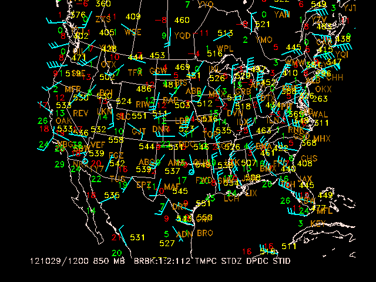
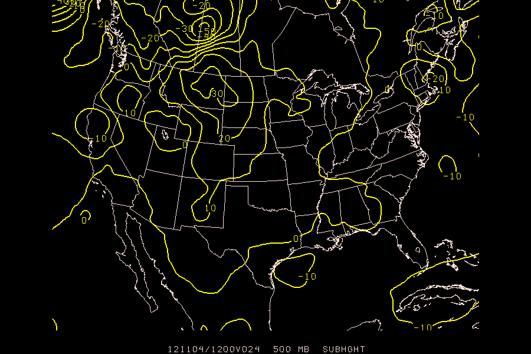
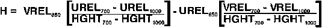
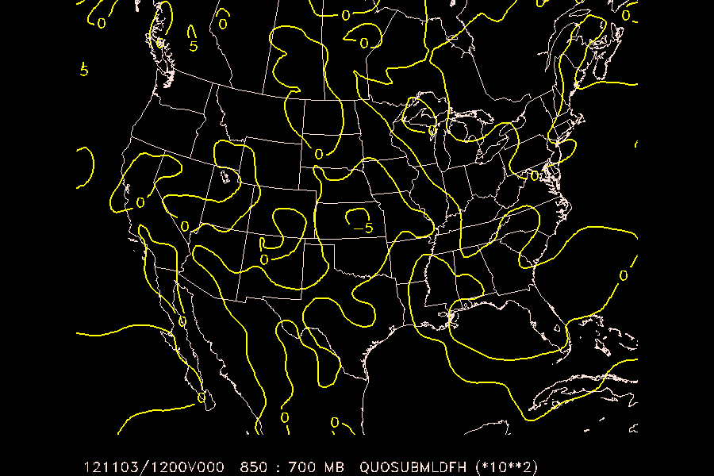
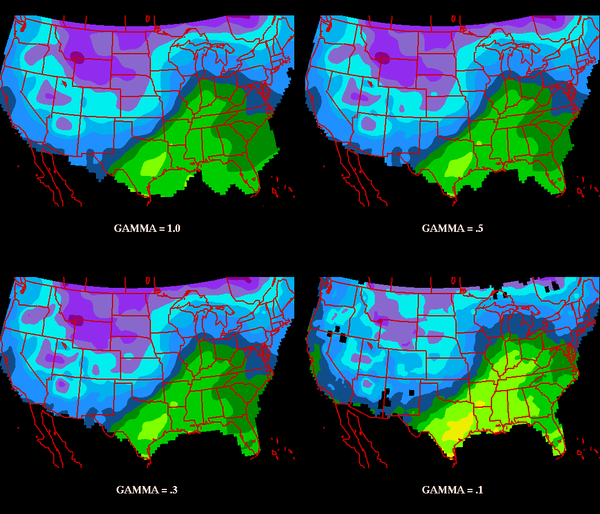
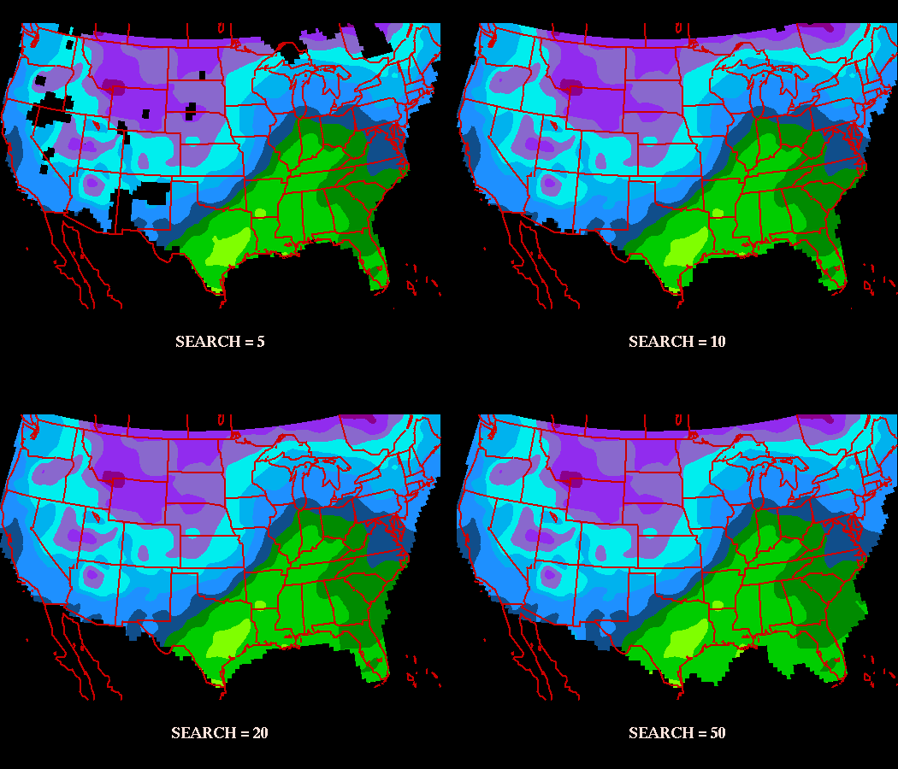
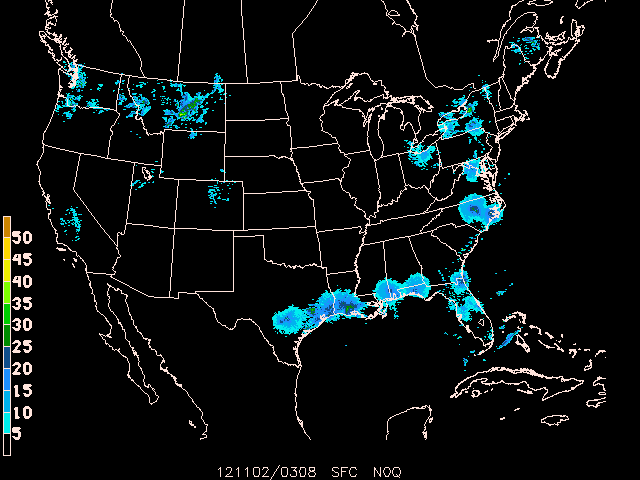
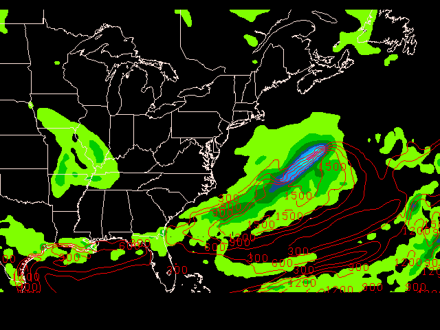
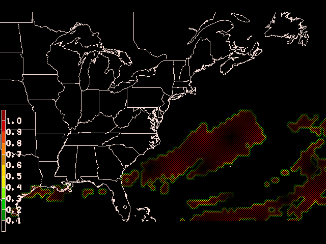
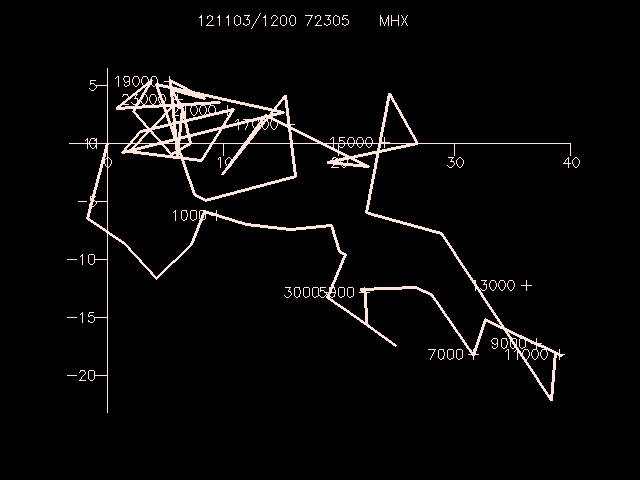

# 3. Surface Data Mapping

The program `sfmap` plots any parameters which can be derived from the data in a GEMPAK surface data file.

## SFMAP Input Parameters

<pre>
[AREA](/cgi-bin/gempak/manual/variables_index?area)      Data area
[GAREA](/cgi-bin/gempak/manual/variables_index?garea)     Graphics area
[SATFIL](/cgi-bin/gempak/manual/variables_index?satfil)    Satellite image filename(s)
[RADFIL](/cgi-bin/gempak/manual/variables_index?radfil)    Radar image filename(s)
[IMCBAR](/cgi-bin/gempak/manual/variables_index?imcbar)    Color/ornt/anch/x;y/ln;wd/freq
[SFPARM](/cgi-bin/gempak/manual/variables_index?sfparm)    Surface parameter list
[DATTIM](/cgi-bin/gempak/manual/variables_index?dattim)    Date/time
[SFFILE](/cgi-bin/gempak/manual/variables_index?sffile)    Surface data file
[COLORS](/cgi-bin/gempak/manual/variables_index?colors)    Color list
[MAP](/cgi-bin/gempak/manual/variables_index?map)       Map color/dash/width/filter flag
[MSCALE](/cgi-bin/gempak/manual/variables_index?mscale)    fgc;bgc;mask/units/lat;hide/values/anch/x;y/ln;wd/freq|text_info|t
[LATLON](/cgi-bin/gempak/manual/variables_index?latlon)    Line color/dash/width/freq/inc/label/format
[TITLE](/cgi-bin/gempak/manual/variables_index?title)     Title color/line/title
[CLEAR](/cgi-bin/gempak/manual/variables_index?clear)     Clear screen flag
[PANEL](/cgi-bin/gempak/manual/variables_index?panel)     Panel loc/color/dash/width/regn
[DEVICE](/cgi-bin/gempak/manual/variables_index?device)    Device|name|x size;y size|color type
[PROJ](/cgi-bin/gempak/manual/variables_index?proj)      Map projection/angles/margins|drop flag
[FILTER](/cgi-bin/gempak/manual/variables_index?filter)    Filter data factor
[TEXT](/cgi-bin/gempak/manual/variables_index?text)      Size/fnt/wdth/brdr/N-rot/just/hw flg
[LUTFIL](/cgi-bin/gempak/manual/variables_index?lutfil)    Enhancement lookup table filename
[STNPLT](/cgi-bin/gempak/manual/variables_index?stnplt)    Txtc/txt attr|marker attr|stnfil#col
[CLRBAR](/cgi-bin/gempak/manual/variables_index?clrbar)    Color/ornt/anch/x;y/ln;wd/freq|text_info
[LSTPRM](/cgi-bin/gempak/manual/variables_index?lstprm)    Filtered parm|x;y|TEXT info
</pre>

To list the variable definitions in the same format as they are entered, type `list` or `l` for short:

     GEMPAK-SFMAP>l
     AREA     = WV
     GAREA    = WV
     SATFIL   =
     RADFIL   =
     IMCBAR   =
     SFPARM   = SKYC;TMPF;WSYM;PMSL;;DWPF;BRBK
     DATTIM   = LAST
     SFFILE   = $GEMPAK/data/hrcbob.sfc
     COLORS   = 1
     MAP      = 1
     MSCALE   = 0
     LATLON   =
     TITLE    = 1
     CLEAR    = YES
     PANEL    = 0
     DEVICE   = XW
     PROJ     = MER
     FILTER   = YES
     TEXT     = 1
     LUTFIL   =
     STNPLT   =
     CLRBAR   =
     LSTPRM   =
     GEMPAK-SFMAP>
    

    What are looking at? **hrcbob.sfc**? **WV**?

    These are the program defaults and allow us to list and plot data immediately when starting to use GEMPAK.

    Run `sfmap` now:

    GEMPAK-SFMAP>r
    Creating process: xw for queue 9797635
    SFMAP PARAMETERS:

    Data area:          WV
    Graphics area name: WV
    Valid parameters:    SKYC TMPF WSYM PMSL BLNK DWPF BRBK
    Parameter colors:     1    1    1    1    0    1    1
    Time:              910820/0600
    File:              $GEMPAK/data/hrcbob.sfc
    Map:               1
    Title:             1
    Device:            XW
    Projection:        MER
    Clear screen:      YES
    Filter:            YES
    Filter factor:      1.00
    Panel:             0 
    Enter <cr> to accept parameters or type EXIT:
    

    Press <enter> once more to display the map:

    

    The X window will display surface observations from "Hurricane Bob" in 1991, centered around West Virginia.

    

    ## Adjusting AREA and GAREA

    `GAREA` is the graphics area: the part of the map that will be plotted. `AREA` is the data area: the area from which to select the data to plot. These areas exist separately for when you might want individual control over both the region of the map that is plotted (`GAREA`) and the region that is covered by data (`AREA`).

     Both are defined by the same syntax (below), but can be defined a number of different ways:

1.  **Lat/Lon**
     AREA = 25;-125;50;-65    
     defines the corners `Lat 1; Lon 1; Lat 2; Lon 2` of the form `LL (1); UR (2)`.
      Be aware that South and West are negative!
2.  **Center/Offset**
     AREA = #37.5;-95;12.5;30    
     In the form `#Center lat; Center lon; Delta lat; Delta lon`
3.  **Geographic Area** (defined in the GEMPAK geography table `$GEMTBL/stns/geog.tbl`)
     AREA = US      the region around the United States.     AREA = MX      the region around Mexico     AREA = CO      the region around Colorado.
     AREA = @CO     only information inside Colorado.
     AREA = @AU:C   Australia (use :C syntac for countries
                      other than US, CN and MX)
    
4.  **Station Area and Station Name**
     AREA = LAX     the region around Los Angelos
     AREA = @DEN    only information from the Denver station
     AREA = @DEN;LAX;PDX
                     only Denver, LA and Portland stations
    
5.  **Full Data Set** (all stations in the file)
     AREA = DSET    
6.  **Contracted and Expanded Areas **
     AREA = CO+      AREA is contracted around CO
     AREA = CO++     AREA is contracted further around CO
     AREA = CO-      AREA is expanded beyond CO
     AREA = @CO--    AREA is expanded even more, but only includes
                      information inside Colorado
    
7.  **Integer Value **(stations are selected if they fall into the range indicated)
     AREA = SELV:0:2000   Selects stations with elevations
                          between 0 and 2000 meters     AREA = SLAT:-45:45   Selects stations located between 45                          degrees south and 45 north     AREA = SLON:-45:45   Between 45 west and 45 east
    

    Any station information can be used in this way:

*   `STID` (Station ID-letters)
*   `STNM` (Station Number)
*   `SLAT` (Station Lat)
*   `SLON` (Station Lon)
*   `STIM` (Station Report Time)

    >  If you want to plot a map with complete  data coverage, including the edges, you should make `AREA` bigger than `GAREA`. This can be done by adding a minus `-` to `AREA` or a plus `+` to `GAREA`:
> 
>         GEMPAK-SFMAP> area = wv-
>         GEMPAK-SFMAP> garea = wv
>         GEMPAK-SFMAP> r
>     

     **MAKE NOTE** `GAREA` can be specified in some of the same ways as `AREA`, with one caveat: **You can not use the `@` symbol to specify `GAREA`**.

    Because `GAREA` defines the boundaries of the graph, adding `@` would force an irregular boundary. Think of the @ sign as a way to restrict the selection of data.

    

    ## SFPARM Surface Parameters

    Multiple surface parameters may be defined in `SFPARM` by entering a list separated by semicolons:

    sfparm = tmpc;pmsl;skyc
    

    GEMPAK can also calculate a number of parameters if the requested parameter is not present in the data set, for example, such as with relative humidity, which GEMPAK determines from a function defined
    internally as `RELH=FUNC (TMPC;DWPT)`.

    sfparm = RELH 
    

    Arithmetic functions and upper and lower limits may be used in the paramater definition:

    sfparm = tmpc/2    
    sfparm = pmsl>1000      
    

    where `pmsl>1000` restricts sea-level pressure records to those below 1000 mb,

    You can manipulate the values of parameters using the following arithmetic functions:

*   Multiplivcation `*`
*   Division `/`
*   Addition `+`
*   Subtraction `-`
*   Greater than `>`
*   Less than `<`

    Raw hourly and special reports (if stored in a file) can be accessed as well:

    sfparm = text
    sfparm = spcl
    sfparm = text;spcl
    sfparm = pmsl;tmpc;wthr;text
    

    For now, to continue with our `SFMAP` example, set `sfparm` back to:

    sfparm = SKYC;TMPF;WSYM;PMSL;;DWPF;BRBK
    

    

    ## Date and Time

    `DATTIM` is date and time, formatted in a number of ways:

1.  Explicit, for all observations at time YYMMDD/HHMM:
     DATTIM = 101025/1200    
2.  Abbreviation, for the last available date and/or time specified:
     DATTIM = 25/1200      DD/HHMM     DATTIM = 25/12        DD/HH     DATTIM = /1200        /HHMM
     DATTIM = 12           HH
    
3.  Range, for all observations between the two date/time ranges:
     DATTIM = 17/00-17/1200
    
4.  List, for all available observations that match the exact date/times listed:
     DATTIM = 17/00;17/06;17/12    
5.  List, for all times in the file, useful for when you don`t know the times when the
    data was collected:
      DATTIM = list    
6.  Last, for observations from the last date/time in the file:
     DATTIM = last    
7.  All, for observations from every date/time in the file, useful for comprehensive analyses:
     DATTIM = all
    

    What happens when we change `DATTIM = all` for `sfmap`:

    

    >  If  `DEVICE = xw` you should
>     see an animation through all times in the file.  If `DEVICE = gif` you'll see stations
>     plotted multiple times to the map if `CLEAR = no` is defined.

    

    ## Clearing the Map Window

    `CLEAR` is a logical variable which determines whether the graphics screen is cleared before plotting.

1.  `CLEAR = YES` (or `CLEAR = y` for short) will clear the window of all previously-drawn graphics before plotting what has been specified.
2.  `CLEAR = NO` (or `CLEAR = n`) will draw what is currently specified over any previously-drawn graphics.

    With `CLEAR = n`, you have the ability to overlay observations, images, maps and various vector and scalar quantities, depending on the GEMPAK program being used.  Additionally, because GEMPAK mapping programs operate within one `gplt` process (until `gpend` is called from the command line), you can overlay fields on the same map projection using multiple programs!

    

    ## Map Projections

    `PROJ` determines the map projection, and directly affects the way the map looks on the screen.  `PROJ` and `GAREA` together give you the flexibility to generate very specific map projections.  Both  **simple map projections** and **full map projections** are avaiable to select:

1.  **Simple Map Projections**
     Simple map projections only require the three-character identifier to be defined:
     proj = mer
    
     Available simple map projections:
     MER     Mercator
     NPS     North Polar Stereographic
     SPS     South Polar Stereographic
     LCC     Northern Hemisphere Lambert Conic Conformal
     SCC     Southern Hemisphere Lambert Conic Conformal
     CED     Cylindrical Equidistant
     MCD     Modified Cylindrical Equidistant
     UTM     Universal Transverse Mercator
     NOR     North Orthographic     SOR     South Orthographic    
2.  **Full Map Projections**
     For full map projections, each definition **MUST** be followed by three specified angles based on the projection class (CYL,AZM, CON), which are defined like so:
     proj = STR/a1;a2;a3
     proj = STR/90;-100;0
    
     Where

        *   `a1` (90) is the standard latitude through which the projection plane passes
    *   `a2` (-100) is the central longitude (i.e. the longitude that lies parallel to the    grid columns).
    *   `a3` (0) angle to skew the projection, defined as zero for these examples.
     You can read about these angles and projections in more detail on the [`PROJ` parameter page](/cgi-bin/gempak/manual/variables_index?proj).
     Available full map projections:
     MER (CYL)   Mercator
     CED (CYL)   Cylindrical Equidistant
     MCD (CYL)   Modified Cylindrical Equidistant
     STR (AZM)   Polar Stereographic
     AED (AZM)   Azimuthal Equidistant
     ORT (AZM)   Orthographic
     LEA (AZM)   Lambert equal area
     GNO (AZM)   Gnomonic
     LCC (CON)   Northern Hemisphere Lambert Conic Conformal
     SCC (CON)   Southern Hemisphere Lambert Conic Conformal
    

    

    ## Exercise #2 (Overlay Satellite Image)

    Display the visible satellite image from 18Z and overlay the surface data
    for the area covered by the image. Plot a standard station model for each location in the data set. The surface data to plot include:

1.  sky cover symbol
2.  temperature in Fahrenheit
3.  weather symbol
4.  coded mean sea level pressure
5.  pressure tendency with symbol
6.  dewpoint in Fahrenheit
7.  station ID
8.  wind barbs in knots

    Therefore, the surface parameters used would be

    <tt>
    SFPARM   =  skyc; tmpf; wsym; smsl; ptnd; dwpf; stid;; brbk
    </tt>

    and colors

    <tt>
    COLORS   =  26; 2; 7; 25; 20; 22; 18; 6
    </tt>

        AREA     =  us
        GAREA    =  dset
        SATFIL   =  $GEMPAK/data/VIS_910819_1801
        RADFIL   =  
        IMCBAR   =  
        SFPARM   =  skyc;tmpf;wsym;smsl;ptnd;dwpf;stid;;;brbk
        DATTIM   =  910819/1800
        SFFILE   =  $GEMPAK/data/hrcbob.sfc
        COLORS   =  26;2;7;25;20;22;18;6
        MAP      =  1
        LATLON   =  
        TITLE    =  1
        CLEAR    =  yes
        PANEL    =  0
        DEVICE   =  xw
        PROJ     =  sat
        FILTER   =  1
        TEXT     =  0.75/22//hw
        LUTFIL   =
        STNPLT   =
        CLRBAR   =
        LSTPRM   = 
    

    `COLORS`, `MAP`, `TITLE`, `FILTER` and `TEXT` control the graphic colors, line thickness,
    style, text fonts and titles. These map aesthetics allow you to generate very specific graphics.  Check the parameter definition pages in the [manual](/cgi-bin/gempak/manual/variables_index) for more detail, or with the `phelp` command at the GEMPAK prompt.

    After running `sfmap`, you can see how the colors match the surface parameters:

     Valid parameters:    SKYC TMPF WSYM SMSL BLNK DWPF STID BLNK BLNK BRBK
     Parameter colors:    26    2    7   25   20   22   18    0    0    6 
    

    

    >  **Save your session!** In the `sfmap` command prompt, you can save the current definitions with the command
> 
>       GEMPAK-SFMAP>save bob.nts
>     
> 
>     then exit the program and check that the file exists
> 
>       GEMPAK-SFMAP>e
>       ls -la
>       ...
>       -rw-r--r--    1 gempak  staff      3151 Oct 29 14:38 bob.nts
>     
> 
>     You can reload this file in any other GEMPAK program, at any time, to retrieve the saved definitions, though only the variables which were saved in `sfmap` will be reloaded:
> 
>       GEMPAK-SFMAP> restore bob.nts
>     

    

    ## Exercise #3 (Live Data)

    Now let's look at data from today. Using an alias for real-time metar observations `SFFILE = metar`, and `DATTIM = 1200`, we can redisplay the map for this morning.

    Make note of what the two new definitions are doing to retreive observations:

1.  The `SFFILE = metar` definition uses an **alias** to the latest GEMPAK metar surface file (typically `$GEMDATA/surface/YYYYMMDD_sao.gem`, where `YYYYMMDD` is the current year, month and day, such as `20121028`).
2.  `DATTIM = 1200` uses only the 1200 UTC records in `SFFILE`

    But how to know the latest available? Exit `SFMAP` and return to the terminal, and execute the command line program `sfctime metar` and you will see surface reports in today's GEMPAK surface file for every twenty minutes:

    GEMPAK-SFMAP>e
    > sfctime metar
    ...     
    121028/1740     
    121028/1800     
    121028/1820     
    121028/1840     
    121028/1900 
    >
    

    Inside our `sfmap` session, let's define a new `AREA`, `GAREA`, and `PROJ`:

     AREA     = us-
     GAREA    = us
     SFFILE   = metar
     DATTIM   = last
     SATFIL   = 
     CLEAR    = y
     PROJ     = STR/90;-100;0
     GEMPAK-SFMAP>r 
    

    

    >  **Also note:** the position of parameters in a list,
> 
>       SFPARM   = skyc;tmpf;wsym;smsl;ptnd;dwpf;stid;;;brbk
>                   1    2    3    4    6    7   8       11
>     
> 
>     correspond to chart position:
> 
>         18      14      8       16      22
>         19      2       10      4       23
>         12      3       1       5       13
>         20      6       11      7       24
>         21      15      9       17      25
>     
> 
>     which also corresponed to the standard ordering of data on a surface chart:
> 
>     

    To overlay the current GOES satellite visible image on your map, you must explicitly define `SATFIL`.  To find the latest EAST-CONUS visible satellite image,  list the contents of `$SAT/EAST-CONUS/1km/VIS/` with the command:

    ls $SAT/EAST-CONUS/1km/VIS/ | tail -1
    VIS_20121029_2132
    

    then use the entire path name for `SATFIL` (evironmental variables allowed):

    GAREA    = dset
    PROJ     = sat
    SATFIL   = $SAT/EAST-CONUS/1km/VIS/VIS_20121029_2132
    DATTIM   = last
    GEMPAK-SFMAP>r 

 **Make Note**:

1.  When using `SATFIL` or `RADFIL`, you must set `PROJ` either to `sat` or `rad`.
2.  with `DATTIM = last`, there may not be any surface observations available in the `last` timeslot in the file referenced by `metar`.  If this is the case, explicitly define `DATTIM` using the a previous 20 minutes interval (i.e. `1140`, `1200`, `1220`).
3.  This method of finding a recent satellite image to overlay is cumbersome! We will soon explore how shell scripting can manage the latest files and images for your GEMPAK programs with ease.
4.  **Always** run `gpend` after finishing a GEMPAK graphics program session.

# 4. Sounding Data Mapping

`SNMAP` plots sounding data parameters at station locations
on a map.  Any level or station parameter that can be
computed can be displayed.  Data may be plotted in any valid
GEMPAK projection and may be overlaid on images.

## SNMAP Input Parameters

<pre>
[AREA](/cgi-bin/gempak/manual/variables_index?area)      Data area
[GAREA](/cgi-bin/gempak/manual/variables_index?garea)     Graphics area
[SATFIL](/cgi-bin/gempak/manual/variables_index?satfil)    Satellite image filename(s)
[RADFIL](/cgi-bin/gempak/manual/variables_index?radfil)    Radar image filename(s)
[IMCBAR](/cgi-bin/gempak/manual/variables_index?imcbar)    Color/ornt/anch/x;y/ln;wd/freq
[SNPARM](/cgi-bin/gempak/manual/variables_index?snparm)    Sounding parameter list
[DATTIM](/cgi-bin/gempak/manual/variables_index?dattim)    Date/time
[LEVELS](/cgi-bin/gempak/manual/variables_index?levels)    Vertical levels
[VCOORD](/cgi-bin/gempak/manual/variables_index?vcoord)    Vertical coordinate type
[SNFILE](/cgi-bin/gempak/manual/variables_index?snfile)    Sounding data file
[COLORS](/cgi-bin/gempak/manual/variables_index?colors)    Color list
[MAP](/cgi-bin/gempak/manual/variables_index?map)       Map color/dash/width/filter flag
[MSCALE](/cgi-bin/gempak/manual/variables_index?mscale)    fgc;bgc;mask/units/lat;hide/values/anch/x;y/ln;wd/freq|text_info|t
[LATLON](/cgi-bin/gempak/manual/variables_index?latlon)    Line color/dash/width/freq/inc/label/format
[TITLE](/cgi-bin/gempak/manual/variables_index?title)     Title color/line/title
[CLEAR](/cgi-bin/gempak/manual/variables_index?clear)     Clear screen flag
[PANEL](/cgi-bin/gempak/manual/variables_index?panel)     Panel loc/color/dash/width/regn
[DEVICE](/cgi-bin/gempak/manual/variables_index?device)    Device|name|x size;y size|color type
[PROJ](/cgi-bin/gempak/manual/variables_index?proj)      Map projection/angles/margins|drop flag
[FILTER](/cgi-bin/gempak/manual/variables_index?filter)    Filter data factor
[TEXT](/cgi-bin/gempak/manual/variables_index?text)      Size/fnt/wdth/brdr/N-rot/just/hw flg
[LUTFIL](/cgi-bin/gempak/manual/variables_index?lutfil)    Enhancement lookup table filename
[STNPLT](/cgi-bin/gempak/manual/variables_index?stnplt)    Txtc/txt attr|marker attr|stnfil#col
</pre>

A list of times may be given in `DATTIM` allowing animation of sounding plots.

The order of the input parameters determines their location
on the plot, similar to `sfmap`. A parameter
will be plotted centered at the station if it is the first
parameter in the list. If no parameter is to be displayed
centered on the station location, a semicolon must appear
before the first parameter, or the first parameter must be
either `SPAC` or `BLNK`.

The following chart shows the placement
of the data around the station.  The number indicates the
position of the parameter in the `SNPARM` list:

                8
            2   10  4
            3   1   5
            6   11  7
                9
    

    Note that wind symbols and markers are always plotted at the center.

    ### Run SNMAP

    Let's start `snmap` and display the current definitions with `l`:

     > snmap
     GEMPAK-SNMAP>l
    

    Notice that `AREA`, `GAREA` and `SATFIL`, among others, are preserved from the previously-run `sfmap` session.

     AREA     = us-
     GAREA    = dset
     SATFIL   = $SAT/EAST-CONUS/1km/VIS/VIS_20121029_2132
     RADFIL   =  
     IMCBAR   =  
     SNPARM   = skyc;tmpf;wsym;rmsl;ptnd;dwpf;p03i;brbk:.7:2
     DATTIM   = 2200
     LEVELS   =  
     VCOORD   =  
     SNFILE   =  
     COLORS   = 26;2;7;25;20;22;18;6
     MAP      = 1
     MSCALE   = 0
     LATLON   =  
     TITLE    = 1
     CLEAR    = y
     PANEL    = 0
     DEVICE   = xw
     PROJ     = sat
     FILTER   = 1
     TEXT     = 0.75/22//hw
     LUTFIL   =  
     STNPLT   =  
    

    Also notice some new variables:

*   [`SNFILE`](/cgi-bin/gempak/manual/variables_index?snfile) - the name of the upper-air file, which can be set tp `uair` for the latest file in `$GEMDATA/upperair`
*   [`SNPARM`](/cgi-bin/gempak/manual/variables_index?snparm) - parameters, analogous to `SFPARM`
*   [`STNDEX`](/cgi-bin/gempak/manual/variables_index?stndex) - stability indices, such as
      SHOW    Showalter index
      LIFT    Lifted index
      LFTV    LIFT computed by using virtual temperature
      SWET    SWEAT index
      KINX    K index
    
*   `VCOORD` is the vertical coordinate on which to list the data. GEMPAK can vertically interpolate sounding data between the various vertical coordinate systems.
      PRES    Pressure (millibars)
      THTA    Isentropes (K)
      HGHT    Height (meters)
      NONE    Surface data or data on one level only
    
*   `LEVELS` - level(s) to be mapped for the vertical coordinate specified by `VCOORD`

        1.  single value  `LEVELS = 500`
    2.  list of values(; separated)          `LEVELS = 500;550;75`
    3.  a range of values (-)                `LEVELS = 500-75`
    4.  Key words:
          LEVELS = MAN                    for mandatory level
          LEVELS = VAS                    for mandatory VAS levels
          LEVELS = ALL                    for ALL level
          LEVELS = SFC or LEVELS = 0      for surface
          LEVELS = TOP or LEVELS = -1     for top level
    

    

    ## Filtering Stations

    `FILTER = YES` with filter station data; i.e., overlapping stations will not be plotted. `FILTER` may also be entered as a number greater than or equal to zero.

    `FILTER = 0` has the same effect as `FILTER = NO`.

    `FILTER = 1` has the same effect as `FILTER = YES`.

    Filter values less than 1 allow more crowding of stations, values exceeding 1 less crowding.  If a parameter is `BLNK`, the filter will not allocate any space for that parameter.  The parameter `SPAC` may be used to reserve the space with the `FILTER` option so that later calls will plot the same stations after filtering, provided that the same number of parameters is specified.

    If certain stations are not to be removed by the filter, these stations are listed first following an `@`.  The area over which filtering is to occur is specified after a slash.  For example,

    AREA   = @iad;hts;rap/us
    FILTER = YES
    

    will display a filtered array of stations over the area corresponding to US, but IAD, HTS and RAP will be shown regardless of the filtering.

    

    ## Wind Barbs and Arrows

    Either wind barbs or wind arrows can be plotted, by specifying a wind symbol parameter name in the list of parameters for `SNPARM`.  The wind barb or arrow is plotted at the station location according to the type specification, which is entered as described in the `SNPARM` documentation.

    

    ## Exercise #4 (Simple Sounding Map)

    Plot stations in the Eastern United States at 850 mb for 1200 UTC today. Plot a standard station model for each location. The upper air data to plot include:

1.  wind barbs in knots
2.  temperature in Celsius
3.  coded height
4.  dewpoint depression in Celsius
5.  station ID

    The data are plotted using the specified color list.

     AREA     = us-
     GAREA    = us
     SATFIL   =  
     RADFIL   =  
     IMCBAR   =  
     SNPARM   = brbk:1:2:112;tmpc;;stdz;;dpdc;stid
     DATTIM   = 1200
     LEVELS   = 850
     VCOORD   = pres
     SNFILE   = uair
     COLORS   = 6;2;5;3;18
     MAP      = 1
     MSCALE   = 0
     LATLON   =  
     TITLE    = 1
     CLEAR    = yes
     PANEL    = 0
     DEVICE   = xw
     PROJ     = STR/90;-100;0
     FILTER   = no
     TEXT     = 0.75
     LUTFIL   =  
     STNPLT   =  
    

    

    

    ## Exercise #5 (More Advanced Parameters)

    At a height of 500 mb and at 1200 UTC, plot the lifted index (multiplied by 10) and temperatures of less than -15 degrees Celsius.

    SNPARM   =  mark:2;;tmpc<-15;;hght;;;;;lift*10
    DATTIM   =  1200
    LEVELS   =  500
    VCOORD   =  pres
    SNFILE   =  uair
    COLORS   =  2;5;3
    FILTER   =  0
    TEXT     =  .75

# 6. Map Aesthetics

## Colors

Each of the parameters you select will be given a color corresponding this color list.

    sfparm = tmpk;relh;wsym;dwpf
    colors = 1;2;3;4
    

    `TMPK` will be color 1 (vanilla), `RELH` will be color 2 (red), `WSYM` will be color 3 (green), `DWPF` will be color 4 (blue)

    **By Range**: First-last-increment

    colors = 1-31-5
    

    This would give colors 1-35 in increments of five (1,6,11,16,21,26,31)

    Colors will repeat when all have been matched to a parameter.
    Color zero will not plot the parameter.
    Blank input defaults to color 1.

    **By Parameter Value**:

    Color-coding of any parameter may be done based on its own value or on the value of any other computable parameter. There is a one-to- one correspondence between the elements in the color list and the elements in the parameter list (e.g., `SFPARM`). To color-code any parameter, replace its corresponding color number in the `COLORS` list with the form:

        (v1;v2;...;vN-1/c1;c2;...;cN/PARM/E)   or
        (v1-vN-1-vInc/c1-cN-cInc/PARM/E)       or
        a combination of a list and a range
    

    where the v's are parameter values, the c's are color numbers, and `PARM` is the parameter whose value determines the color. If `PARM` is omitted, the parameter will be color-coded based on its own value. The number of values must be one less than the number of colors. If a value range is used, an increment must be specified. If a color range is used and no increment is specified, 1 is assumed. For example, to color-code a marker based on the 3-hour flash flood guidance value, the color element corresponding to the parameter `MARK` could be specified as:

        COLORS = (0.5;1;1.5;2;3/2;19;21;22;6;4/FF03)
        or
        COLORS = (50;60;70;80/2;3;4;5;6/TMPF)
        or
        COLORS = (20-95-5/30-14//U)
    

    meaning that values less than or equal to .5 inch would be plotted with color 2, values greater than .5 but less than or equal to 1 would be plotted with color 19, etc. The E is a flag to indicate whether to include the break value with the lower range or the upper range of values. Valid values are L and U, respectively. The default is L for inclusion in the lower range of values. In the above example, the first data range is X <= 0.5, the second is 0.5 < X <= 1.0, etc. If the U flag is added, the ranges change to X < 0.5, 0.5 <= X < 1.0, etc.

    

    ## Color Enhancement

    ### Enhancement Tables

    Enhancement tables are found under the directory `$GEMTBL/luts`.

    Several predefined color tables are provided with the GEMPAK, and can be used within GEMPAK programs by using the `LUTFIL` variable.

    Additionally, the enhancement can be changed after a mapping program has been run with the look up table command at the program prompt, ie:

    LUT enhancement.tbl
    

    Where `enhancement` is the name of the file. The default enhancement used for each image type is defined in the file `IMGTYP.TBL`. To select a different default enhancement for a given satellite image, simply enter a new enhancement name under the DEFAULT LUT FILE column.

    ### Adding New Enhancement Tables

    If you want to add new enhancement tables of your own, be sure to follow the format of one of the existing files. Location of RGB values is dependent on column location. When new enhancements are created, you will need to add the name to the `$GEMTBL/luts/enhance.tbl` file. Note that the enhancement names must end with the `.tbl` extension.

    

    ## Exercise #8 (Temperature Color Map)

    Plot an IR image from this morning for the continental United States with temperature (F) observations overlayed, colored according to value (see above).
    Some notes:

    You'll be plotting obs on top of an image with `SFMAP`:

    AREA     = us-
    GAREA    = 20;-120;55;-60
    SATFIL   = $SAT/GOES-13/4km/IR/IR_20121104_1800
    RADFIL   =  
    IMCBAR   =  
    SFPARM   = TMPF
    DATTIM   = 1800
    SFFILE   = metar
    COLORS   = (20-95-5/30-14//U)
    MAP      = 31
    MSCALE   = 0
    LATLON   = 0
    TITLE    = 1
    CLEAR    = y
    PANEL    = 0
    DEVICE   = xw
    PROJ     = sat
    FILTER   = y
    TEXT     = 1//2
    LUTFIL   =  
    STNPLT   =  
    CLRBAR   = 1
    LSTPRM   =  
    GEMPAK-SFMAP>r
    

    

    

    ## Device Drivers

    Device drivers translate the graphics commands generated by GEMPLT into format specific commands for each output device.
    The following device drivers are currently supported by GEMPAK:

    XW   : X Windows terminal
    PS   : Generalized PostScript
    GF   : GIF format (uses X11 window)
    GIF  : GIF format (rendered in software)
    NC   : NTRANS CGM
    VG   : Vector Graphics (N-AWIPS Product Generation)
    TIFF : TIFF file
    RBK  : AWIPS RedBook Graphics
    

    ### Device-Specific Notes

1.  XW - X windows are by far the most popular format for displaying graphics on workstations. The portability in display features provides the user with the ability to design displays that can be viewed locally, or to any other display console which provides display access to the computer initiating the output. As a result, distributed processing of data sets is possible.
     The XW device is capable of dumping the contents of the current frame to a GIF file by using the GSAVE [NAME] command at the GEMPAK prompt.
2.  PS - Postscript output is generally used for hardcopy devices. The attractive feature about Postscript is that the graphics are independent of the resolution of the hardware which generates the image. This is because the graphics commands use vectors to define graphics primatives. Ultimately, the resolution of the image is determined by the printer or other output device which is typically a much higher resolution device than the workstation console.
     The PS driver now supports image types as well.
3.  GF - GIF format graphics files are one of the most popular forms for storing and transporting image information due to the widely accepted standard, and their relatively efficient use of data compression. GIF images are raster data, and therefore are limited by the resolution of the hardware on which they are generated. These images are typically used for console display, but are less attractive for hardcopy output.
4.  GIF - The standard GF driver utilizes the X display to generate its graphics output, as well as to obtain hardware fonts. GIF provides for GIF file generation without connecting to an X server. All fonts will be rendered in software.
5.  NC - NTRANS CGM driver for creating META files for use with the NTRANS viewing Software.

    ### DEVICE Definitions

    The `DEVICE` definition in GEMPAK programs utilizes the following format:

    DEVICE = device | name | X ; Y-size | color-type
    

1.  NAME

        *   In the XW driver, NAME specifies the window to be used. Up to 5 windows may be opened. The default window name is "GEMPAK".
    *   For the NC, GF and PS drivers, NAME is the output filename. For the NC driver, if the file already exists, subsequent plots (frames) will be appended to the end of the file unless the name specified is the default name ("Nmeta"), in which case a new file is always created. The PS driver will always overwrite an existing file (if it exists) when it starts up. The default file for the PS driver is `ps.plt`. The gif driver GF default output file is `gempak.gif`. If the file `gempak.gif` already exists, then a sequence number is appended, so that the next file written is `gempak.gif.1`. This is useful when generating multiple gif images from the same application.
2.  X ; Y-size

        *   X and Y are the device dimensions. For XW, xsize and ysize may be (1) the number of pixels in the corresponding direction, or (2) a percentage of the screen size. In the PS driver, xsize and ysize are the paper dimensions in inches. If xsize is greater than ysize, then a landscape orientation is used. For xsize less than ysize, the plot orientation is portrait.
     If xsize and ysize are not specified the following defaults will be used:

        *   XW .7;.7 (70 percent of the screen size)
    *   PS 11;8.5 (Standard letter size paper in landscape)
    *   Xsize and ysize are not currently used by the NC driver.
3.  CMODE

        *   CMODE is the color mode for the device. It is only used by the PS driver. Possible values are:
      M : Monochrome (one color - black)
      G : Gray scales, 20
      C : 32 colors

The default is `M`.

Not all options are valid for all devices.

 It is very important that you run `GPEND` when you are finished generating your output files. Otherwise, the "End of File" message won't get written to the files. Without the "End of File" message, you will be unable to view or print your picture.

# 7. Gridded Data Mapping

Gridded data may be obtained from numerical model output, or by performing objective analysis on surface or sounding data sets using the OA programs. For now, we will deal with data that is already in gridded form. Later we will see what goes in to converting surface and upper air data into grid files, and learn about the various models available for ingest via the LDM.

## Grid Data Types

Gridded data assumes one of two forms:

1.  **Scalar data** - possess only magnitude (handled by the program `gdcntr`)
2.  **Vector data** - comprised of both magnitude and direction (handled by `gdstream` and `gdwind`)

The program `gdplot2` is designed to handle **both** scalar and vector data.  Think of `gdplot2` as a combination of the capabilities offered by `gdcntr`, `gdstream` and `gdwind` in one program.

Before we look at the `GD` plotting programs, we have to familiarize ourselves with a very useful program called `gdinfo`.

## GDINFO - Grid Info

`gdinfo` lists information about the navigation and fields stored within a GEMPAK grid file.

<pre>
[GDFILE](/cgi-bin/gempak/manual/variables_index?gdfile)    Grid file
[LSTALL](/cgi-bin/gempak/manual/variables_index?lstall)    Full list flag
[OUTPUT](/cgi-bin/gempak/manual/variables_index?output)    Output device/filename
[GDATTIM](/cgi-bin/gempak/manual/variables_index?gdattim)   Grid date/time
[GLEVEL](/cgi-bin/gempak/manual/variables_index?glevel)    Grid level
[GVCORD](/cgi-bin/gempak/manual/variables_index?gvcord)    Grid vertical coordinate
[GFUNC](/cgi-bin/gempak/manual/variables_index?gfunc)     Scalar grid
</pre>

Let's run `gdinfo` for the first time to load the default Hurricane Bob grid:

    gdinfo
    GDFILE    Grid file                         $GEMPAK/data/hrcbob.grd
    LSTALL    Full list flag                    YES
    OUTPUT    Output device/filename            T
    GDATTIM   Grid date/time                    LAST
    GLEVEL    Grid level                        500
    GVCORD    Grid vertical coordinate          PRES
    GFUNC     Scalar grid                       TMPC
    Parameters requested: GDFILE,LSTALL,OUTPUT,GDATTIM,GLEVEL,GVCORD,GFUNC.
    GEMPAK-GDINFO>r
    

    

    ### Grid Navigation

    Before listing the requested grids, `gdinfo` will print out the full pathname of the grid file, the grid navigation, analysis block, and number of grids in the file:

     GRID FILE: /Users/gempak/GEMPAK6.7.0/gempak/data/hrcbob.grd                                                    

     GRID NAVIGATION: 
         PROJECTION:          STR                 
         ANGLES:                90.0  -105.0     0.0
         GRID SIZE:           53  45
         LL CORNER:               7.65   -133.44
         UR CORNER:              44.29    -23.75

     GRID ANALYSIS BLOCK: 
         ANALYSIS TYPE:        BARNES
         DELTAN:               3.750
         DELTAX:               2.110
         DELTAY:               0.833
         GRID AREA:             7.65 -133.44   44.29  -23.75
         EXTEND AREA:           7.65 -133.44   44.29  -23.75
         DATA AREA:             7.65 -133.44   44.29  -23.75

     Number of grids in file:   433

     Maximum number of grids in file:    500
    

    Un oh, what's this?

     [GDU 2]  Did not find any matching grids.
    

    This is because `gdinfo` is looking for grid `TMPC` at `500` mb `PRES` at `GDATTIM = last`, but this grid can not be found.  Let's set `GFUNC = all` and `GDATTIM = first` to see the first grids available:

      NUM       TIME1              TIME2           LEVL1 LEVL2  VCORD PARM
       33     910819/0000F000                        500         PRES TMPK        
       34     910819/0000F000                        500         PRES RELH        
       36     910819/0000F000                        500         PRES HGHT        
       37     910819/0000F000                        500         PRES OMEG        
       38     910819/0000F000                        500         PRES UREL        
       39     910819/0000F000                        500         PRES VREL        
    

    >  Note that if only one parameter is entered, the program searches only for that parameter. In the case above, the grid `TMPC` was being searched for but not found. `gdinfo` does **not** perform grid parameter conversions!
> 
>     If `GFUNC = all` is entered, the program will match all of the parameters in its search.  Entering several parameters separated by semicolons will match those parameters only.

    Now that we know what grids are available, we can start plotting the data with `gdcntr`.

    

    ## Scalar Plotting

    

    ### GDCNTR Input Parameters

    `gdcntr` draws contour lines through a scalar grid computed
    using the GEMPAK grid diagnostic functions.

    <pre>
    [GDATTIM](/cgi-bin/gempak/manual/variables_index?gdattim)   Grid date/time
    [GLEVEL](/cgi-bin/gempak/manual/variables_index?glevel)    Grid level
    [GVCORD](/cgi-bin/gempak/manual/variables_index?gvcord)    Grid vertical coordinate
    [GFUNC](/cgi-bin/gempak/manual/variables_index?gfunc)     Scalar grid
    [GDFILE](/cgi-bin/gempak/manual/variables_index?gdfile)    Grid file
    [CINT](/cgi-bin/gempak/manual/variables_index?cint)      Contour interval/min/max
    [LINE](/cgi-bin/gempak/manual/variables_index?line)      Color/type/width/label/smth/fltr/scflg
    [MAP](/cgi-bin/gempak/manual/variables_index?map)       Map color/dash/width/filter flag
    [MSCALE](/cgi-bin/gempak/manual/variables_index?mscale)    fgc;bgc;mask/units/lat;hide/values/anch/x;y/ln;wd/freq|text_info|t
    [TITLE](/cgi-bin/gempak/manual/variables_index?title)     Title color/line/title
    [DEVICE](/cgi-bin/gempak/manual/variables_index?device)    Device|name|x size;y size|color type
    [SATFIL](/cgi-bin/gempak/manual/variables_index?satfil)    Satellite image filename(s)
    [RADFIL](/cgi-bin/gempak/manual/variables_index?radfil)    Radar image filename(s)
    [IMCBAR](/cgi-bin/gempak/manual/variables_index?imcbar)    Color/ornt/anch/x;y/ln;wd/freq
    [PROJ](/cgi-bin/gempak/manual/variables_index?proj)      Map projection/angles/margins|drop flag
    [GAREA](/cgi-bin/gempak/manual/variables_index?garea)     Graphics area
    [IJSKIP](/cgi-bin/gempak/manual/variables_index?ijskip)    Iskp;Istrt;Istp/Jskp;Jstrt;Jstp
    [CLEAR](/cgi-bin/gempak/manual/variables_index?clear)     Clear screen flag
    [PANEL](/cgi-bin/gempak/manual/variables_index?panel)     Panel loc/color/dash/width/regn
    [TEXT](/cgi-bin/gempak/manual/variables_index?text)      Size/fnt/wdth/brdr/N-rot/just/hw flg
    [SCALE](/cgi-bin/gempak/manual/variables_index?scale)     Scalar scale / vector scale
    [LATLON](/cgi-bin/gempak/manual/variables_index?latlon)    Line color/dash/width/freq/inc/label/format
    [HILO](/cgi-bin/gempak/manual/variables_index?hilo)      Color/symbol/rng/rad/cnt/intp
    [HLSYM](/cgi-bin/gempak/manual/variables_index?hlsym)     HILO txt size/posn/font/wdth/hw
    [CLRBAR](/cgi-bin/gempak/manual/variables_index?clrbar)    Color/ornt/anch/x;y/ln;wd/freq|text_info
    [CONTUR](/cgi-bin/gempak/manual/variables_index?contur)    Subbox/smooth
    [SKIP](/cgi-bin/gempak/manual/variables_index?skip)      Skip_cntr/skip_plt_x;skip_plt_y
    [FINT](/cgi-bin/gempak/manual/variables_index?fint)      Fill interval/min/max
    [FLINE](/cgi-bin/gempak/manual/variables_index?fline)     Fill colors/fill types
    [CTYPE](/cgi-bin/gempak/manual/variables_index?ctype)     Contour type:  C/F
    [LUTFIL](/cgi-bin/gempak/manual/variables_index?lutfil)    Enhancement lookup table filename
    [STNPLT](/cgi-bin/gempak/manual/variables_index?stnplt)    Txtc/txt attr|marker attr|stnfil#col
    </pre>

    

    ### Contouring and Filling

    Contours may be displayed three different ways:

1.  `CTYPE = c` draws contour lines using input from `CINT` and `LINE`.
2.  `CTYPE = f` draws filled contours using input from `FINT` and `FLINE`.
3.  `CTYPE = f/c` draws both contour lines and filled contours.

    `CINT` specifies the contour interval, minimum value, and maximum value separated with slashes:

    CINT = contour interval / minimum / maximum / ndigits
    

    Likewise, `FINT` specified the same intervales, minimum and maximum values for color-filled contours.

    

    ### Line Type

    `LINE` is the color, line type, line width, line label freqency, smoothing separated by slashes, and flag to suppress small contours.  The individual values in each group are separated by semicolons:

     colr1;..;colrn/type1;..;typen/width1;..;widthn/labl1;..;labln/smth/fltr
    

    For example:

        LINE = 1;2 / 7;8 / 4;5 / 2 / 2
    

    assigns colors 1 and 2 to alternate lines, dashing patterns 7 and 8 to
         alternate lines, line widths 4 and 5 to alternate lines, and labels
         every other line.  Smoothing level 2 is used on all lines.

    >  If any specification is missing, a default of 1 is used, except for smoothing, which defaults to 0, or no smoothing.

    There are ten distinct line types:

1.  solid
2.  short dashed
3.  medium dashed
4.  long dash short dash
5.  long dash
6.  long dash three short dashes
7.  long dash dot
8.  long dash three dots
9.  medium dash dot
10.  dotted

    

    ### Exercise #9 (Simple Gridded Contours)

    Use `gdcntr` to plot 500mb heights for last nights 0000 UTC GFS forecast valid at 1200 UTC this morning, using the standard 60 m contour interval.

     GDATTIM  = 0000f12
     GLEVEL   = 500
     GVCORD   = pres
     GFUNC    = hght
     GDFILE   = gfs
     CINT     = 60
     LINE     = 5/1/2
     MAP      = 1
     MSCALE   = 0
     TITLE    = @
     DEVICE   = xw
     SATFIL   =  
     RADFIL   =  
     IMCBAR   =  
     PROJ     = STR/90;-100;0
     GAREA    = us
     IJSKIP   =  
     CLEAR    = yes
     PANEL    = 0
     TEXT     = 1
     SCALE    = 999
     LATLON   =  
     HILO     =  
     HLSYM    =  
     CLRBAR   =  
     CONTUR   = 3
     SKIP     = 0
     FINT     = 0
     FLINE    = 10-20
     CTYPE    = C
     LUTFIL   =  
     STNPLT   = 
    

    

    Now overlay 500mb absolute vorticity ontop of the 500mb map we just plotted.  Remember the check the `CLEAR` setting so the graphics area isn't cleared before we plot another layer!

     CLEAR    = no
     GFUNC    = avor(wnd)
     CINT     = 0
     LINE     = 3/10
     TITLE    = 1/-2
    

    

    Now mark the vorticity centers the old fashioned way, X's for maximas, -'s for minimas, and run again

    hilo = 6;6/X;-
    hlsym = 3/2/22/1/hw
    

    

    

    ### Exercise #10 (Color-Fill Grid Contours)

    With that we've visualized vorticity advection for this morning's forecast from last night.  But why don't we save some work and have GEMPAK compute vorticity advection itself:

    clear = y
    ctype = f
    hilo =
    fline = 0;30-7
    fint = 1/1
    scale = 9                  
    gfunc = adv(avor(wnd),wnd) 
    

    

    

    ### GDMAP - Point Data

    `gdmap` plots data computed from GEMPAK grid files on a map.

     GDATTIM  = 0000f12
     GLEVEL   = 500
     GVCORD   = pres
     GFUNC    = tmpf
     GDFILE   = gfs
     GAREA    = us
     IJSKIP   = 2
     COLORS   = 6
     TITLE    = 1/-2
     SCALE    =  
     DEVICE   = xw
     PROJ     = STR/90;-100;0
     CLEAR    = y
     TEXT     = 1
     GRDLBL   = 0
    

    

    

    ## Vector Plotting

    

    ### GDWIND - Wind Vectors

    `gdwind` draws wind barbs or arrows at each grid point of a
    vector grid.  Vector plots can be drawn for any vector field
    computed using the GEMPAK grid diagnostic functions.

    As an example, plot 300 and 700 mb wind barbs

     GDATTIM  = 0000f12
     GLEVEL   = 300
     GVCORD   = pres
     GVECT    = geo
     GDFILE   = gfs
     GAREA    = us
     IJSKIP   = 1
     SATFIL   =  
     RADFIL   =  
     IMCBAR   = 1
     SKIP     = /-1
     WIND     = bk6
     REFVEC   =  
     MAP      = 1
     MSCALE   = 0
     LATLON   =  
     PANEL    = 0
     TITLE    = 1
     DEVICE   = xw
     PROJ     = STR/90;-100;0
     CLEAR    = y
     SCALE    =  
     TEXT     = 1
     LUTFIL   =  
     STNPLT   =  
     GEMPAK-GDWIND>r

     CLEAR    = no
     GLEVEL   = 700
     WIND     = bk22
     GEMPAK-GDWIND>r
    

    

    

    ### GDSTREAM - Streamlines

    `gdstream` draws streamlines through any vector grid computed
    by the grid diagnostics package. The vector grid is specified
    by `GVECT`.

     GDATTIM  = last
     GLEVEL   = 850
     GVCORD   = pres
     GVECT    = wnd
     GDFILE   = gfs
     GAREA    = us
     IJSKIP   =  
     SATFIL   =  
     RADFIL   =  
     IMCBAR   = 1
     LINE     = 6/1
     MAP      = 1
     MSCALE   = 0
     LATLON   =  
     TITLE    = 1
     PANEL    = 0
     TEXT     = 1
     DEVICE   = xw
     PROJ     = STR/90;-100;0
     CLEAR    = y
     WIND     =  
     LUTFIL   =  
     STNPLT   =  
     STREAM   =  
    

    

    In the examples above, we were able to contour layers on top of each other with the `CLEAR = no` definition.  Now we will learn an easier way to display multiple grids on the same map using `gdplot2`.

    

    ## Plotting Scalars and Vectors

    

    ### GDPLOT2 Input Parameters

    `gdplot2` has the special ability to plot multiple sets of contours, vectors and/or streamlines for each frame.

    <pre>
    [GDFILE](/cgi-bin/gempak/manual/variables_index?gdfile)    Grid file
    [GDATTIM](/cgi-bin/gempak/manual/variables_index?gdattim)   Grid date/time
    [GLEVEL](/cgi-bin/gempak/manual/variables_index?glevel)    Grid level
    [GVCORD](/cgi-bin/gempak/manual/variables_index?gvcord)    Grid vertical coordinate
    [PANEL](/cgi-bin/gempak/manual/variables_index?panel)     Panel loc/color/dash/width/regn
    [SKIP](/cgi-bin/gempak/manual/variables_index?skip)      Skip_cntr/skip_plt_x;skip_plt_y
    [SCALE](/cgi-bin/gempak/manual/variables_index?scale)     Scalar scale / vector scale
    [GDPFUN](/cgi-bin/gempak/manual/variables_index?gdpfun)    Scalar grid or vector grid function
    [TYPE](/cgi-bin/gempak/manual/variables_index?type)      GDPLOT2 function processing type
    [CONTUR](/cgi-bin/gempak/manual/variables_index?contur)    Subbox/smooth
    [CINT](/cgi-bin/gempak/manual/variables_index?cint)      Contour interval/min/max
    [LINE](/cgi-bin/gempak/manual/variables_index?line)      Color/type/width/label/smth/fltr/scflg
    [FINT](/cgi-bin/gempak/manual/variables_index?fint)      Fill interval/min/max
    [FLINE](/cgi-bin/gempak/manual/variables_index?fline)     Fill colors/fill types
    [HILO](/cgi-bin/gempak/manual/variables_index?hilo)      Color/symbol/rng/rad/cnt/intp
    [HLSYM](/cgi-bin/gempak/manual/variables_index?hlsym)     HILO txt size/posn/font/wdth/hw
    [CLRBAR](/cgi-bin/gempak/manual/variables_index?clrbar)    Color/ornt/anch/x;y/ln;wd/freq|text_info
    [WIND](/cgi-bin/gempak/manual/variables_index?wind)      Wind symbol/siz/wdth/typ/hdsz
    [REFVEC](/cgi-bin/gempak/manual/variables_index?refvec)    Mag;x;y;txtsiz/font/wdth/HW;labl
    [TITLE](/cgi-bin/gempak/manual/variables_index?title)     Title color/line/title
    [TEXT](/cgi-bin/gempak/manual/variables_index?text)      Size/fnt/wdth/brdr/N-rot/just/hw flg
    [CLEAR](/cgi-bin/gempak/manual/variables_index?clear)     Clear screen flag
    [GAREA](/cgi-bin/gempak/manual/variables_index?garea)     Graphics area
    [IJSKIP](/cgi-bin/gempak/manual/variables_index?ijskip)    Iskp;Istrt;Istp/Jskp;Jstrt;Jstp
    [PROJ](/cgi-bin/gempak/manual/variables_index?proj)      Map projection/angles/margins|drop flag
    [MAP](/cgi-bin/gempak/manual/variables_index?map)       Map color/dash/width/filter flag
    [MSCALE](/cgi-bin/gempak/manual/variables_index?mscale)    fgc;bgc;mask/units/lat;hide/values/anch/x;y/ln;wd/freq|text_info|t
    [LATLON](/cgi-bin/gempak/manual/variables_index?latlon)    Line color/dash/width/freq/inc/label/format
    [DEVICE](/cgi-bin/gempak/manual/variables_index?device)    Device|name|x size;y size|color type
    [STNPLT](/cgi-bin/gempak/manual/variables_index?stnplt)    Txtc/txt attr|marker attr|stnfil#col
    [SATFIL](/cgi-bin/gempak/manual/variables_index?satfil)    Satellite image filename(s)
    [RADFIL](/cgi-bin/gempak/manual/variables_index?radfil)    Radar image filename(s)
    [IMCBAR](/cgi-bin/gempak/manual/variables_index?imcbar)    Color/ornt/anch/x;y/ln;wd/freq
    [LUTFIL](/cgi-bin/gempak/manual/variables_index?lutfil)    Enhancement lookup table filename
    [STREAM](/cgi-bin/gempak/manual/variables_index?stream)    lines/arrows/stop/slow/scale
    [POSN](/cgi-bin/gempak/manual/variables_index?posn)      Position / Text format
    [COLORS](/cgi-bin/gempak/manual/variables_index?colors)    Color list
    [MARKER](/cgi-bin/gempak/manual/variables_index?marker)    Marker color/type/size/width/hw
    [GRDLBL](/cgi-bin/gempak/manual/variables_index?grdlbl)    Grid point label color
    [FILTER](/cgi-bin/gempak/manual/variables_index?filter)    Filter data factor
    </pre>

    

    ### Plotting Multiple Fields

    Exclamation points `!` are used in `GDPFUN` to delimit multiple overlays of scalar and vector fields.  All other parameters (except `DEVICE`, `CLEAR` and `LUTFIL`) may contain exclamation points to delimit specifications for the fields defined by `GDPFUN`.  If any parameter contains more specifications than the maximum number of plots specified in `GDPFUN` or `GDFILE`, they will be ignored.  Positions between exclamation points may be left blank.  Most parameters will replace the blank with the previous value (repeat).  A trailing exclamation point will be treated as a blank.  If there is no trailing exclamation point, the last specification will be repeated for subsequent plots.

    

    ### Exercise #11 (Scalars and Vectors)

    Use `gdplot2` to plot 12-hr precipitation color area contours, overlaid with sea level pressure line contours, and 850 mb wind vectors.  Use the 12hr forecast fields of the most recent GFS model.

    GDPFUN  = p12m      ! emsl      ! wnd  
    GLEVEL  = 0         ! 0         ! 850   
    GVCORD  = none      ! none      ! pres
    TYPE    = f         ! c         ! b
    GAREA   = uslcc
    PROJ    = def  
    CINT    =           ! 4         !
    FINT    = 2.5/2.5   !           !
    FLINE   = 0;30-7
    SCALE   = 0
    TITLE   = 1/-1      ! 1/-2      ! 1/-3
    GEMPAK-GDPLOT2>r        

Each column seperated by exclamation points essentially contains it's own instructions on what to contour or plot and how.  `gdplot2` eliminates the need to run GEMPAK programs multiple times with the `CLEAR = n` option.

In this example there are three fields being plotted:

1.  12-hour precipitation in mm `GDPFUN = p12m` at the surface `GLEVEL = 0` with a fill interval of 2.5 mm, beginning at 2.5 mm `FINT = 2.5/2.5`, each level colored in the range 30-7, with no color drawn for levels lower than 2.5 mm `FLINE = 0;30-7`.
2.  sea level pressure `GDPFUN = emsl` contoured `TYPE = c` every 4 millibars `CINT = 4`.
3.  850mb `GLEVEL = 850` wind `GDPFUN = wnd` barbs `TYPE = b`.

Later on in the workshop tutorial we will revisit multiple fields plotted on the same map using `gdplot2`, and get more in depth with shell scripting to make it happen.

# 8. Grid Diagnostics

GEMPAK possess a robust set of mathmatical and meteorological functions which may be used in the grid programs to generate a wide range of diagnostics.

Formulas can be extended up to 128 characters. When designing complex equations, it is often helpful to develop the equation in pieces, or terms. In these cases, `GDDIAG` can be used to calculate store the terms, for ultimate use in the final expansion.

When storing grids with `GDDIAG`, the variable `GRDNAM` will be used to define a name for the new parameter. If this parameter is left blank, GEMPAK will compose a name based on the variables and functions used in the expression.

## In-line Modifiers

Many times, a single `GLEVEL`, `GDATTIM`, or even `GVCORD` is not sufficient for calculating all the quantities in a formula. In these cases we need to use in-line modifiers.

In line expansions allow us to modify the values used for a parameter in a per-variable manner.

The following may be used to specify a value other than that which a variable would obtain if using the values specified in the user interface variables:

    ^time, @level, %vcord
    

    Additionally, we may need to specify more than 1 value, as in the case of a layer quantity such as thickness between pressure levels, or as in time differences such as the height change of a surface with time.

    When we have to specify more than 1 value for a level or time parameter (either in `GLEVEL` and `GDATTIM`, or through the in-line modifiers) the values are separated with a color: `:`.

    

    ## Multiple Grid Files

    When multiple grid files are used, a `+` character is used in the `GDFILE` variable to separate the filenames. Then when referencing which file a grid field should be found, the variable is appended with `+n`, where n is the number of the grid file in the order given in `GDFILE`.

    Remember the batch script we created? Now we're going to modify it perform more complicated grid diagnostics.

    

    ## Exercise #12 (Grid Diagnostics with Multiple Files and In-line Modifiers)

1.  Using the ability to open multiple input files, compare the 24 hour 500mb
       height forecast from the GFS and ETA models by
       computing the difference of the height fields.

        *   define two files in `GDFILE` using `+`
    *   reference the second of the two files by using the in-line modifier `+2`
    *   allow `CINT = 0` for automatic contouring
       GDATTIM  = f024
       GLEVEL   = 500
       GVCORD   = pres
       GFUNC    = sub(hght,hght+2)
       GDFILE   = eta + gfs
       CINT     = 0
       LINE     = 5
       MAP      = 3/1/1
       TITLE    = 1
       DEVICE   = xw
       SATFIL   =       RADFIL   =       PROJ     = str/90;-100;0
       GAREA    = us
       CLEAR    = YES
       PANEL    = 0
       TEXT     = 1
       SCALE    = 999
       LATLON   = 0
       HILO     =       HLSYM    =
       CLRBAR   =       CONTUR   = 3/3
       SKIP     = 0
       FINT     =       FLINE    =       CTYPE    = c
       LUTFIL   = default
       STNPLT   =      GEMPAK-GDCNTR>r
    
     
2.  Produce a contour plot of the 1000-500mb change in thickness between the 0 and 24 hour forecast ETA fields.

        *   Use the layer difference function `ldf()` along with the subtraction function `sub(X,Y)` (see the [`GPARM`](http://www.unidata.ucar.edu/cgi-bin/gempak/manual/variables_index?gparm) man page for help)
    *   You'll need to specify the exact times for the paramaters used in the calculation (see "in-line modifiers" above).
       GDATTIM  = f000
       GLEVEL   = 500:1000
       GVCORD   = pres
       GFUNC    = sub(ldf(hght^f024),ldf(hght^f000))
       GDFILE   = eta
       CINT     = 60
       LINE     = 5
       MAP      = 1
       TITLE    = 1
       DEVICE   = xw
       SATFIL   =       RADFIL   =       PROJ     = str/90;-100;0
       GAREA    = us
       CLEAR    = y
       PANEL    = 0
       TEXT     = 1.3/22/1/hw
       SCALE    =       LATLON   = 0
       HILO     =       HLSYM    =       CLRBAR   =       CONTUR   = 3/3
       SKIP     = 0
       FINT     =       FLINE    =       CTYPE    = c
       GEMPAK-GDCNTR>r
    
     
3.  Contour the advection of 500mb geostrophic relative vorticity by
    the thermal wind in the 300mb to 700mb layer (i.e. Trenberth's Q-G formula).
      functions you'll need to use:

        *   advection: `adv()`
    *   vorticity: `vor()`
    *   thermal wind: `thrm()`
    *   use in-line modifiers for `hght@300:700` to calculate the thermal wind
    *   you'll need to adjust the contour interval down from 60 (try `CINT = 2//2`)
       GDATTIM  = f000
       GLEVEL   = 500
       GVCORD   = pres
       GFUNC    = adv(vor(geo),thrm(hght@300:700))
       GDFILE   = eta
       CINT     = 2//2
       LINE     = 5
       MAP      = 6
       TITLE    = 5/-2/ADV of Geo. Relative Vorticity in the layer 300-700mb ~
       DEVICE   = xw
       SATFIL   =       RADFIL   =       PROJ     = str/90;-100;0
       GAREA    = us
       CLEAR    = y
       PANEL    = 0
       TEXT     = 1.3/22/1/hw
       SCALE    =       LATLON   = 0
       HILO     =       HLSYM    =       CLRBAR   = 1/h/lc/.5/.5;.01
       CONTUR   = 3/3
       SKIP     = 0
       FINT     = 2/4
       FLINE    = 0;30-7
       CTYPE    = c/f
       GEMPAK-GDCNTR>
    
      
4.  Calculate and plot helicity for the 1000mb - 700mb layer using the formula:
     
     functions you'll need to use:

        *   quotient: `quo(X,Y)`
    *   subtraction: `sub(X,Y)`
    *   multiplication: `mul(X,Y)`
    *   layer difference: `ldf()`
    *   you'll need to adjust the contour interval to `CINT = 5`
      First we must rewrite the formula for helicity in GEMPAK GPARM notation!
     In "psuedocode", the forumla would look like:
          H =  vrel@850 * (urel@700 - urel@1000)/(hght@700 - hght@1000)
             - urel@850 * (vrel@700 - vrel@1000)/(hght@700 - hght@1000)
    
     Substituting `ldf()` for the `hght`, `urel` and `vrel` differences, and using our `GLEVEL = 700:1000` definition:
          H =  vrel@850 * ( ldf(urel) )/( ldf(hght) )
             - urel@850 * ( ldf(vrel) )/( ldf(hght) )
    
     Factoring out the common denominator:
          H = ( vrel@850 * ldf(urel)  - urel@850 * ldf(vrel) )
             % ldf(hght)
    
     Now using the `sub()`, `mul()` and `qou()` mathematical operators:
         H = quo( sub(mul(vrel@850,ldf(urel)),mul(urel@850,ldf(vrel))), ldf(hght) )
    
     So the full entry to `GDCNTR` would be:
          GEMPAK-GDCNTR>l
          GDATTIM  = f000
          GLEVEL   = 700:1000
          GVCORD   = pres
          GFUNC    = quo(sub(mul(vrel@850,ldf(urel)),mul(urel@850,ldf(vrel))),ldf(hght))
          GDFILE   = eta
          CINT     = 5
          LINE     = 5//2
          MAP      = 1
          TITLE    = 1
          DEVICE   = xw
          SATFIL   =          RADFIL   =          PROJ     = str/90;-100;0
          GAREA    = us
          CLEAR    = y
          PANEL    = 0
          TEXT     = 1.3/22/1/hw
          SCALE    = 2
          LATLON   = 0
          HILO     =          HLSYM    =          CLRBAR   = 1/h/lc/.5/.5;.01
          CONTUR   = 3/3
          SKIP     = 0
          FINT     = 2/4
          FLINE    = 0;30-7
          CTYPE    = c
          GEMPAK-GDCNTR>r

 
 
 # 9. Grid Interpolation and Transformation

Occasionally, the vertical coordinate on which data are available in there native format is not the optimum coordinate for performing analysis. Similarly, it is possible that data may not be provided at the desired level for analysis.

## GDVINT Input Parameters

GEMPAK provides for interpolating to alternate levels and coordinates through the program `GDVINT`. Additionally, the grid area may be subsetted to a new grid file using `GDVINT`.

    GDFILE   Grid file
    GDOUTF   Output grid file
    GDATTIM  Grid date/time
    GVCORD   Grid vertical coordinate
    GLEVEL   Grid level
    MAXGRD   Maximum number of grids
    GAREA    Graphics area
    VCOORD   Vertical coordinate type
    

    The input file is specified in `GDFILE` and the output file
    in `GDOUTF`.  If `GDOUTF` does not exist, then a new file
    will be created with the maximum number of grids given
    in `MAXGRD`.

    `GVCORD` specifies the input and output vertical
    coordinates separated by a slash.  The coordinates
    supported are:

    PRES    --  pressure
    THTA    --  potential temperature
    HGHT    --  height above sea level
    SGMA    --  sigma p
    ETA     --  eta
    ZAGL    --  height above ground level
    

    When `SGMA` is specified, the pressure on `SGMA=0` is
         given following a semicolon.  For example, if the
         pressure at `SGMA=0` is 50 mb, the specification in
         `GVCORD` is

        SGMA:50
    

    

    ## Exercise #13 (Interpolate to Theta Coordinates)

    Using `GDVINT`, convert last night's 00 UTC ETA analysis to a `THTA` vertical coordinate.

    > gdvint
    GDFILE   = $MODEL/gfs/2012110118_thin.gem
    GDOUTF   = theta.grd
    GDATTIM  = f000
    GVCORD   = pres/thta
    GLEVEL   = 280-350-5
    MAXGRD   = 2000
    GAREA    = 15;-150;60;-50
    VCOORD   = pres
    GEMPAK-GDVINT>r
    

    Now use `GDINFO` to look at the grids on the 300K surface:

    GDFILE   = theta.grd
    LSTALL   = YES
    OUTPUT   = T
    GDATTIM  = f000
    GLEVEL   = 300
    GVCORD   = thta
    GFUNC    = all
    GEMPAK-GDINFO>r

    ...

      NUM       TIME1              TIME2           LEVL1 LEVL2  VCORD PARM
      102     121102/0000F000                        300         THTA PRES        
      103     121102/0000F000                        300         THTA PSYM        
      104     121102/0000F000                        300         THTA AVOR        
      105     121102/0000F000                        300         THTA SPFH        
      106     121102/0000F000                        300         THTA CWTR        
      107     121102/0000F000                        300         THTA SNMR        
      108     121102/0000F000                        300         THTA OMEG        
      109     121102/0000F000                        300         THTA UREL        
      110     121102/0000F000                        300         THTA VREL        
    

    There are some new parameters in our grid file. `PSYM` is Montgomery stream function divided by 100, `SPFH` is specific humidity.

    Now construct a plot of Montgomery Stream Function (`PSYM`) on the 300K Theta surface for `F000`.  Overlay pressure contours show vertical motion for air parcels.

    GDFILE   = theta.grd
    GDATTIM  = f000
    GLEVEL   = 300
    GVCORD   = thta
    PANEL    = 0
    SKIP     = l
    SCALE    =  
    GDPFUN   = psym     ! pres
    TYPE     = c
    CONTUR   = 2
    CINT     = 5        ! 50
    LINE     = 2        ! 3
    FINT     = 2/100/220
    FLINE    =  
    HILO     =  
    HLSYM    =  
    CLRBAR   =  
    WIND     = 0
    REFVEC   =  
    TITLE    = @
    TEXT     = 1/2//hw
    CLEAR    = y
    GAREA    = us
    IJSKIP   = 0
    PROJ     = STR/90;-100;0
    MAP      = 1
    MSCALE   = 0
    LATLON   = 0
    DEVICE   = xw
    STNPLT   =  
    SATFIL   =  
    RADFIL   =  
    IMCBAR   =  
    LUTFIL   =  
    STREAM   =  
    POSN     = 0
    COLORS   = 
    MARKER   = 0
    GRDLBL   = 0
    FILTER   = YES
    GEMPAK-GDPLOT2>r

# 10. Importing Data into GEMPAK

The GEMPAK "EDIT" programs can be used to import non-standard data sets into GEMPAK, as well as to modify data values already in GEMPAK files. To modify exiting GEMPAK files, you will need to list the data out into ASCII format using one of the listing programs.

Some notes:

1.  `SFEDIT` requires a surface data file already exists
2.  `SNEDIT` will create a file if one does not already exist
3.  To import research data sets with stations that aren't present in the standard GEMPAK station tables, you will have to create your own station tables.

## Importing Raw Surface Data

If you want to import research data sets which contain special PAM, MESONET, Aircraft, Dropsonde, or other special station locations, you will need to create a station table that including station locations.

Importing surface data always requires that SFCFIL be used in advance to create a file for the new dataset.

When you create your new GEMPAK file, the program asks for the name of a station file. For research datasets, it is probable that special sensor locations will not be in any of the distributed tables. When creating your own station tables follow the format used in provided station tables.

## Exercise #14 (Import Surface Data)

[Here is a sample](http://www.unidata.ucar.edu/software/gempak/tutorial/data/astex_1.raw) of aircraft data collected during a field experiment:

    DATE        LAT    LON      PRES     HGHT     TMPC     DWPC     SSTC     SPED     DRCT
    21.9361   37.04 -25.20    975.58   433.78    14.37    11.54    17.49     5.62    78.27
    21.9389   37.05 -25.20    965.67   520.66    13.58    11.08    17.48     4.45    83.18
    21.9417   37.06 -25.20    956.32   601.89    13.22     9.09    17.49     4.18    88.79
    21.9444   37.06 -25.21    948.71    21.58    12.70     8.32    17.51     3.82    81.65
    21.9472   37.07 -25.21    942.53    21.58    12.36     7.60    17.37     4.56    85.96
    21.9500   37.08 -25.21    937.86   189.88    12.19     6.20    17.31     4.41    82.84
    21.9528   37.09 -25.22    932.87   814.19    12.40     4.69    17.17     4.44    82.12
    21.9556   37.10 -25.22    927.48   863.54    12.17     4.92    17.20     4.20    73.18
    21.9583   37.11 -25.22    919.45   934.24    11.74     4.94    17.26     3.83    61.57
    21.9611   37.12 -25.23    911.19  1010.74    11.26     5.16    17.17     3.85    58.72
    

    We would like to represent this data as a GEMPAK surface file so thatwe can plot the flight track and sea surface temperature along the path of the aircraft as individual surface station reports.

1.  Generate a surface station table and surface data file from the aircraft data. You will need to convert your raw data into the appropriate format to be read by GEMPAK (see the included data file below):
      Here are the [Station Table](http://www.unidata.ucar.edu/software/gempak/tutorial/data/astex_1.tbl) and [Data file](http://www.unidata.ucar.edu/software/gempak/tutorial/data/astex_1.dat) I created.
2.  Using `sfcfil`, create an empty GEMPAK surface file:
     > sfcfil
     sfoutf = test_data.sfc
     sfprmf = HOUR;PRES;HGHT;TMPC;DWPC;SSTC;SPED;DRCT
     stnfil = astex_1.tbl
     SHIPFL = no
     TIMSTN =     SFFSRC = text
     GEMPAK-SFCFIL>r
     SFCFIL PARAMETERS:     New surface file:      data.sfc     Parameter file:        HOUR;PRES;HGHT;TMPC;DWPC;SSTC;SPED;DRCT     Station file:     Number of stations in STNFIL:    1412
     Number of additional stations:      0
     Total number of stations:        1412
     Total number of times:              1
     This file will be a standard surface file.
     Enter <cr> to accept parameters or type EXIT:
     The file has been created.
    
     This creates the file `test_data.sfc` in the current working directory.
    >  Be sure that `SFPRMF` is defined exactly how parameters are listed in your surface station file!
3.  Using `SFEDIT`, import the data file into the newly created GEMPAK surface file:
     > sfedit
     sfefil   = astex_1.dat
     sffile   = test_data.sfc
     GEMPAK-SFEDIT>r
      SFEDIT PARAMETERS:      Edit file:           astex_1.dat      Output surface file: test_data.sfc      Parameters to be added to file:
      HOUR PRES HGHT TMPC DWPC SSTC SPED DRCT
     Enter <cr> to accept parameters or type EXIT:

 Check your `test_data.sfc` file in the present working directory, it should be much larger in size!

 You can compare `test_data.sfc` file with a [pre-generated GEMPAK file](http://www.unidata.ucar.edu/software/gempak/tutorial/data/astex_1.gem) from the above data.

 Want to see if it worked? Try plotting the data using `SFMAP`.

 You will need to define `AREA` and `GAREA` for the dataset (look at the lat/lon in the raw file to get an idea of an approximate area). You may also want to limit `SFPARM` to only one or two parameters to begin
 
 # 11. Objective Analysis

Objective analysis is the process of interpolating data from irregularly
spaced locations to a fixed grid.

GEMPAK grid programs which plot contours and vectors use algorithms which
require data on a rectangular grid. The process of contouring, as well as calculating finite differences, uses the gridpoints to perform the desired operation.

**Numerical model simulations are perfomed using gridpoints**, so that data is
already on a regular grid. However, for standard surface and upperair
measurements the data must first be gridded.

 In addition to simply gridding unevenly-spaced data, objective analysis can filter data. The process of filtering occurs as stations surrounding a nearby grid point receive a relative weight, typically based on the distance they lie
from the gridpoint. The process of assigning weights to grid points
determines the eventual contribution that point will have in the
final value of the gridpoint.

Stations which lie closest to the gridpoint receive the greatest weight,
while those that lie farther away contribute less to the overall value.
In this way, the gridpoint is not representative of a single station, but is instead
a best fit to all the surrounding data.

As a result, the final grid value is a compromise between all the stations which are used to determine the value. The effect of considering several stations leads to smoothing of the data. The final grid point value will range somewhere between the maximum and minimum values of the stations used.

## Barnes Analysis

The Objective Analysis procedure used for GEMPAK is known as a Barnes scheme. For a detailed technical description, see **_Koch, desJardins,and Kocin: Journal of Climate Appl. Meteor., 22, 1487-1503_**.

The Barnes Scheme applies a **Gaussian Weighting function**, in which the weight a station contributes to the overall value of the grid point falls off rapidly with increasing distance from the point. Since the tails of a Gaussian function are infinite, in practice a radius of influence is chosen such that stations outside the circle about the gridpoint are not considered.

 The GEMPAK implementation requires that at least 3 stations be within the radius for a value to be assigned to a grid point.

The depiction above represents the Barnes Analysis process. For each gridpoint, stations within the radius of influence `R` are assigned a weight value `W` using the formula:

where `d` is the distance from the station to the gridpoint.

After the weights are determined, the first guess of the gridpoint is determined by:

This is known as the **first pass** of the scheme. If more than 1 iteration of the scheme is desired (typically 2 passes are preformed), a method known as successive correction is applied. This method interpolates from the new (first pass) grid values back to the original station. The difference in the interpolation from the original value is then used as a correction to the first pass grid point value.

A new parameter called the convergence parameter () is used to control the amount of smoothing. Each correction step can be represented as:

where (W') is the correction weight parameter:

The convergence parameter ( - or `GAMMA` in GEMPAK) ranges between 0 and 1. A value between .2 and .3 is generally assumed.

>  Since the grid point values are essentially weighted averages of surrounding stations, the grid point value will always be less than the maximum, and greater than the minimum values surrounding the point. As a result, there is smoothing occuring within the grid. The purpose of the convergence parameter on successive correction passes is to mitigate oversmoothing of the data.

## Creating Grid Files

Prior to running the objective analysis routines, a grid file must be created in which to store the output grids. Grid files can be created either with `OAGRID` or with `GDCFIL`.

`GDCFIL` is typically used when the user has some knowledge about the data that will be gridded, and is experienced in the selection of the Barnes Analysis parameteres. The program `OAGRID` is designed to query that data that will be gridded, and suggest reasonable values for the parameters used in Barnes Analysis, which if accepted will be used to create the grid file.

Grid files may also be created by using information in existing grid files and copying the navigation and analysis parameters to the newly generated grid file.

`OAGRID` creates a GEMPAK grid file which can be used in a Barnes
objective analysis program.

## OAGRID Input Parameters

<pre>
[GDFILE](/cgi-bin/gempak/manual/variables_index?gdfile)   Grid file
[DELTAN](/cgi-bin/gempak/manual/variables_index?deltan)   Station spacing
[DELTAX](/cgi-bin/gempak/manual/variables_index?deltax)   X spacing
[DELTAY](/cgi-bin/gempak/manual/variables_index?deltay)   Y spacing
[GRDAREA](/cgi-bin/gempak/manual/variables_index?grdarea)      Area covered by grid
[EXTEND](/cgi-bin/gempak/manual/variables_index?extend)   Points to extend grid
[DTAAREA](/cgi-bin/gempak/manual/variables_index?dtaarea)      Data area for OA
[SOURCE](/cgi-bin/gempak/manual/variables_index?source)   Data source (SN or SF)
[SNFILE](/cgi-bin/gempak/manual/variables_index?snfile)   Sounding data file
[SFFILE](/cgi-bin/gempak/manual/variables_index?sffile)   Surface data file
[SNPARM](/cgi-bin/gempak/manual/variables_index?snparm)   Sounding parameter list
[SFPARM](/cgi-bin/gempak/manual/variables_index?sfparm)   Surface parameter list
[DATTIM](/cgi-bin/gempak/manual/variables_index?dattim)   Date/time
[LEVELS](/cgi-bin/gempak/manual/variables_index?levels)   Vertical levels
[MAXGRD](/cgi-bin/gempak/manual/variables_index?maxgrd)   Maximum number of grids
</pre>

The computed station spacing `DELTAN` is the average of the computed and uniform station spacing. This spacing will be used in the Barnes Analysis routines to determine the search radius also known as the radius of influence. A default value of 0 should be used for `OAGRID` to compute and select its own value.

The value of `DELTAN` is used with the selected grid region to compute `DELTAX` and `DELTAX`. If values are given for `DELTAN`, `DELTAX`, and `DELTAY`, `OAGRID` will accept those values for the grid.

The `EXTEND` area is the number of grid rows to extend the `GRDAREA` for the first pass of the Barnes analysis. The purpose of extending the desired grid area is to reduce the edge effects. `DTAAREA` is the region in which station data is considered.

`OAGRID` produces evenly spaced lat/lon (CED) grids. For greater flexibility in choosing the projection, `GDCFIL` may be used.

## GDCFIL

For more experienced users of objective analysis schemes, `GDCFIL` cay be used to create a new grid file or copy grid information from an existing file. `GDCFIL` allows the user the ability to choose the projection and number of grid points the file will contain.

New variables to make note of:

1.  `KXKY` The number of X;Y grid points
2.  `CPYFIL` Used to copy grid file information from an existing grid file. Other variables are ignored if `CPYFIL` is not blank.
3.  `ANLYSS` Grid analysis block, in the form: DELTAN / EXTEND

If the `DELTAN` field in `ANLYSS` is left blank, the `DELTAN` values is assigned as twice the grid spacing computed from the gridarea and `KXKY`.

`CPYFIL` can be used to transfer the grid information from an existing file, or to generate a grid based on one of the known grids in the grid navigation table used for model grids.

## Creating Grids from Surface Data

`OABSFC` may be used to perform and objective analysis on surface data, once a grid file has been created using `OAGRID` and/or `GDCFIL`.

New variables for `OABSFC`:

1.  `DTAAREA`        Area of objective analysis if not same as grid file
2.  `GUESS`          First guess file, if available
3.  `GUESFUN`        First guess field, if available
4.  `QCNTL`          Quality control threshold for first guess
5.  `GAMMA`          Value of the convergence parameter
6.  `SEARCH`         Search radius for stations
7.  `NPASS`          Number of passes in the Barnes Scheme
8.  `OABND`          Bounds file(s) to use for 'blocking' out regions

`DTAAREA` is typically the same area as the grid file, and may be left blank or set to `DATA`. Stations which posses bad data may be eliminated from consideration by appending a tag `/-@station1;station2;etc.` to this variable.

`GUESS` and `GUESFUN` can be used to supply the original guess field as a zeroeth pass of the Barnes analysis. `GUESFUN` may be different than the field to be analyzed. For example, the 10 meter temperature from a model at a specific forecast hour can be used as a first guess for the 2 meter temperature analyzed field. `QCNTL` can be used to create a threshold for rejecting data which deviate from the expected first guess field.

`GAMMA` is a value between 0 and 1. Typically a value between .2 and .3 is used.
`SEARCH` is a value between 1 and 50, such that stations receiving a weight less than `EXP(-SEARCH)` are considered negligible. Typically a value of 20 is used, which corresponds to a weight threshold of approximately 2e-9. A modifier of `/EX` may be used to allow data extrapolation for regions that lack at least 3 station within the search radius.

`NPASS` may be from 1 to 5 passes. 2 passes are recommended.

>  A word of warning! Although objective analysis does filter data so that any singular value does not contribute solely to a grid point value, it does not prevent the contribution of **BAD** data.
> 
> You should always inspect the raw data that is used in objective analysis to determine possible contamination of grid results. When using gridded data, the #1 rule is always, **Garbage in, Garbage out**.

## Creating Grids from Sounding Data

`OABSND` may be used to perform and objective analysis on sounding data, once a grid file has been created using `OAGRID` and/or `GDCFIL`.

New variables for `OABSFC`:

1.  `SNPARM`         Level parameters indicies to be gridded
2.  `STNDEX`         Special entire sounding indices to be gridded
3.  `VCOORD`         Vertical coordinate for levels used
4.  `LEVELS`         Levels on which to perform analysis

>  Note: Due to the large numbers of grids that may be generated when perfoming objective analysis on multiple parameters on multiple levels, you may have to run `OABSND` using several subsets instead of all desired combinations at one in order to avoid running your workstation out of memory!

Upper air stations are typically spaced at greater distances than surface data stations, so the grid spacings should be correspondingly greater for upperair data. Remember that data void regions can cause maximas and minimas to be displaced!

## Exercise #15 (Objective Analysis)

Perform objective analyses for surface temperature as a function of convergence parameter GAMMA. Plot a 4 panel graphic showing the comparison, using the following values:

1.  `GAMMA = 1.0` (maximum smoothing)
2.  `GAMMA = 0.5`
3.  `GAMMA = 0.3` (default)
4.  `GAMMA = 0.1`(minimum smoothing)

You will need to create your grid file `barnes1.grd` and make 3 additional copies.

#### 1. Create Grid File

Start with `OAGRID`:

    GEMPAK-OAGRID>
    GDFILE   = barnes1.grd
    DELTAN   = 0
    DELTAX   = 0
    DELTAY   = 0
    GRDAREA  = us
    EXTEND   = 2;2;2;2
    DTAAREA  = 
    SOURCE   = SF
    SNFILE   = 
    SFFILE   = metar
    SNPARM   = ;TMPC;;HGHT;DWPC;BRBM
    SFPARM   = tmpf;dwpf;pmsl;sped;drct
    DATTIM   = 1200
    LEVELS   = 500
    MAXGRD   = 200
    GEMPAK-OAGRID>r
    

    We're using **live data** by specifying `SFFILE = metar`, as `SOURCE` is set to `SF`.

    After runing, exit the program:

    GEMPAK-OAGRID>e
    

    and make three copies of your file `barnes1.grd`

    cp barnes1.grd barnes2.grd
    cp barnes1.grd barnes3.grd
    cp barnes1.grd barnes4.grd
    

    #### 2. Perform the Barnes Analyses

    GEMPAK-OABSFC>
    SFFILE  = metar
    GDFILE  = barnes1.grd
    SFPARM  = tmpf;dwpf;pmsl;sped;drct
    DATTIM  = 1200
    DTAAREA =                 
    GUESS   =
    GAMMA   = 1
    SEARCH  = 20
    NPASS   = 2
    QCNTL   =         
    OABND   = 
    GDATTIM =
    GFUNC   =
    GLEVEL  = 0
    GVCORD  = none
    GEMPAK-OABSFC>r
    

    Next, change `GDFILE` and `GAMMA` to the next value:

    GDFILE  = barnes3.grd
    GAMMA   = 0.5
    GEMPAK-OABSFC>r
    

    Do the same for `GAMMA = 0.3` and `GAMMA = 0.1`, saving to the other two barnes analysis grid files.

    #### 3. Plot The Surface Grid

    Plot the four new surface grids using `GDCNTR`, and using setting different panels for each using the `PANEL` variable.

    > gdcntr

    gdattim = last
    glevel  = 0
    gvcord  = none
    gfunc   = tmpf
    gdfile  = barnes1.grd
    panel   = ul
    clear   = y
    garea   = #35;-93;12;27
    proj    = lea/35;-100;0
    fline   = 30-7
    ctype   = f
    fint    = 5
    title   = 1/-1/GAMMA = 1.0
    GEMPAK-GDCNTR>r   

    clear = n
    panel = ur
    gdfile = barnes2.grd
    title = 1/-1/GAMMA = .5
    GEMPAK-GDCNTR>r

    panel = ll
    gdfile = barnes3.grd
    title = 1/-1/GAMMA = .3
    GEMPAK-GDCNTR>r

    panel = lr
    gdfile = barnes4.grd
    title = 1/-1/GAMMA = .1
    GEMPAK-GDCNTR>r
    

    

    #### 4. Adjusting Search Radius

    Now perform objective analyses of surface temperature using search values of 5, 10, 20 and 50 (`GAMMA = 0.3`). Plot a 4 panel graphic to compare search radii.

    Lets recycle our first grid file from the first run:

    > gddelt

    gdfile = barnes1.grd
    gdnum  = list
    GEMPAK-GDDELT>r

    Enter  to delete grids or type EXIT:

    GEMPAK-GDDELT>e
    

    Now make 3 more copies of the file again:

    cp barnes1.grd barnes2.grd
    cp barnes1.grd barnes3.grd
    cp barnes1.grd barnes4.grd
    

    Now perform the Barnes Analyses:

    > oabsfc
    SFFILE   = metar
    GDFILE   = barnes1.grd
    SFPARM   = tmpf
    DATTIM   = 1200
    DTAAREA  = 
    GUESS    = 
    GAMMA    = .3
    SEARCH   = 5
    NPASS    = 2
    GEMPAK-OABSFC>r

    GEMPAK-OABSFC>gdfile = barnes2.grd
    GEMPAK-OABSFC>search = 10
    GEMPAK-OABSFC>r

    GEMPAK-OABSFC>gdfile = barnes3.grd
    GEMPAK-OABSFC>search = 20
    GEMPAK-OABSFC>r

    GEMPAK-OABSFC>gdfile = barnes4.grd
    GEMPAK-OABSFC>search = 50
    GEMPAK-OABSFC>r

    GEMPAK-OABSFC>e
    

    Finally, lets plot it up:

    <pre>
        > gdcntr < [barnes_search.dat](http://www.unidata.ucar.edu/software/gempak/tutorial/answers/barnes_search.dat)
    </pre>

    

    

    ## Multi-Panel Display

    Multi-panel displays are composed in a manner very similar to overlays. The first panel is drawn with `CLEAR=YES`, and subsequent panels are drawn with `CLEAR=NO`. The only difference is that the `PANEL` variable is changed to a different region of the window. Of course, you can create multi-panel displays with overlays too!
    PANEL specifies the panel location, panel outline color, line type and width separated with slashes:

      panel location / outline color / line type / width / region
    

    The panel location determines the location of the view region on the graphics device. It may be specified using a number or abbreviation as follows:

        NUMBER  ABBREVIATION    DESCRIPTION
        0       ALL             Entire device
        1       UL              Upper left quadrant
        2       UR              Upper right quadrant
        3       LL              Lower left quadrant
        4       LR              Lower right quadrant
        5       L               Left half
        6       R               Right half
        7       T               Top half
        8       B               Bottom half
    

    An easy 9-panel capability uses abbreviations M1,...,M9 which will be laid out on the page as:

                M1      M2      M3

                M4      M5      M6

                M7      M8      M9
    

    The view region may also be specified as four numbers separated with semicolons, giving the lower left and upper right corners in fractions of the graphics display area. The origin is in the lower left of the display. For example, the lower left quadrant can be given as:

                0;0;.5;.5
    

    If the panel location is unspecified, the current location is unchanged.
    The panel outline color, line type and line width specify the values used to draw a box around the specified region. The valid regions are `VIEW`, `PLOT` and `DEVICE`. If the color is 0 or unspecified, no box is drawn.

    

    ## Exercise #16 (Surface File from Gridded Data)

    

    ### Creating the Surface File

    `SFCFIL` creates a new GEMPAK surface file.

    SFOUTF   = metar.sfc
    SFPRMF   = tmpc;dwpc;sped;drct;pmsl
    STNFIL   = sfstns.tbl
    SHIPFL   = no
    TIMSTN   = 15/100
    SFFSRC   = AIRW|TEXT
    GEMPAK-SFCFIL>r
    

    

    ### GDGSFC

    `GDGSFC` computes grid data and interpolates to stations in a GEMPAK surface file.

    INPUT PARAMETERS

    <pre>
    [GDFILE](/cgi-bin/gempak/manual/variables_index?gdfile)       Grid file
    [GDATTIM](/cgi-bin/gempak/manual/variables_index?gdattim)      Grid date/time
    [GVCORD](/cgi-bin/gempak/manual/variables_index?gvcord)       Grid vertical coordinate
    [GLEVEL](/cgi-bin/gempak/manual/variables_index?glevel)       Grid level
    [GFUNC](/cgi-bin/gempak/manual/variables_index?gfunc)        Scalar grid
    [SCALE](/cgi-bin/gempak/manual/variables_index?scale)        Scalar scale / vector scale
    [SFFILE](/cgi-bin/gempak/manual/variables_index?sffile)       Surface data file
    [SFPARM](/cgi-bin/gempak/manual/variables_index?sfparm)       Surface parameter list
    </pre>

    The program computes the requested grid data from the given
    grid file.  `GFUNC` can be any valid GEMPAK grid function.  The
    other grid related parameters are used to specify the grid
    to calculate.

    The output surface file, `SFFILE`, must already exist.  The
    output parameter, `SFPARM`, must also exist in the surface file.

    The program reads each successive station from the surface file
    and overwrites the existing data with the interpolated data from
    the grid.

    #### Interpolate Grid data into the surface file

    With `GDGSFC`:

    GDFILE   = gfs
    GDATTIM  = 0000f012
    GVCORD   = none
    GLEVEL   = 0
    GFUNC    = tmpc
    SCALE    =  
    SFFILE   = metar.sfc
    SFPARM   = tmpc
    GEMPAK-GDGSFC>r
    

    #### Map The Surface Temperature

    With `SFMAP`:

    AREA     = us-
    GAREA    = us
    SATFIL   =  
    RADFIL   =  
    IMCBAR   =  
    SFPARM   = tmpf
    DATTIM   = 1200
    SFFILE   = metar.sfc
    COLORS   = (20-95-5/30-14//U)
    MAP      = 1
    MSCALE   = 0
    LATLON   = 0
    TITLE    = @ GFS Forecast Temperatures (F)
    CLEAR    = y
    PANEL    = 0
    DEVICE   = xw
    PROJ     =  
    FILTER   = YES
    TEXT     = 1/2//hw
    LUTFIL   =  
    STNPLT   =  
    CLRBAR   =  
    LSTPRM   = 
    GEMPAK-SFMAP>r

# 12. Vertical Plotting

GEMPAK supports the following known vertical coordinates:

    NONE - Surface Data
    PRES - Pressure
    HGHT - Height
    THTA - Potential Temperature
    SGMA - Sigma
    PAGL - Pressure Above Ground
    HAGL - Height Above Ground
    

    Other vertical coordinates that GEMPAK doesn't know about can be handled as long as they are 4 letter representations, such as `ETAL`.

    

    ## Sounding Data Cross Sections

    `sncross` draws cross sections using upper-air sounding data. The cross-section line, `CXSTNS`, must be specified as a list of stations separated with semicolons.

    Alternatively, a single station may be entered in `CXSTNS` and a list of times in `DATTIM`.  In this case, a time section will be drawn.

    The plot background consists of a pressure axis, a horizontal
    axis with the station names, a filled region indicating the
    part of the plot below the earth surface, and vertical lines
    at each station.

    The horizontal axis represents a straight line between the
    first and last stations.  The positions of intervening stations
    are proportional to the perpendicular projections of the actual
    positions onto the section line.  All of these calculations
    are done in lat/lon coordinates.  If the plot is a time section,
    the times will be displayed on the x axis with the earliest
    time at the left.  If the first character in `TAXIS` is an `R`, the
    earliest time will appear on the right.

    The vertical coordinate may be specified as `LIN`, `LOG`, or `STUVE`;
    `SKEWT` is not valid in this program.  The bottom and top limits
    for the y axis are specified in `YAXIS`, but the axis labeling
    specifications are ignored.

    

    ### SNCROSS Input Parameters

    <pre>
    [CXSTNS](/cgi-bin/gempak/manual/variables_index?cxstns)    Cross-section station line
    [SNPARM](/cgi-bin/gempak/manual/variables_index?snparm)    Sounding parameter list
    [SNFILE](/cgi-bin/gempak/manual/variables_index?snfile)    Sounding data file
    [DATTIM](/cgi-bin/gempak/manual/variables_index?dattim)    Date/time
    [VCOORD](/cgi-bin/gempak/manual/variables_index?vcoord)    Vertical coordinate type
    [PTYPE](/cgi-bin/gempak/manual/variables_index?ptype)     Plot type/h:w ratio/margins
    [YAXIS](/cgi-bin/gempak/manual/variables_index?yaxis)     Ystrt/ystop/yinc/lbl;gln;tck
    [TAXIS](/cgi-bin/gempak/manual/variables_index?taxis)     Time1-time2-tinc;lbl;gln;tck
    [LINE](/cgi-bin/gempak/manual/variables_index?line)      Color/type/width/label/smth/fltr/scflg
    [BORDER](/cgi-bin/gempak/manual/variables_index?border)    Background color/type/width
    [CINT](/cgi-bin/gempak/manual/variables_index?cint)      Contour interval/min/max
    [WIND](/cgi-bin/gempak/manual/variables_index?wind)      Wind symbol/siz/wdth/typ/hdsz
    [TITLE](/cgi-bin/gempak/manual/variables_index?title)     Title color/line/title
    [PANEL](/cgi-bin/gempak/manual/variables_index?panel)     Panel loc/color/dash/width/regn
    [DEVICE](/cgi-bin/gempak/manual/variables_index?device)    Device|name|x size;y size|color type
    [CLEAR](/cgi-bin/gempak/manual/variables_index?clear)     Clear screen flag
    [FILTER](/cgi-bin/gempak/manual/variables_index?filter)    Filter data factor
    [TEXT](/cgi-bin/gempak/manual/variables_index?text)      Size/fnt/wdth/brdr/N-rot/just/hw flg
    [CURVE](/cgi-bin/gempak/manual/variables_index?curve)     Curve fit type
    [CLRBAR](/cgi-bin/gempak/manual/variables_index?clrbar)    Color/ornt/anch/x;y/ln;wd/freq|text_info
    [CONTUR](/cgi-bin/gempak/manual/variables_index?contur)    Subbox/smooth
    [FINT](/cgi-bin/gempak/manual/variables_index?fint)      Fill interval/min/max
    [FLINE](/cgi-bin/gempak/manual/variables_index?fline)     Fill colors/fill types
    [CTYPE](/cgi-bin/gempak/manual/variables_index?ctype)     Contour type:  C/F
    </pre>

    

    ### Exercise #17 (Contoured Upper Air Cross-Section)

    Draw isentropes in color 3 for the last time in the data set.  Plot the background in color 1.  Use a logarithmic scale for the y axis and a 5 degree interval for the isentropes.  Draw wind barbs in color number 6 with line width 2.

        CXSTNS   =  epz;abq;gjt;riw
        SNPARM   =  thta
        SNFILE   =  uair
        DATTIM   =  0000
        VCOORD   =  pres
        PTYPE    =  log
        YAXIS    =
        TAXIS    =
        LINE     =  3
        BORDER   =  1
        CINT     =  5
        WIND     =  bm6//2
        TITLE    =  1
        PANEL    =  0
        DEVICE   =  xw
        CLEAR    =  y
        FILTER   =  .8
        TEXT     =  1
        CURVE    =  2
        CLRBAR   =
        CONTUR   =  0
        FINT     =  0
        FLINE    =  10-20
        CTYPE    =  C
        GEMPAK-SNCROSS>r
    

    

    

    ## Exercise #18 (Filled Upper Air Cross-Section)

    Draw filled contours of relative humidity for the same cross section.  Fill in contours greater than 50%.  Draw a horizontal color bar at the bottom of the plot.  Draw the cross section from 1050 mb to 300 mb.

       CXSTNS    =  epz;abq;gjt;riw
       SNPARM    =  relh
       SNFILE    =  uair
       DATTIM    =  0000
       VCOORD    =  pres
       PTYPE     =  log/.5
       YAXIS     =  1050/300
       TAXIS     =
       LINE      =  3
       BORDER    =  1
       CINT      =  5
       WIND      =  bm6//2
       TITLE     =  1
       PANEL     =  0
       DEVICE    =  xw
       CLEAR     =  y
       FILTER    =  .8
       TEXT      =  1
       CURVE     =  2
       CLRBAR    =  1/h
       CONTUR    =  0
       FINT      =  50;60;70;80
       FLINE     =  0;21;22;23;24
       CTYPE     =  f
       GEMPAK-SNCROSS>r
    

    

    

    ## Gridded Data Cross-Sections

    `gdcross` draws a vertical cross section between two points
    in a grid field.  The cross-section path is a line segment
    on the grid projection plane joining the two points.  Gridded
    data are interpolated to the cross-section plane at intervals
    corresponding to approximately one grid increment.

    The vertical coordinate, set in `GVCORD`, can be `PRES`, `THTA`, `HGHT`,
    or `SGMA`.  The data must be stored in that vertical coordinate in
    the grid file.  No automatic vertical interpolation is included.

    

    ### Exercise #19 (Gridded Cross-Section)

    Plot temperature in Kelvin on a log-P chart along the cross section from LAX to BWI.  Plot the filled contours using colors from 13 to 30.  Plot wind barbs for the wind.  Plot a horizontal color bar centered under the cross section.

    CXSTNS   = lax>bwi
    GDATTIM  = f06
    GVCORD   = pres
    GFUNC    = tmpk
    GVECT    = wnd
    GDFILE   = gfs
    WIND     = bm32
    REFVEC   = 10
    PTYPE    = log
    YAXIS    =  
    IJSKIP   = 0
    CINT     =  
    SCALE    =  
    LINE     = 32/1/3
    BORDER   = 1
    TITLE    = 1
    CLEAR    = yes
    DEVICE   = xw
    TEXT     = 1
    PANEL    = 0
    CLRBAR   = 1/h/cc/.5;.03/.6;.01
    CONTUR   = 3
    FINT     = 5
    FLINE    = 13-30
    CTYPE    = f
    GEMPAK-GDCROSS>r
    

    

    

    ### Exercise #20 (Nationwide Vorticity Advection Cross-Section)

    Using the same cross-section and grid file as before, plot a log pressure cross
            section of the vorticity advection, scaled by 10**9, colored by positive and negative values as shades of
            Also, plot the ageostrophic circulation using arrows.  Use a height-to-width plot ratio of 0.5.

    CXSTNS   = lax>bwi
    GDATTIM  = f06
    GVCORD   = pres
    GFUNC    = adv(avor(wnd),wnd)
    GVECT    = circ(age;omeg)
    GDFILE   = gfs
    WIND     = bm32
    REFVEC   = 5;.05;.2
    PTYPE    = log/0.5
    YAXIS    =  
    IJSKIP   = 0
    CINT     = 1/-3/3
    SCALE    = 9
    LINE     = 32
    BORDER   = 1
    TITLE    = 1/-2
    CLEAR    = yes
    DEVICE   = xw
    TEXT     = 1
    PANEL    = 0
    CLRBAR   = 1/h/lc/.5;.01;.5;.01
    CONTUR   = 3
    FINT     = 1/-3/3
    FLINE    = 24;25;26;27;11;12;13;14
    CTYPE    = c/f
    GEMPAK-GDCROSS>r
    

    

    

    ### Exercise #21 (Gridded Data Vertical Profile)

    `gdprof` draws vertical profiles at a point.  Data from each
        level in the grid file are interpolated to the point.

    `GPOINT` specifies the location for the profile.  It may be
        entered as a latitude and longitude separated with a semicolon,
        as a station character identifier or station number, or as a
        set of x and y grid points separated with a semicolon and
        preceded with an `@`.  The profile location may also be selected
        graphically with the `CURSOR` command.

    

    ## Upper-Air Vertical Plotting

    `GDPROF` draws upper-air profiles using gridded data.

    Run `GPCOLOR` first to set the background color to white:

    COLORS   = 101=255:255:255
    DEVICE   = xw
    GEMPAK-GPCOLOR>
    

    Next run `GDPROF` for the station `iad` (Washington DC)

    GPOINT   = iad
    GDATTIM  = last
    GVCORD   = pres
    GFUNC    = tmpc
    GVECT    = wnd
    GDFILE   = gfs
    LINE     = 2//3
    MARKER   =  
    BORDER   = 32
    PTYPE    = skewt
    SCALE    = 0
    XAXIS    = -40/40/10
    YAXIS    = 1000/100/100/;1
    WIND     = bm32
    REFVEC   = 10
    WINPOS   = 1
    FILTER   = no
    TITLE    = 32/3/ GFS ^ ~ TMPC DWPC #
    PANEL    = 0
    CLEAR    = yes
    TEXT     = 1
    DEVICE   = xw
    OUTPUT   =  
    THTALN   = 2/2
    THTELN   = 23/2
    MIXRLN   = 19/10
    GEMPAK-GDPROF>r
    

    

    Now re-run to overlay dewpoint temperature using `CLEAR = n` on the same graphics device:

    GFUNC    = dwpc
    LINE     = 3//3
    CLEAR    = n
    GEMPAK-GDPROF>r
    

    

    

    ### Exercise #22 (Upper-Air Sounding)

    Make note that because `GDCROSS` uses `GFUNC` (and not `GDPFUN`) we can not plot both temperature and dewpoint at the same time, making use of `CLEAR = n` overlaying.

    For `SNPROF`, we can plot both profiles simulataneously.

    Draw a Skew-T, Log-P for the same station (`iad`) using `SNPROF`.  Again, start with `GPCOLOR` to set the background to white:

    COLORS   = 101=255:255:255
    DEVICE   = xw
    GEMPAK-GPCOLOR>
    

    Now run `SNPROF` with sounding parameters `tmpc;dwpc` matched by line style `2;3//2`:

    SNFILE   = uair
    DATTIM   = 1200
    AREA     = @iad
    SNPARM   = tmpc;dwpc
    LINE     = 2;3//2
    PTYPE    = skewt
    VCOORD   = pres
    STNDEX   =  
    STNCOL   =  
    WIND     = bm32
    WINPOS   = 1
    MARKER   =  
    BORDER   = 32
    TITLE    = 32/3/ IAD SKEW-T/LOG-P 1200 UTC
    DEVICE   = xw
    YAXIS    = 1000/100/100/;1
    XAXIS    = -40/40/10
    FILTER   = no
    CLEAR    = n
    PANEL    = 0
    TEXT     = 1
    THTALN   = 2/2
    THTELN   = 23/2
    MIXRLN   = 19/10
    GEMPAK-SNPROF>r

 
 
 # 13. Radar Programs

## GDRADR - NEXRAD to Grid

`GDRADR` samples NEXRAD Level III (NIDS) products to a common
grid projection.

`GDFILE` specifies the output grid file. If the file does not already
exist, the file is created using the grid defined by `CPYFIL`,
or if `CPYFIL` is not defined then by `PROJ`, `GRDAREA`, and `KXKY`.

`CPYFIL` may provide either an existing grid file to read the projection
information from, or a grid number (`#nnn`) defined in grdnav.tbl.

`STNFIL` is the station table which supplies radar IDs to be searched
for the composite. If `STNFIL` is blank, then `nexrad.tbl` is used
by default.

`GDPFUN` is a list of data parameters for which composites are created.
The NEXRAD file naming is assumed to be such that the site identifier
and the product type are both present in the directory/file naming
structure.

### Exercise #23 (Create a NEXRAD N0Q Grid)

Create a  National composite of NEXRAD base reflectivity (N0Q). Use the current time with a 30 minute window  for data. Use the `nexrad.tbl` station table.
Create the grid output file using the `YYYYMMDD_radar.gem` file name
template. Accept data only from radars operating in precipitation
mode.

    PROJ     = lcc/25;-103;60
    GRDAREA  = 23.0;-120.0;47.0;-65.0
    KXKY     = 720;500
    GDPFUN   = n0q
    GDFILE   = YYYYMMDD_radr.gem
    RADTIM   = current
    RADDUR   = 30
    RADFRQ   = 
    CPYFIL   =  
    STNFIL   = nexrad.tbl
    MAXGRD   = 1000
    RADMODE  = P
    

    Examine the contents with `GDINFO`:

    GDFILE   = 20121102_radr.gem
    LSTALL   = YES
    OUTPUT   = T
    GDATTIM  = all
    GLEVEL   = all
    GVCORD   = all
    GFUNC    = n0q
    GEMPAK-GDINFO>
    

    Now color-fill the N0Q reflectivity contours with `GDPLOT2`:

    GDFILE   = 20121102_radr.gem
    GDATTIM  = last
    GLEVEL   = 0
    GVCORD   = none
    PANEL    = 0
    SKIP     = l
    SCALE    =  
    GDPFUN   = n0q
    TYPE     = f
    CONTUR   = 2
    CINT     = l
    LINE     =  
    FINT     = 5/5
    FLINE    = 0;30-7
    HILO     =  
    HLSYM    =  
    CLRBAR   = 1
    WIND     = 0
    REFVEC   =  
    TITLE    = @
    TEXT     = 1/2//hw
    CLEAR    = y
    GAREA    = us
    IJSKIP   = 0
    PROJ     = lcc/25;-103;60
    MAP      = 1
    MSCALE   = 0
    LATLON   = 0
    DEVICE   = xw
    STNPLT   =  
    SATFIL   =  
    RADFIL   =  
    IMCBAR   = 1
    LUTFIL   =  
    STREAM   =  
    POSN     = 0
    COLORS   =  
    MARKER   = 0
    GRDLBL   = 0
    FILTER   = YES
    

    

    

    ## NEX2GINI - GINI File from NEXRAD Composite

    `NEX2IMG` samples NEXRAD Level III (NIDS) products to a common
       grid projection, and then creates a GIF format image raster.
       `NEX2IMG` is not limited by the traditional `LLMXGD`
       limitation for grid files.

    

    ### NEX2GINI Input Variables

    <pre>
    [GRDAREA](/cgi-bin/gempak/manual/variables_index?grdarea)    Area covered by grid
    [PROJ](/cgi-bin/gempak/manual/variables_index?proj)       Map projection/angles/margins|drop flag
    [KXKY](/cgi-bin/gempak/manual/variables_index?kxky)       Number of grid points in x;y
    [CPYFIL](/cgi-bin/gempak/manual/variables_index?cpyfil)     Grid file whose navigation is to be used in new grid file | subarea
    [GFUNC](/cgi-bin/gempak/manual/variables_index?gfunc)      Scalar grid
    [RADTIM](/cgi-bin/gempak/manual/variables_index?radtim)     Radar composite current/dattim
    [RADDUR](/cgi-bin/gempak/manual/variables_index?raddur)     Radar time window (minutes prior to RADTIM)
    [RADFRQ](/cgi-bin/gempak/manual/variables_index?radfrq)     Update Frequency
    [STNFIL](/cgi-bin/gempak/manual/variables_index?stnfil)     Station information file
    [RADMODE](/cgi-bin/gempak/manual/variables_index?radmode)    Radar operational mode
    [SATFIL](/cgi-bin/gempak/manual/variables_index?satfil)     Satellite image filename(s)
    [COMPRESS](/cgi-bin/gempak/manual/variables_index?compress)   output in compressed format
    </pre>

    `NEX2GINI` uses a suplemental table `$GEMTBL/unidata/nex2gini.tbl` to specify
    configurations for data to pixel mappings.

    `SATFIL` specifies the output file. If the file already exists,
    it is overwritten.

    `CPYFIL` may provide either an existing grid file to read the projection
    information from, or a grid number (#nnn) defined in grdnav.tbl.

    `PROJ`, `GRDAREA`, and `KXKY` define a grid navigation as in `GDCFIL` if
    CPYFIL is blank.

    `STNFIL` is the station table which supplies radar IDs to be searched
    for the composite. If `STNFIL` is blank, then `nexrad.tbl` is used
    by default.

    `GFUNC` is the data parameter which the composite is created for.
    The NEXRAD file naming is assumed to be such that the site identifier
    and the product type are both present in the directory/file naming
    structure.

    

    ### Exercise #24 (NEX2GINI N0Q Composite)

    Create a 1km National composite of NEXRAD base reflectivity (`N0Q`).
            Use the current time with a 30 minute window for data. Use the `nexrad.tbl` station table. Create the GINI
            output file using the `rad_YYYYMMDD_HHNN` file name template.
            Accept data from radars operating in precipitation and
            clear air mode.

    GRDAREA  = 25;-128;50;-65
    PROJ     = mer
    KXKY     = 4000;2400
    CPYFIL   =  
    GFUNC    = n0q
    RADTIM   = current
    RADDUR   = 5
    RADFRQ   = 0
    STNFIL   = nexrad.tbl
    RADMODE  = PC
    SATFIL   = rad_YYYYMMDD_HHNN
    COMPRESS =  
    GEMPAK-NEX2GINI>r
    

    You now have the `rad_YYYYMMDD_HHNN` in your working directory.

    Display the NEXRAD composite as a satellite image in `GPMAP`:

    MAP      = 1
    MSCALE   = 0
    GAREA    = 25;-128;50;-65
    PROJ     = sat
    SATFIL   = rad_20121102_0349
    RADFIL   = 
    IMCBAR   = 1/V/LL/0.05;0.04/0.925;0.0125/-5
    LATLON   =  
    PANEL    = 0
    TITLE    = 1/-2
    TEXT     = 1/2//hw
    CLEAR    = y
    DEVICE   = xw
    LUTFIL   = upc_ref256.tbl
    STNPLT   =  
    VGFILE   =  
    AFOSFL   =  
    AWPSFL   =  
    LINE     =  
    WATCH    =  
    WARN     =  
    HRCN     =  
    ISIG     =  
    LTNG     =  
    ATCF     =  
    AIRM     =  
    GAIRM    =  
    NCON     =  
    CSIG     =  
    SVRL     =  
    BND      = lakes/24
    TCMG     =  
    QSCT     =  
    WSTM     =  
    WOU      =  
    WCN      =  
    WCP      =  
    ENCY     =  
    FFA      =  
    WSAT     =  
    ASCT     =  
    TRAK1    =  
    TRAKE    =  
    TRAK2    =  
    GEMPAK-GPMAP>r
    

    

    

    ### Exercise #25 (NEX2IMG N0Q Composite)

    `nex2img` operates the exact same way as `nex2gini` , only it outputs the radar data directly to a GIF image.

    To create a composite of NEXRAD base reflectivity (N0Q), use the current time with a 30 minute window for data. Create the GIF output file using the `YYYYMMDD_HHNN.gif` file name template.
            Accept data from radars operating in precipitation and
            clear air mode.

        GRDAREA  = 25;-125;50;-65
        PROJ     = MER
        KXKY     = 4000;2400
        CPYFIL   =  
        GFUNC    = n0q
        RADTIM   = current
        RADDUR   = 30
        RADFRQ   =  
        STNFIL   = nexrad.tbl
        RADMODE  = PC
        RADFIL   = YYYYMMDD_HHNN.gif
        LUTFIL   = upc_rad24.tbl
        GEMPAK-NEX2IMG>r
    

    

    ## GPNIDS - NEXRAD Level III Plotting

    `GPNIDS` plots NEXRAD Level III products.

    `RADFIL` is the NEXRAD Level III input file. A template may
    be specified, with an optional site name and product type
    (eg `NEXRIII|DDC|NWV`). If a site name is provided, it will
    be used to replace the `%SITE%` alias in the template name.
    If a product type is provided, it will be used to replace
    the `%PROD%` alias in the template string if present. Products
    will br plotted in graph or map coordinates depending on
    the type of product. For VAD wind profile products (NVW) the
    display is graph coordinates, while raster and radial images,
    and overlay products (eg mesocyclone, storm track, tvs etc) are
    displayed in map coordinates. The NEXRIII template is provided
    for NEXRAD Level III files.

    

    ### GPNIDS Input Parameters

    <pre>
    [RADFIL](/cgi-bin/gempak/manual/variables_index?radfil)    Radar image filename(s)
    [RADTIM](/cgi-bin/gempak/manual/variables_index?radtim)    Radar composite current/dattim
    [TITLE](/cgi-bin/gempak/manual/variables_index?title)     Title color/line/title
    [PANEL](/cgi-bin/gempak/manual/variables_index?panel)     Panel loc/color/dash/width/regn
    [DEVICE](/cgi-bin/gempak/manual/variables_index?device)    Device|name|x size;y size|color type
    [CLEAR](/cgi-bin/gempak/manual/variables_index?clear)     Clear screen flag
    [TEXT](/cgi-bin/gempak/manual/variables_index?text)      Size/fnt/wdth/brdr/N-rot/just/hw flg
    [COLORS](/cgi-bin/gempak/manual/variables_index?colors)   Color list
    [WIND](/cgi-bin/gempak/manual/variables_index?wind)      Wind symbol/siz/wdth/typ/hdsz
    [LINE](/cgi-bin/gempak/manual/variables_index?line)      Color/type/width/label/smth/fltr
    [CLRBAR](/cgi-bin/gempak/manual/variables_index?clrbar)   Color/ornt/anch/x;y/ln;wd/freq|text_info
    [IMCBAR](/cgi-bin/gempak/manual/variables_index?imcbar)    Color/ornt/anch/x;y/ln;wd/freq
    [GAREA](/cgi-bin/gempak/manual/variables_index?garea)     Graphics area
    [MAP](/cgi-bin/gempak/manual/variables_index?map)       Map color/dash/width/filter flag
    [LATLON](/cgi-bin/gempak/manual/variables_index?latlon)    Line color/dash/width/freq/inc/label/format
    [OUTPUT](/cgi-bin/gempak/manual/variables_index?output)    Output device/filename
    </pre>

    `WIND` can be used to select the type and plot size of barbs or
        arrows for the vectors in the VAD display.

    

    ### Exercise #26 (Level 3 Reflectivity)

    Plot the High Resolition Reflectivity (N0Q) product for RTX:

    RADFIL   = NEXRIII|RTX|N0Q
    RADTIM   = last
    TITLE    = 1/-2
    PANEL    = 0
    DEVICE   = xw
    CLEAR    = Y
    TEXT     = 1/2/2/hw
    COLORS   = 7
    WIND     =  
    LINE     =  
    CLRBAR   =  
    IMCBAR   = 5/v/LL/.005;.6/.4;.01
    GAREA    = dset
    $mapfil  = lorvus.usg + hicnus.nws + hipona.nws + louhus.nws + loisus.nws
    MAP      = 24 + 23 + 1/1/2 + 14 + 15/1/2
    LATLON   = 0
    OUTPUT   = t
    GEMPAK-GPNIDS>r
    

    

    

    ## GPNEXR2 - NEXRAD Level II Plotting

    `GPNEXR2` displays NEXRAD Level II products in ARCHIVE2 format.

    `RADFIL` specifies the input level II file. A template may be
    specified, with an optional site name (eg `NEXRII|KDDC`).
    If a site name is provided, it will be used to replace the `%SITE%`
    alias in the template name. The NEXRII template is provided
    for ARCHIVE2 format files.

    `RADPARM` is the Radar parameter to be displayed.

    Valid values are:

*   `dz` (reflectivity)
*   `vr` (radial velocity)
*   `sw` (spectrum width).

    

    ### GPNEXR2 Input Parameters

    <pre>
    [MAP](/cgi-bin/gempak/manual/variables_index?map)       Map color/dash/width/filter flag
    [GAREA](/cgi-bin/gempak/manual/variables_index?garea)     Graphics area
    [PROJ](/cgi-bin/gempak/manual/variables_index?proj)      Map projection/angles/margins|drop flag
    [RADFIL](/cgi-bin/gempak/manual/variables_index?radfil)    Radar image filename(s)
    [LATLON](/cgi-bin/gempak/manual/variables_index?latlon)    Line color/dash/width/freq/inc/label/format
    [PANEL](/cgi-bin/gempak/manual/variables_index?panel)     Panel loc/color/dash/width/regn
    [TITLE](/cgi-bin/gempak/manual/variables_index?title)     Title color/line/title
    [TEXT](/cgi-bin/gempak/manual/variables_index?text)      Size/fnt/wdth/brdr/N-rot/just/hw flg
    [CLEAR](/cgi-bin/gempak/manual/variables_index?clear)     Clear screen flag
    [DEVICE](/cgi-bin/gempak/manual/variables_index?device)    Device|name|x size;y size|color type
    [LUTFIL](/cgi-bin/gempak/manual/variables_index?lutfil)    Enhancement lookup table filename
    [IMCBAR](/cgi-bin/gempak/manual/variables_index?imcbar)    Color/ornt/anch/x;y/ln;wd/freq|text_info
    [TILT](/cgi-bin/gempak/manual/variables_index?tilt)      Radar beam elevation/tilt number
    [RADPARM](/cgi-bin/gempak/manual/variables_index?radparm)  Radar parameter (dz, vr, sw)
    [RADTIM](/cgi-bin/gempak/manual/variables_index?radtim)    Radar composite current/dattim
    </pre>

    

    ### Exercise #27 (Level 2 Reflectivity)

    Display the most recent reflectivity for KRTX using the sweep with
            mean elevation angle is closest to .5 degrees.

        MAP      = 6/1/1+3/1/2
        GAREA    = dset
        PROJ     = rad
        RADFIL   = NEXRII|KRTX
        LATLON   = 0
        PANEL    = 0
        TITLE    = 31
        TEXT     = 1
        CLEAR    = YES
        DEVICE   = xw
        LUTFIL   = default
        IMCBAR   = 31/V/LL/.005;.05/.85;.01|.7/1/1/hw
        TILT     = .5
        RADPARM  = dz
        RADTIM   = last
        GEMPAK-GPNEXR2>r
    

    

    

    ## GPVAD - NEXRAD Level III Wind Profile

    `GPVAD` plots the NEXRAD Level III wind profile product.

    `RADFIL` is used the same as in `GPNIDS` (eg `NEXRIII|DDC|NWV`).

    <pre>
    [RADFIL](/cgi-bin/gempak/manual/variables_index?radfil)    Radar image filename(s)
    [RADTIM](/cgi-bin/gempak/manual/variables_index?radtim)    Radar composite current/dattim
    [WIND](/cgi-bin/gempak/manual/variables_index?wind)      Wind symbol/siz/wdth/typ/hdsz
    [TITLE](/cgi-bin/gempak/manual/variables_index?title)     Title color/line/title
    [PANEL](/cgi-bin/gempak/manual/variables_index?panel)     Panel loc/color/dash/width/regn
    [DEVICE](/cgi-bin/gempak/manual/variables_index?device)    Device|name|x size;y size|color type
    [CLEAR](/cgi-bin/gempak/manual/variables_index?clear)     Clear screen flag
    [TEXT](/cgi-bin/gempak/manual/variables_index?text)      Size/fnt/wdth/brdr/N-rot/just/hw flg
    [CLRBAR](/cgi-bin/gempak/manual/variables_index?clrbar)    Color/ornt/anch/x;y/ln;wd/freq|text_info
    [OUTPUT](/cgi-bin/gempak/manual/variables_index?output)    Output device/filename
    </pre>

    

    ### Exercise #28 (VAD Time Series)

    Plot the VAD profile for radar location RTX using the NEXRIII
        template for the most recent time. Use wind barbs, and plot the
        RMS bar along the altitude axis.

    RADFIL   = NEXRIII|RTX|NVW
    RADTIM   = last
    WIND     = bk1
    TITLE    = 1/-2/VAD DISPLAY ~
    PANEL    = 0
    DEVICE   = XW
    CLEAR    = y
    TEXT     = 1/1/1/hw
    CLRBAR   = 1/v/cl/.05;.5/.3;.01
    GEMPAK-GPVAD>r
    

    

    

    ## NEXR2RHI - NEXRAD Level II Vertical Cross-Section

    `NEXR2RHI` displays NEXRAD Level II vertical cross sections for
    data in ARCHIVE2 format. This program is adopted from `GDCROSS` to
    create a volume rendering of NEXRAD data along a specified
    axis.

    <pre>
    [CXSTNS](/cgi-bin/gempak/manual/variables_index?cxstns)    Cross-section station line
    [GVCORD](/cgi-bin/gempak/manual/variables_index?gvcord)    Grid vertical coordinate
    [PTYPE](/cgi-bin/gempak/manual/variables_index?ptype)     Plot type/h:w ratio/margins
    [YAXIS](/cgi-bin/gempak/manual/variables_index?yaxis)     Ystrt/ystop/yinc/lbl;gln;tck
    [CINT](/cgi-bin/gempak/manual/variables_index?cint)      Contour interval/min/max
    [SCALE](/cgi-bin/gempak/manual/variables_index?scale)     Scalar scale / vector scale
    [LINE](/cgi-bin/gempak/manual/variables_index?line)      Color/type/width/label/smth/fltr
    [BORDER](/cgi-bin/gempak/manual/variables_index?border)    Background color/type/width
    [TITLE](/cgi-bin/gempak/manual/variables_index?title)     Title color/line/title
    [CLEAR](/cgi-bin/gempak/manual/variables_index?clear)     Clear screen flag
    [DEVICE](/cgi-bin/gempak/manual/variables_index?device)    Device|name|x size;y size|color type
    [TEXT](/cgi-bin/gempak/manual/variables_index?text)      Size/fnt/wdth/brdr/N-rot/just/hw flg
    [PANEL](/cgi-bin/gempak/manual/variables_index?panel)     Panel loc/color/dash/width/regn
    [CLRBAR](/cgi-bin/gempak/manual/variables_index?clrbar)    Color/ornt/anch/x;y/ln;wd/freq|text_info
    [CONTUR](/cgi-bin/gempak/manual/variables_index?contur)    Subbox/smooth
    [FINT](/cgi-bin/gempak/manual/variables_index?fint)      Fill interval/min/max
    [FLINE](/cgi-bin/gempak/manual/variables_index?fline)     Fill colors/fill types
    [CTYPE](/cgi-bin/gempak/manual/variables_index?ctype)     Contour type: C/F
    [RADFIL](/cgi-bin/gempak/manual/variables_index?radfil)    Radar file
    [RADPARM](/cgi-bin/gempak/manual/variables_index?radparm)  Radar parameter (dz, vr, sw)
    [RADTIM](/cgi-bin/gempak/manual/variables_index?radtim)    Radar date/time
    [INTERP](/cgi-bin/gempak/manual/variables_index?interp)    Interpolation flag
     </pre>

    `RADPARM` is the Radar parameter to be displayed. Valid values are
       `dz` (reflectivity), `vr` (radial velocity), `sw` (spectrum width).

    `RADTIM` is a valid GEMPAK date/time string or abbreviation. A time
       range may be specified.

    `INTERP` is a logical variable which determines whether interpolation
       between sweeps will occur.

    `CXSTNS` is the cross section axis (as in `GDCROSS`). A grid coordinate
       can be used with row and colums 1 to 920.

    `GVCORD` is the vertical coordinate of the radar data (always `HGHT`).

    `PTYPE` is the plot type. A value of `LIN` is generally the only
       useful setting.

    

    ### Exercise #29 (Reflectivity RHI)

    Display an East-West RHI which passes through the radar location
        for reflectivity data from KRTX. Display the RHI from 0 to 6km
        using color filled contours. Use a contour interval of 4 dBZ
        with a minimum value of -12 dBZ. Grid point 460;460 is the radar center.
        Interpolate contours between beam scans.

    CXSTNS   = @300;460>@620;460
    GVCORD   = hght
    PTYPE    = lin
    YAXIS    = 0/6000
    CINT     = 0
    SCALE    = 0
    LINE     = 1
    BORDER   = 1
    TITLE    = 1/-2/RHI Base Reflectivity Level II ^
    CLEAR    = YES
    DEVICE   = xw
    TEXT     = .8/1/1/111/hw
    PANEL    = 0
    CLRBAR   = 1
    CONTUR   = 3/2
    FINT     = 4
    FLINE    = 0;30-7
    CTYPE    = f
    RADFIL   = NEXRII|KRTX
    RADPARM  = dz
    RADTIM   = last
    INTERP   = y

# GEMPAK Program Index

GEMPAK programs are classified by data type and capabilities

*   [Surface](#sf) (SF)
*   [Sounding](#sn) (SN)
*   [Gridded Data](#gd) (GD)
*   [Objective Analysis](#oa) (OS)
*   [Graphics](#gp) (GP)
*   [Decoders](#dc) (DC)

## Surface Data Programs (SF)

##### Surface Mapping

<table>
<thead>
<tr>
</tr>
</thead>
<tbody>
<tr>
<td>[sflist](/cgi-bin/gempak/manual/programs_index?sflist) lists surface data from a gempak surface data file.</td>
</tr>
<tr>
<td>[sfmap](/cgi-bin/gempak/manual/programs_index?sfmap) plots surface station data on a map.</td>
</tr>
<tr>
<td>[sfcntr](/cgi-bin/gempak/manual/programs_index?sfcntr) plots surface station data and optionally contours one of the fields being plotted.</td>
</tr>
<tr>
<td>[sfgram](/cgi-bin/gempak/manual/programs_index?sfgram) draws a meteorogram for surface data.</td>
</tr>
</tbody>
</table>

##### Surface File Creation and Editing

<table>
<thead>
<tr>
</tr>
</thead>
<tbody>
<tr>
<td>[sfcfil](/cgi-bin/gempak/manual/programs_index?sfcfil) creates a new gempak surface file.</td>
</tr>
<tr>
<td>[sfedit](/cgi-bin/gempak/manual/programs_index?sfedit) adds or changes data in a surface file using a sequential text file.</td>
</tr>
<tr>
<td>[sfdelt](/cgi-bin/gempak/manual/programs_index?sfdelt) deletes data from a surface data file.</td>
</tr>
<tr>
<td>[sfstns](/cgi-bin/gempak/manual/programs_index?sfstns) modifies the station information in a surface file.</td>
</tr>
<tr>
<td>[sfmod](/cgi-bin/gempak/manual/programs_index?sfmod) moves selected surface data from an input surface file to an output durface file.</td>
</tr>
<tr>
<td>[sfvgsf](/cgi-bin/gempak/manual/programs_index?sfvgsf) adds or changes data in a surface file using elements in a VGF file.</td>
</tr>
<tr>
<td>[sfchck](/cgi-bin/gempak/manual/programs_index?sfchck) creates a table of stations and reporting indicators from a gempak surface file.</td>
</tr>
</tbody>
</table>

##### Fixed Format Surface Data

<table>
<thead>
<tr>
</tr>
</thead>
<tbody>
<tr>
<td>[sfl604](/cgi-bin/gempak/manual/programs_index?sfl604) lists data from a gempak surface file in a fixed format.</td>
</tr>
<tr>
<td>[sfdsl604](/cgi-bin/gempak/manual/programs_index?sfdsl604) lists data from a gempak surface file in a fixed format.</td>
</tr>
</tbody>
</table>

## Sounding Data Programs (SN)

##### Sounding Mapping

<table>
<thead>
<tr>
</tr>
</thead>
<tbody>
<tr>
<td>[snmap](/cgi-bin/gempak/manual/programs_index?snmap) plots sounding data on a map.</td>
</tr>
<tr>
<td>[snprof](/cgi-bin/gempak/manual/programs_index?snprof) draws profiles of upper air data.</td>
</tr>
<tr>
<td>[acprof](/cgi-bin/gempak/manual/programs_index?acprof) draws profiles of ACARS data.</td>
</tr>
<tr>
<td>[sncross](/cgi-bin/gempak/manual/programs_index?sncross) draws cross sections through sounding data.</td>
</tr>
<tr>
<td>[snhodo](/cgi-bin/gempak/manual/programs_index?snhodo) draws a hodograph of upper air data.</td>
</tr>
<tr>
<td>[sntser](/cgi-bin/gempak/manual/programs_index?sntser) draws a time series at a sounding station.</td>
</tr>
<tr>
<td>[snlist](/cgi-bin/gempak/manual/programs_index?snlist) lists data from a sounding file for specified vertical levels and stations.</td>
</tr>
<tr>
<td>[sndslist](/cgi-bin/gempak/manual/programs_index?sndslist) lists data from a sounding file in a format for the AMS DataStreme website.</td>
</tr>
</tbody>
</table>

##### Sounding File Creation and Editing

<table>
<thead>
<tr>
</tr>
</thead>
<tbody>
<tr>
<td>[sncfil](/cgi-bin/gempak/manual/programs_index?sncfil) creates a new gempak sounding file.</td>
</tr>
<tr>
<td>[snedit](/cgi-bin/gempak/manual/programs_index?snedit) adds data in a sequential edit file to a sounding file.</td>
</tr>
<tr>
<td>[sndelt](/cgi-bin/gempak/manual/programs_index?sndelt) deletes data from a sounding data file.</td>
</tr>
<tr>
<td>[snmod](/cgi-bin/gempak/manual/programs_index?snmod) moves selected sounding data from an input sounding file to an output.</td>
</tr>
<tr>
<td>[snstns](/cgi-bin/gempak/manual/programs_index?snstns) modifies the station information in an upper air file.</td>
</tr>
<tr>
<td>[namsnd](/cgi-bin/gempak/manual/programs_index?namsnd) transfers model profile output in bufr to gempak sounding files.</td>
</tr>
<tr>
<td>[sndiag](/cgi-bin/gempak/manual/programs_index?sndiag) performs specialized computations on a  sounding or set of soundings.</td>
</tr>
</tbody>
</table>

## Gridded Data Programs (GD)

##### Grid Mapping

<table>
<thead>
<tr>
</tr>
</thead>
<tbody>
<tr>
<td>[gdcntr](/cgi-bin/gempak/manual/programs_index?gdcntr) draws contour lines through a scalar grid.</td>
</tr>
<tr>
<td>[gdcross](/cgi-bin/gempak/manual/programs_index?gdcross) displays a vertical cross section of scalar and/or vector grids.</td>
</tr>
<tr>
<td>[gdmap](/cgi-bin/gempak/manual/programs_index?gdmap) plots data from a scalar grid.</td>
</tr>
<tr>
<td>[gdplot](/cgi-bin/gempak/manual/programs_index?gdplot) draws contour lines through scalar grids and/or wind barbs or arrows through vector grids.</td>
</tr>
<tr>
<td>[gdplot2](/cgi-bin/gempak/manual/programs_index?gdplot2) draws contour lines through scalar grids and/or wind barbs or arrows through vector grids.</td>
</tr>
<tr>
<td>[gdplot3](/cgi-bin/gempak/manual/programs_index?gdplot3) draws contour lines through scalar grids and/or wind barbs or arrows or streamlines through vector grids.</td>
</tr>
<tr>
<td>[gdprof](/cgi-bin/gempak/manual/programs_index?gdprof) draws profiles of a scalar grid and/or a vector grid.</td>
</tr>
<tr>
<td>[gdptpdf](/cgi-bin/gempak/manual/programs_index?gdptpdf) draws cumulative probability or probability density.</td>
</tr>
<tr>
<td>[gdstream](/cgi-bin/gempak/manual/programs_index?gdstream) draws streamlines through a vector grid.</td>
</tr>
<tr>
<td>[gdthgt](/cgi-bin/gempak/manual/programs_index?gdthgt) draws contours and wind barbs or arrows on a time section at a grid point.</td>
</tr>
<tr>
<td>[gdtser](/cgi-bin/gempak/manual/programs_index?gdtser) draws a time series of a scalar at a single level.</td>
</tr>
<tr>
<td>[gdtspdf](/cgi-bin/gempak/manual/programs_index?gdtspdf) draws contour or color fill of cumulative probability.</td>
</tr>
<tr>
<td>[gdwind](/cgi-bin/gempak/manual/programs_index?gdwind) displays a vector grid using wind barbs or arrows.</td>
</tr>
</tbody>
</table>

##### Grid Diagnostics

<table>
<thead>
<tr>
</tr>
</thead>
<tbody>
<tr>
<td>[gdinfo](/cgi-bin/gempak/manual/programs_index?gdinfo) lists information about gempak grid files.</td>
</tr>
<tr>
<td>[gdlist](/cgi-bin/gempak/manual/programs_index?gdlist) lists data from a scalar grid.</td>
</tr>
<tr>
<td>[gddiag](/cgi-bin/gempak/manual/programs_index?gddiag) computes a scalar/vector diagnostic grid and adds it to the grid file.</td>
</tr>
<tr>
<td>[gdomeg](/cgi-bin/gempak/manual/programs_index?gdomeg) computes grids of vertical motion and adds them to the grid file.</td>
</tr>
<tr>
<td>[gdvint](/cgi-bin/gempak/manual/programs_index?gdvint) performs interpolation between vertical coordinates.</td>
</tr>
<tr>
<td>[gdpvsf](/cgi-bin/gempak/manual/programs_index?gdpvsf) vertically interpolates grid data to an arbitrary surface.</td>
</tr>
<tr>
<td>[gdpoint](/cgi-bin/gempak/manual/programs_index?gdpoint) outputs values of any scalar gridded data calculation at a specified time.</td>
</tr>
<tr>
<td>[gdstat](/cgi-bin/gempak/manual/programs_index?gdstat) computes statistics on a time series of scalar grids.</td>
</tr>
<tr>
<td>[gdgsfc](/cgi-bin/gempak/manual/programs_index?gdgsfc) computes grid data and interpolates to stations in a surface file.</td>
</tr>
</tbody>
</table>

##### Grid File Creation and Editing

<table>
<thead>
<tr>
</tr>
</thead>
<tbody>
<tr>
<td>[gdmod](/cgi-bin/gempak/manual/programs_index?gdmod) moves grids from one gempak grid file to another.</td>
</tr>
<tr>
<td>[gdgrib](/cgi-bin/gempak/manual/programs_index?gdgrib) computes a scalar diagnostic grid and adds it to a GRIB file.</td>
</tr>
<tr>
<td>[gdgrib2](/cgi-bin/gempak/manual/programs_index?gdgrib2) computes a scalar diagnostic grid and adds it to a GRIB2 file.</td>
</tr>
<tr>
<td>[gdbiint](/cgi-bin/gempak/manual/programs_index?gdbiint) interpolates grids from one projection to another.</td>
</tr>
<tr>
<td>[gdcfil](/cgi-bin/gempak/manual/programs_index?gdcfil) creates a gempak grid file.</td>
</tr>
<tr>
<td>[gdedit](/cgi-bin/gempak/manual/programs_index?gdedit) reads grids from a sequential edit file and adds them to a grid file.</td>
</tr>
<tr>
<td>[gddelt](/cgi-bin/gempak/manual/programs_index?gddelt) deletes grids from gempak grid files.</td>
</tr>
<tr>
<td>[gdtopo](/cgi-bin/gempak/manual/programs_index?gdtopo) creates a gempak grid file from a raster file of topography.</td>
</tr>
<tr>
<td>[gdradr](/cgi-bin/gempak/manual/programs_index?gdradr) creates a gridded composite of NEXRAD level 3 products.</td>
</tr>
<tr>
<td>[gdradrc](/cgi-bin/gempak/manual/programs_index?gdradrc) creates a gridded composite of canadian (ASCII) products.</td>
</tr>
<tr>
<td>[gdfrzl](/cgi-bin/gempak/manual/programs_index?gdfrzl) generates GFA FZLVLs in VG format from a scalar grid.</td>
</tr>
<tr>
<td>[gd2img](/cgi-bin/gempak/manual/programs_index?gd2img) creates a GINI format image from a grid.</td>
</tr>
<tr>
<td>[gd2ndfd](/cgi-bin/gempak/manual/programs_index?gd2ndfd) converts a gempak grid to an NDFD grib2 file.</td>
</tr>
<tr>
<td>[gdobscnt](/cgi-bin/gempak/manual/programs_index?gdobscnt) creates a gridded sampling of surface observations within a specified radius of each grid point.</td>
</tr>
</tbody>
</table>

## Objective Analysis Programs (OA)

<table>
<thead>
<tr>
</tr>
</thead>
<tbody>
<tr>
<td>[oabsfc](/cgi-bin/gempak/manual/programs_index?oabsfc) performs a barnes objective analysis on surface data.</td>
</tr>
<tr>
<td>[oabsnd](/cgi-bin/gempak/manual/programs_index?oabsnd) performs a barnes objective analysis on upper air data.</td>
</tr>
<tr>
<td>[oagrid](/cgi-bin/gempak/manual/programs_index?oagrid) creates a gempak grid file which can be used in a barnes analysis.</td>
</tr>
<tr>
<td>[oabox](/cgi-bin/gempak/manual/programs_index?oabox) draws a box around an objective analysis region.</td>
</tr>
</tbody>
</table>

## Graphics Programs (GP)

##### Radar Programs

<table>
<thead>
<tr>
</tr>
</thead>
<tbody>
<tr>
<td>[nex2gini](/cgi-bin/gempak/manual/programs_index?nex2gini) creates a GINI format image composite of  NEXRAD level 3 products.</td>
</tr>
<tr>
<td>[nex2img](/cgi-bin/gempak/manual/programs_index?nex2img) creates a gif format image composite of  NEXRAD level 3 products.</td>
</tr>
<tr>
<td>[gpvad](/cgi-bin/gempak/manual/programs_index?gpvad) plots the NEXRAD level 3 vad wind profile.</td>
</tr>
<tr>
<td>[gpnids](/cgi-bin/gempak/manual/programs_index?gpnids) plots NEXRAD level 3 products.</td>
</tr>
<tr>
<td>[radmap](/cgi-bin/gempak/manual/programs_index?radmap) creates gif images of NEXRAD level 3 files.</td>
</tr>
<tr>
<td>[nexr2rhi](/cgi-bin/gempak/manual/programs_index?nexr2rhi) displays NEXRAD level 2 vertical cross sections.</td>
</tr>
<tr>
<td>[gpnexr2](/cgi-bin/gempak/manual/programs_index?gpnexr2) displays NEXRAD level 2 products.</td>
</tr>
</tbody>
</table>

##### Mapping Programs

<table>
<thead>
<tr>
</tr>
</thead>
<tbody>
<tr>
<td>[gpmap](/cgi-bin/gempak/manual/programs_index?gpmap) draws a map, latitude/longitude lines, and various image and graphic products.</td>
</tr>
<tr>
<td>[gpwarn](/cgi-bin/gempak/manual/programs_index?gpwarn) is a version of gpmap that plots filled county/zone regions from reports.</td>
</tr>
<tr>
<td>[gpfront](/cgi-bin/gempak/manual/programs_index?gpfront) is a version of gpmap that plots map symbols interpreted from ASUS bulletins.</td>
</tr>
<tr>
<td>[gpltln](/cgi-bin/gempak/manual/programs_index?gpltln) draws a map, latitude/longitude lines with a selected marker.</td>
</tr>
<tr>
<td>[gptraj](/cgi-bin/gempak/manual/programs_index?gptraj) computes trajectories for gridded data files.</td>
</tr>
<tr>
<td>[gptpc](/cgi-bin/gempak/manual/programs_index?gptpc) generates hurricane graphics for the TPC</td>
</tr>
<tr>
<td>[gptcww](/cgi-bin/gempak/manual/programs_index?gptcww) generates the track error watch/warn plot for the TPC.</td>
</tr>
<tr>
<td>[gptext](/cgi-bin/gempak/manual/programs_index?gptext) draws the contents of a text file to the output device.</td>
</tr>
<tr>
<td>[gprcm](/cgi-bin/gempak/manual/programs_index?gprcm) is a version of gpmap that plots radar coded messages.</td>
</tr>
</tbody>
</table>

##### Graphics Management

<table>
<thead>
<tr>
</tr>
</thead>
<tbody>
<tr>
<td>[gpcolor](/cgi-bin/gempak/manual/programs_index?gpcolor) changes the colors on a color device.</td>
</tr>
<tr>
<td>[gpclose](/cgi-bin/gempak/manual/programs_index?gpclose) closes the specified graphics output window or file.</td>
</tr>
<tr>
<td>[gpbox](/cgi-bin/gempak/manual/programs_index?gpbox) draws a box around a region.</td>
</tr>
<tr>
<td>[gpclear](/cgi-bin/gempak/manual/programs_index?gpclear) clears the current graphics device.</td>
</tr>
<tr>
<td>[gpend](/cgi-bin/gempak/manual/programs_index?gpend) terminates the gemplt subprocesses.</td>
</tr>
<tr>
<td>[gpfax](/cgi-bin/gempak/manual/programs_index?gpfax) creates a postscript, gif, or tiff file, or an X window display</td>
</tr>
<tr>
<td>[gpanot](/cgi-bin/gempak/manual/programs_index?gpanot) will allow the user to place objects at any location on the map.</td>
</tr>
</tbody>
</table>

## Decoders (DC)

##### Surface Data/Bulletin Decoders

<table>
<thead>
<tr>
</tr>
</thead>
<tbody>
<tr>
<td> [dcmetr](decoders_index?dcmetr) decodes raw SAO and METAR reports.</td>
</tr>
<tr>
<td> [dcmsfc](decoders_index?dcmsfc) decodes raw buoy, ship, C-MAN, and Coast Guard reports.</td>
</tr>
<tr>
<td> [dccsig](decoders_index?dccsig) decodes convective sigmet and convective outlook reports.</td>
</tr>
<tr>
<td> [dcffa](decoders_index?dcffa) decodes flash flood watch reports.</td>
</tr>
<tr>
<td> [dcffg](decoders_index?dcffg) decodes flash flood guidance data.</td>
</tr>
<tr>
<td> [dchrcn](decoders_index?dchrcn) decodes forecast/advisory reports for tropical storms and hurricanes.</td>
</tr>
<tr>
<td> [dclsfc](decoders_index?dclsfc) decodes land surface synoptic reports.</td>
</tr>
<tr>
<td> [dcprof](decoders_index?dcprof) decodes BUFR format profiler reports.</td>
</tr>
<tr>
<td> [dcredbook](decoders_index?dcredbook) creates displays of Redbook graphic format products.</td>
</tr>
<tr>
<td> [dcstorm](decoders_index?dcstorm) decodes Severe Storm reports from the Storm Prediction Center.</td>
</tr>
<tr>
<td> [dcsvrl](decoders_index?dcsvrl) decodes severe local storm reports.</td>
</tr>
<tr>
<td> [dctrop](decoders_index?dctrop) decodes Hurricane/Tropical storm reports.</td>
</tr>
<tr>
<td> [dcwarn](decoders_index?dcwarn) decodes flash flood, tornado and severe thunderstorm warning reports.</td>
</tr>
<tr>
<td> [dcwatch](decoders_index?dcwatch) decodes WWUS40 format Severe Thunderstorm and Tornado watch box bulletins.</td>
</tr>
<tr>
<td> [dcwcn](decoders_index?dcwcn) decodes watch county notification reports.</td>
</tr>
<tr>
<td> [dcwcp](decoders_index?dcwcp) decodes tornado and severe thunderstorm WCP reports.</td>
</tr>
<tr>
<td> [dcwou](decoders_index?dcwou) decodes watch outline update reports.</td>
</tr>
<tr>
<td> [dcwstm](decoders_index?dcwstm) decodes winter storm reports.</td>
</tr>
<tr>
<td> [dcwtch](decoders_index?dcwtch) decodes tornado and severe thunderstorm watch box reports and statuses.</td>
</tr>
</tbody>
</table>

##### Sounding Data Decoders

<table>
<thead>
<tr>
</tr>
</thead>
<tbody>
<tr>
<td> [dcuair](decoders_index?dcuair) decodes upper air sounding data.</td>
</tr>
<tr>
<td> [dcncprof](decoders_index?dcncprof) decodes NetCDF format profiler and RASS reports.</td>
</tr>
</tbody>
</table>

##### Gridded Data Decoders

<table>
<thead>
<tr>
</tr>
</thead>
<tbody>
<tr>
<td> [dcgmos](decoders_index?dcgmos) decodes GFS Model Output Statistics data.</td>
</tr>
<tr>
<td> [dcgrib](decoders_index?dcgrib) decodes GRIB1 format model grids</td>
</tr>
<tr>
<td> [dcgrib2](decoders_index?dcgrib2) decodes GRIB1 and GRID2 format model grids</td>
</tr>
<tr>
<td> [dcxmos](decoders_index?dcxmos) decodes GFS Model Output Statistics.</td>
</tr>
<tr>
<td> [dcnmos](decoders_index?dcnmos) decodes NGM Model Output Statistics data.</td>
</tr>
</tbody>
</table>

##### Radar Decoders

<table>
<thead>
<tr>
</tr>
</thead>
<tbody>
<tr>
<td> [dcnexr2](decoders_index?dcnexr2) decodes level II  NEXRAD CRAFT data.</td>
</tr>
</tbody>
</table>

##### Lightning Data Decoders

<table>
<thead>
<tr>
</tr>
</thead>
<tbody>
<tr>
<td> [dcnldn](decoders_index?dcnldn)  decodes NLDN lightning data reports.</td>
</tr>
<tr>
<td> [dcuspln](decoders_index?dcuspln) decodes USPLN lightning data reports.</td>
</tr>
</tbody>
</table>

##### Aircraft Data Decoders

<table>
<thead>
<tr>
</tr>
</thead>
<tbody>
<tr>
<td> [dcairm](decoders_index?dcairm) decodes airmet reports.</td>
</tr>
<tr>
<td> [dcacars](decoders_index?dcacars) is a decoder for use with the NetCDF format ACARS data files.</td>
</tr>
<tr>
<td> [dcacft](decoders_index?dcacft)  decodes raw AIREP, PIREP, RECCO and AMDAR reports.</td>
</tr>
<tr>
<td> [dctaf](decoders_index?dctaf) decodes raw TAF (terminal aerodrome forecast) reports.</td>
</tr>
<tr>
<td> [dctama](decoders_index?dctama) decodes TAMDAR data in BUFR format.</td>
</tr>
<tr>
<td> [dcncon](decoders_index?dcncon) decodes non-convective SIGMET reports.</td>
</tr>
<tr>
<td> [dcisig](decoders_index?dcisig) decodes international SIGMET reports.</td>
</tr>
</tbody>
</table>

##### Other Decoders

<table>
<thead>
<tr>
</tr>
</thead>
<tbody>
<tr>
<td> [dcsuomi](decoders_index?dcsuomi) decoder for use with the NetCDF format SUOMINET data.</td>
</tr>
<tr>
<td> [dcrdf](decoders_index?dcrdf) decodes Regional Digital Forecast (RDF) reports.</td>
</tr>
<tr>
<td> [dcigdr](decoders_index?dcigdr) decodes IGDR data in BUFR format.</td>
</tr>
<tr>
<td> [dcshef](decoders_index?dcshef) decodes raw SHEF reports.</td>
</tr>
<tr>
<td> [dcshef_comet](decoders_index?dcshef_comet) decodes raw SHEF reports.</td>
</tr>
<tr>
<td> [dcscd](decoders_index?dcscd) decodes Supplemental Climatological Data reports.</td>
</tr>
<tr>
<td> [dccosmic](decoders_index?dccosmic) decodes COSMIC radio occultation reports.</td>
</tr>
</tbody>
</table>

## NLDN Animation

Here we will build an script that may be used either interactively, or as a batch script. While you may not wish to run this script at your site, you should be able to apply your knowledge of GEMPAK and similar principles to either create your own scripts, or to modify those provided with the GEMPAK distribution.

We will build this script in pieces so that you may follow more easily.

### Create Shell Script

Create a shell script to allow the user to interactively (graphically) select the area they wish to use for eventual application:

    #!/bin/csh -f

    gpmap << SELECT
      garea = usnps
      proj = str/90;-100;0 
      map = 6
      title = 5/-1/Select Map Area
      dev = xw|GAREA SELECTION
      clear = y
      \$mapfil = hipowo.gsf
      r

      cursor garea
      e
    SELECT
    gpend

    exit(0)
    

    ### Modify the Script to Accept an Argument

    Now modify the shell script above to be run either interactively, or by specifying the area on the command line with the shell invocation.

    #!/bin/csh -f

    if(x${1} != x) then
       gpmap << SELECT1
          garea = $1
          e
    SELECT1
    else
      gpmap << SELECT2
         garea = usnps
         proj = str/90;-100;0 
         map = 6
         title = 5/-1/Select Map Area
         dev = xw|SELECT_AREA
         clear = y
         \$mapfil = hipowo.gsf
         r

         cursor garea
         e
    SELECT2
      gpend
    endif

    exit(0)
    

    ### Plot Lightning for Each Time

    Expand your script to plot the location of lightning strikes for the desired area for the current hour today. Use MARK to plot a suitably sized circle for each lightning location.

    #!/bin/csh -f

    # set directory of lightning data
    set NLDN=$GEMDATA/nldn
    # set the current year, month day
    set YMD=`date -u '+%Y%m%d'`
    # set the current HOUR
    set HOUR=`date -u '+%H'`
    # get the day of week, month abbrev., day and 4 digit year for title
    set TITLE = `date -u '+%A %B %d, %Y'`

    # There may be more than 1 NLDN file for each hour...we store ours
    # at 30 minute intervals. Alternatively, if more that the maximum number
    # of strikes that can be stored in a single file is exceeded, then
    # an additional file is opened (see the dcnldn template @@).
    # The file naming expected can be one of:
    # YYYYMMDDHHNN_@@_nldn.gem
    # YYYYMMDDHHNN_nldn.gem
    # YYYYMMDDHH_@@_nldn.gem
    # YYYYMMDDHH_nldn.gem
    set FILES=`ls $NLDN/${YMD}${HOUR}*_nldn.gem`

    if($#FILES > 0) then

       foreach FILE ($FILES)
          # Data may be binned hourly, or at other intervals. We assume 5 minute bins.
          # We could use dattim=all (but that will generate a loop using XW
          # instead, plot the data for each time in the file, setting clear=no
          # after the first time in the file.
          set TIMES=`sfctime $FILE`

          foreach TIME ($TIMES)
          sfmap << EOF
          map = 1
          dev = xw|"lightning strikes"
          proj = nps
          area = dset
          filter = no
          garea = us
          clear = yes
          text = 1.2/23/1/hw
          title = 5/-2/Lightning Strikes ${YMD}/${TIME}Z
          panel = .02;.02;.97;.97/1/1/4
          sffile = $FILE
          sfparm = sgnl;mark:15:3:1
          color = 0;30
          dattim = $TIME
          r

          e
    EOF
          end
       end
    endif

    exit(0)
    

    Use the `SGNL` parameter stored in the NLDN file to plot stikes with `SGNL < -400` with a `-`, `SGNL > 400` with a `+`, and values from -400 to 400 with a dot.

    

    foreach TIME ($TIMES)
      sfmap << EOF
      map = 1
      dev = xw|"lightning strikes"
      area = dset
      filter = no
      clear = yes
      garea = us
      text = 1.2/23/1/hw
      title = 1/-2/Lightning Strikes ${YMD}/${TIME}Z
      panel = .02;.02;.97;.97/1/1/4
      sffile = $FILE
      color = 0;30
      dattim = $TIME
      sfparm = sgnl<-400;mark:22:1:1
      r

      clear = no 
      sfparm = sgnl>400;mark:1:1:1
      r

      sfparm = sgnl > -401 < 401;mark:15:2:1
      r

      e
    EOF

    ...
    

    Using the result from #3 above, create a gif image for each hour today. Use a different color for each hour.

    You'll need to set the above block within a loop for `$HOUR` and increment `$COLOR` with `@ COLOR = $COLOR - 4`.

    Limit the animation to the last 2 hours with the inclusion of a definition `set HRSB = 2`:

    #!/bin/csh -f

    # hour setback
    set HRSB = 2
    # This is the directory of our lightning data
    set NLDN=$GEMDATA/nldn
    # set the current year, month day
    set YMD=`date -u '+%Y%m%d'`
    # get the day of week, month abbrev., day and 4 digit year for title
    set INC = 1
    set CURHR = `date -u '+%H'`
    if($CURHR < $HRSB) then
            @ HOUR = 23 - $HRSB - $CURHR
            @ STOP_HOUR = ($CURHR + 23 ) % 23

    else
            @ HOUR = $CURHR - $HRSB
            @ STOP_HOUR = $CURHR
    endif

    @ COLOR=29

    while($HOUR <= $STOP_HOUR)

       if($HOUR < 10) then
          set SFHOUR=0${HOUR}
       else
          set SFHOUR=${HOUR}
       endif

       set FILES=`ls $NLDN/${YMD}${SFHOUR}*_nldn.gem`
       if($#FILES > 0) then

       foreach FILE ($FILES)
          set TIMES=`sfctime $FILE`

         foreach TIME ($TIMES)
             set DEV = 'gif|lightning_'${YMD}'_'${INC}.gif'|900;600'
             if($INC < 10) then
                set DEV = 'gif|lightning_'${YMD}'_0'${INC}.gif'|900;600'
             endif
             sfmap << EOF
             map = 1
             garea = us
             proj = str/90;-100;0
             \$mapfil = hipowo.gsf
             dev = ${DEV}
             area = dset
             filter = no
             clear = y
             text = 1.2/23/1/hw
             title = ${COLOR}/-2/Lightning Strikes ${YMD}/${TIME}Z
             panel = .02;.02;.97;.97/1/1/4
             sffile = $FILE
             color = 0;${COLOR}
             dattim = $TIME
             sfparm = sgnl<-400;mark:22:1:1
             r

             clear = no
             sfparm = sgnl>400;mark:1:1:1
             r

             sfparm = sgnl > -401 < 401;mark:15:2:1
             r

             e
    EOF
             @ INC = $INC + 1
          end # foreach TIME
       end # foreach file
       endif

       @ HOUR = $HOUR + 1
       @ COLOR = $COLOR - 4
       gpend
    end

    # now create an animated GIF
    convert -delay 10 -loop 0 lightning_${YMD}_*.gif lightning.gif

    exit(0)
    

    

    ### What if we want all lightning data plotted on the same image?

    Modify the script to write the same file `lightning_YYYYMMDD.gif` and move the `gpend` call from the `FILE` loop to the end of the script, and use the entire days' worth o data:

    #!/bin/csh -f

    # This is the directory of our lightning data
    set NLDN=$GEMDATA/nldn
    # set the current year, month day
    set YMD=`date -u '+%Y%m%d'`
    # get the day of week, month abbrev., day and 4 digit year for title
    @ HOUR = 0
    @ STOP_HOUR = 23
    @ COLOR=30

    while($HOUR <= $STOP_HOUR)
       if($HOUR < 10) then
          set SFHOUR=0${HOUR}
       else
          set SFHOUR=${HOUR}
       endif
       set YMD='20121102'
       set FILES=`ls $NLDN/${YMD}${SFHOUR}*_nldn.gem`
       if($#FILES > 0) then

       foreach FILE ($FILES)
          echo "plotting $FILE"
          set TIMES=`sfctime $FILE`

          foreach TIME ($TIMES)
             set DEV = 'gif|lightning_'${YMD}'.gif|900;600'
             sfmap << EOF
             map = 1
             garea = us
             proj = str/90;-100;0
             \$mapfil = hipowo.gsf
             dev = ${DEV}
             area = dset
             filter = no
             clear = n
             text = 1.2/23/1/hw
             title = 1/-2/Lightning Strikes ${YMD}
             panel = .02;.02;.97;.97/1/1/4
             sffile = $FILE
             color = 0;${COLOR}
             dattim = $TIME
             sfparm = sgnl<-400;mark:22:1:1
             r

             sfparm = sgnl>400;mark:1:1:1
             r

             sfparm = sgnl > -401 < 401;mark:15:1:1
             r

             e
    EOF
          end # foreach TIME
       end # foreach file
       endif

       @ HOUR = $HOUR + 1
       @ COLOR = $COLOR - 1
    end

    gpend
    exit(0)

# Additional Exercises

## Creating a Topographic Image

This example utilizes DEM topography data 5 minute topography data to create a topographic image that may be used as a basemap.

For this exercise you will need to download the DEM global 5 minute topography file [`world_topo.5min`](world_topo.5min) to your working directory.

1.  Create a topographic grid for desired area using `GDTOPO`

     GDFILE   = nam_basemap.gem
     GAREA    = 10;-140;65;-40
     GDATTIM  = 070101/0000
     GVCORD   = none
     GFUNC    = topo
     TOPOFL   = world_topo.5min
     IJSKIP   = 0
     GEMPAK-GDTOPO>r
    
2.  Create an image from topography/bathymetry data using `GD2IMG`
     Use a 2 part calibration range for band 3.
     Use pixel values 0 to 7 for negative values (-8103 to 0 meters), and pixel values 8 to 95 to represent positive values (0 to 4700 meters).
     The region selected represents a 6 km resolution product.
     GDATTIM  = last
     GDFILE   = nam_basemap.gem
     GLEVEL   = 0
     GVCORD   = none
     GFUNC    = topo
     SCALE    = 0
     PROJ     = str/90;-97;0
     GRDAREA  = 15;-116;50;-51.95
     KXKY     = 1002;925
     CPYFIL   =     SATFIL   = nam_basemap.gini
     CALINFO  = 99/3/TOPO,0,7,-8103,0;8,95,0,4700
     WMOHDR   = TICZ99/UPC/
     GEMPAK-GD2IMG>r
    
3.  Display the composite image in GEMPAK programs as a satellite image and overlay data as desired.
     MAP      = 1
     GAREA    = dset
     PROJ     = sat
     SATFIL   = nam_basemap.gini
     LUTFIL   = upc_dem5.tbl
     GEMPAK-GPMAP>r

## Masking Grid Fields

The GFS model provides deterministic output at the 72 hour forecast time for 6 hour accumulated precipitation `P06M` and boundary layer `CAPE` (using an internal function) as shown in `GDPLOT2` using:

    GDFILE   = gfs004
    GDATTIM  = f072
    GLEVEL   = 0        ! 2
    GVCORD   = none     ! hght
    SCALE    = 0
    GDPFUN   = p06m     ! cape(pres@0%none,hght@0%none,tmpc,dwpc)
    TYPE     = f        ! c
    CONTUR   = 3/3
    CINT     = 300
    LINE     = 2/1/1
    FINT     = .25;2.5;6.35;12.7;19.05;25.4;31.75;38.1;44.45;50.8;63.5;76.2;101.6;127;152.4;177.8 
    FLINE    = 0;21-30;14-20;5 
    GAREA    = 25;-100;50;-50
    PROJ     = STR/90;-100;0  
    GEMPAK-GDPLOT2>r
    

    

    The figure above shows areas of precipitation with low CAPE values. We also see several areas with large cape values and little precipitation.

    Now plot the areas of greater than .25mm (red contour lines), and CAPE values exceeding 300 J Kg^-2 (yellow shading) in `GDPLOT2` using:

    GDFILE   = gfs004
    GDATTIM  = f072
    GLEVEL   = 0                ! 2
    GVCORD   = none             ! hght
    SCALE    = 0
    GDPFUN   = sgt(p06m,.25)    ! sgt(cape(pres@0%none,hght@0%none,tmpc,dwpc),300)
    TYPE     = p                ! f
    CONTUR   = 3/3
    FINT     =                  ! 100
    FLINE    =                  ! 5/7
    COLORS   = 3
    TEXT     = 0.5
    GEMPAK-GDPLOT2>r
    

    

    Observing the plot above, we can visually detect several regions where precipitation probability and CAPE values might suggest likely areas of thunderstorm activity where the two contour regions intersect. We can quantify the  probability by using the logical operator `AND()` to compute the probability of both conditions as shown below:

    GDFILE   = gfs004
    GDATTIM  = f072
    GLEVEL   = 2
    GVCORD   = hght
    SCALE    = 0
    GDPFUN   = and(gt(p06m,.25),gt(cape(pres@0%none,hght@0%none,tmpc,dwpc),300))
    TYPE     = f
    CONTUR   = 3/3
    CINT     = 
    LINE     = 
    FINT     = .05/.05
    FLINE    = 0;23-13/7
    CLRBAR   = 1
    GEMPAK-GDPLOT2>r

## Hodograph

`SNHODO` draws a hodograph which represents the vertical
distribution of the horizontal wind at a station.  The winds
are plotted in meters/sec.

Plot the `MHX` (Newport, North Carolina) hodograph using height coordinates.
    Label every 2000 meters from 1000 meters to
    24000 meters.

    GEMPAK-SNHODO>
    SNFILE   = uair
    AREA     = @mhx
    LINE     = 1//3
    MARKER   = 1
    BORDER   = 1
    TITLE    = 1
    XAXIS    =  
    YAXIS    =  
    LEVELS   = 1000-24000-2000
    VCOORD   = hght
    DATTIM   = 1200
    CLEAR    = y
    DEVICE   = xw
    PANEL    = 0
    TEXT     = 1/2/1/hw
    GEMPAK-SNHODO>r

## Isentropic Analysis

Isentropic ananlyses allow you to view vertical motion along a theta surface (dry adiabats) to asses vertical motion, and combined with relative humidity, may indicate convection or potential for convection.

First you must create a new grid file with `gdcfil` called `thta.gem`

    GDOUTF   = thta.gem
    PROJ     = 
    GRDAREA  = us
    KXKY     =  
    MAXGRD   = 200
    CPYFIL   = $MODEL/gfs/2012110312_gfs212.gem
    ANLYSS   =  
    GEMPAK-GDCFIL>r
    

    Next, interpolate the vertical levels from pressure to isentropic coordinates `THTA` with `gdvint`:

    GDFILE   = $MODEL/gfs/2012110312_gfs212.gem
    GDOUTF   = thta.gem
    GDATTIM  = f018
    GVCORD   = pres/thta
    GLEVEL   = 280-320-10
    MAXGRD   = 200
    GAREA    = us
    VCOORD   = pres
    GEMPAK-GDVINT>r
    

    Finally, plot variables on the 280 K theta surface with `gdplot2`:

    GDFILE   = thta.gem
    GDATTIM  = f018
    GLEVEL   = 290          
    GVCORD   = thta
    PANEL    = 0
    SKIP     =  
    SCALE    = 0        
    GDPFUN   = relh         ! pres          ! wnd
    TYPE     = f            ! c             ! B
    CONTUR   = 1
    CINT     =              ! 50            
    LINE     =              ! 5//3
    FINT     = 10/50/90
    FLINE    = 0;21-25-1
    HILO     =  
    HLSYM    =  
    CLRBAR   = 1/V/ll
    WIND     =              !               ! bk31/0.4
    REFVEC   = 10
    TITLE    = 1/-1         ! 1/-2          ! 1/-3
    TEXT     = 0.65/2//hw
    CLEAR    = n
    GAREA    = us
    IJSKIP   = 0            !               ! 3
    PROJ     = str/90;-100;0
    MAP      = 1
    MSCALE   =  
    LATLON   = 0
    DEVICE   = xw
    STNPLT   =  
    SATFIL   =  
    RADFIL   =  
    IMCBAR   =  
    LUTFIL   = 
    STREAM   =  
    POSN     =  
    COLORS   =  
    MARKER   =  
    GRDLBL   =  
    FILTER   = no
    GEMPAK-GDPLOT2>r

## Trenberth Formulation

The [Trenberth Formulation](trenberth_equation.html) is sometimes used as an alternative to the quasi-geostrophic omega equation to infer vertical motion from the advection of geostrophic vorticity within a layer, in one term, rather than from two terms (temperature advection and differential vorticity advection), which may result in small and inaccurate vertical motion estimates when two large terms of opposite sign are present.

Using `gdplot2`, plot 700mb absolute vorticity `avor(wnd)`, 1000-500mb layer thickness `ldf(hght)`, and 1000-500mb thermal wind vectors in m/s `thrm(hght)` for the 18-hr GFS forecast to show regions of 700 mb vorticity advection by the thermal wind, which indicate rising motion in the layer:

    GDFILE   = gfs
    GDATTIM  = f018
    GLEVEL   = 700              ! 500:1000  ! 500:1000
    GVCORD   = pres
    PANEL    = 0
    SKIP     =  
    SCALE    = 5                ! 0 ! 0 
    GDPFUN   = avor(wnd)        ! ldf(hght) ! thrm(hght)
    TYPE     = f                ! c ! A
    CONTUR   = 3
    CINT     =                  ! 60
    LINE     =                  ! 31//3
    FINT     = 2/-4/30
    FLINE    = 28;28-13-1
    HILO     =  
    HLSYM    =  
    CLRBAR   = 1/V/ll
    WIND     = 0 ! ! am31/0.2///0.5
    REFVEC   = 10
    TITLE    = 1/-1             ! 1/-2 ! 1/-3
    TEXT     = 0.65/2//hw
    CLEAR    = n
    GAREA    = us
    IJSKIP   = 0 ! ! 1
    PROJ     = str/90;-100;0
    MAP      = 1
    MSCALE   =  
    LATLON   = 0
    DEVICE   = xw
    STNPLT   =  
    SATFIL   =  
    RADFIL   =  
    IMCBAR   =  
    LUTFIL   = 
    STREAM   =  
    POSN     =  
    COLORS   =  
    MARKER   =  
    GRDLBL   =  
    FILTER   = no

