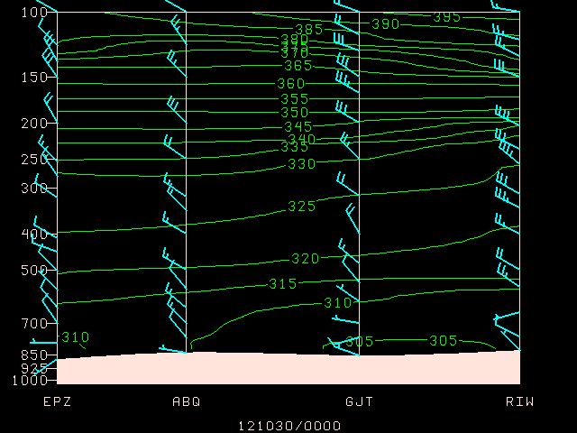
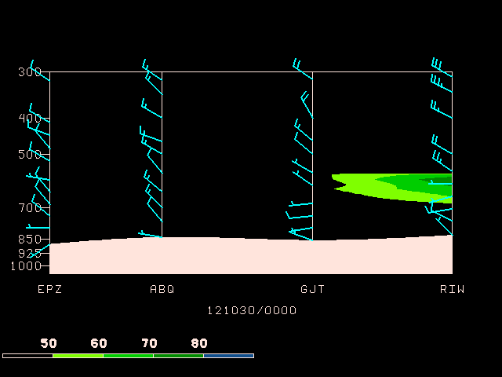
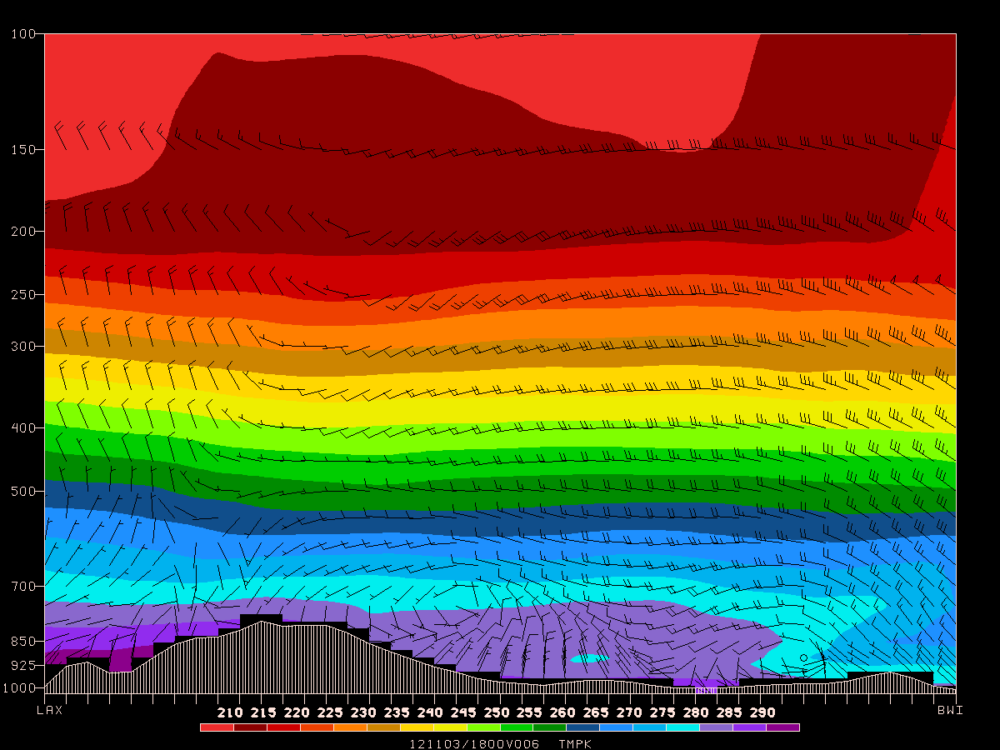
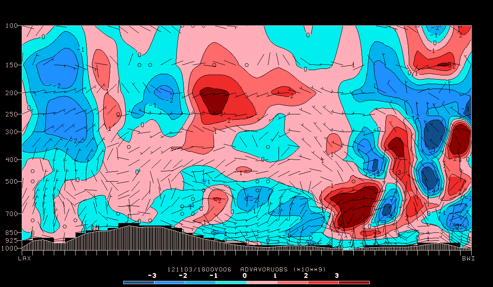
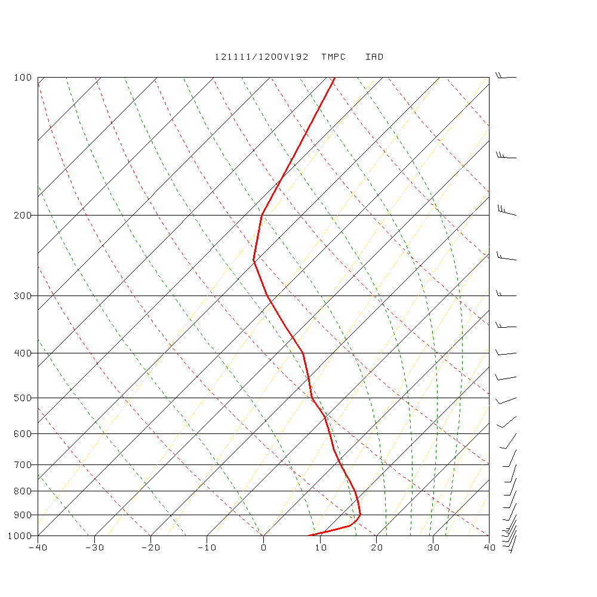
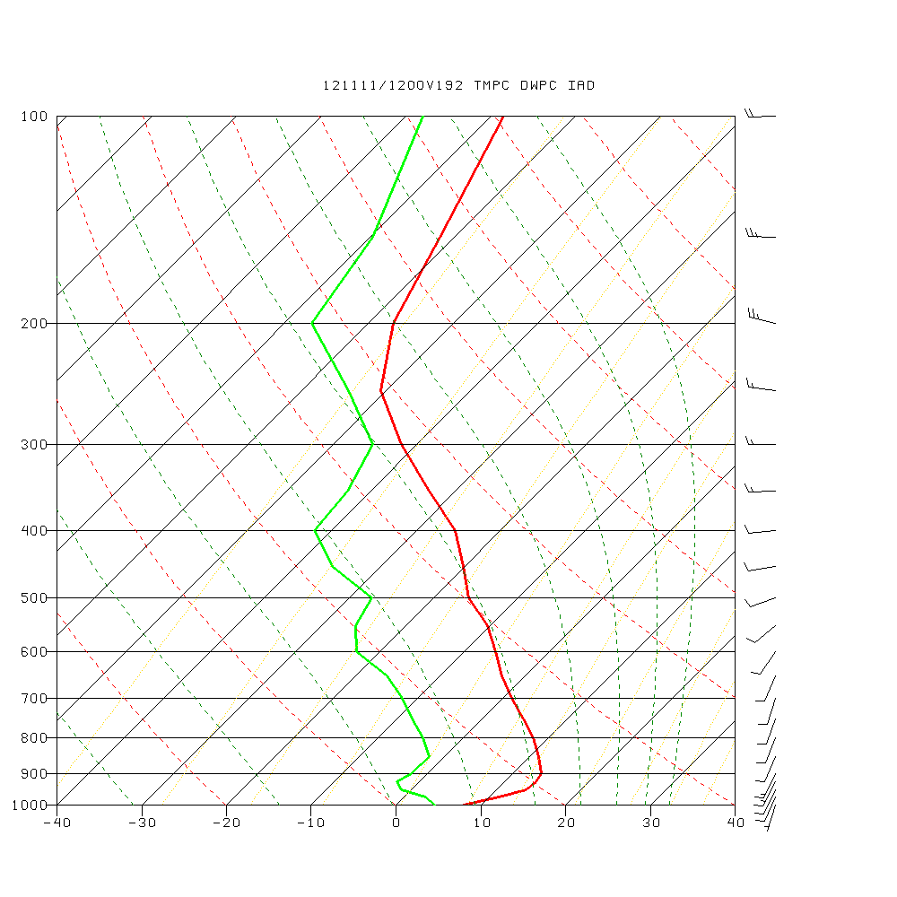
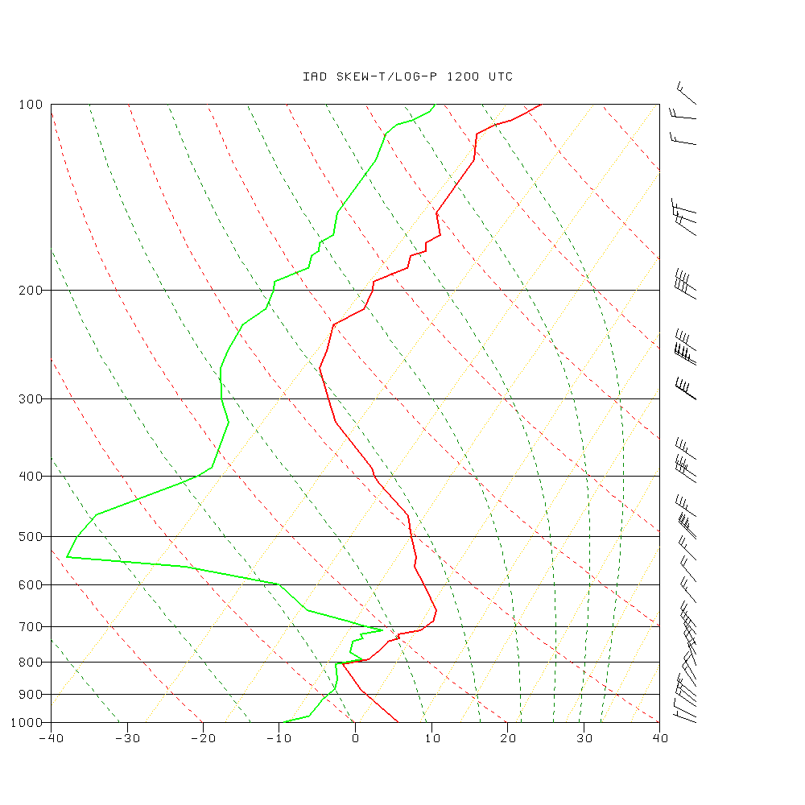

GEMPAK supports the following vertical coordinates:

    NONE - Surface Data
    PRES - Pressure
    HGHT - Height
    THTA - Potential Temperature
    SGMA - Sigma
    PAGL - Pressure Above Ground
    HAGL - Height Above Ground

---

# Cross Section Analysis

`sncross` draws cross section analyses.

- `CXSTNS` must be specified as a list of stations separated with semicolons.

- A **single station** may be entered in `CXSTNS` and a **list of times** in `DATTIM`.  In such a case, a time section will be drawn instead of a geographic cross-section.

- The **plot background** consists of a pressure axis, a horizontal
axis with the station names, a filled region indicating the
part of the plot below the earth surface, and vertical lines
at each station.

- The **horizontal axis** represents a straight line between the
first and last stations.  The positions of intervening stations
are proportional to the perpendicular projections of the actual
positions onto the section line.  All of these calculations
are done in lat/lon coordinates.  If the plot is a time section,
the times will be displayed on the x axis with the earliest
time at the left.  If the first character in `TAXIS` is an `R`, the
earliest time will appear on the right.

- The **vertical coordinate** may be specified as 
    * `LIN`
    * `LOG`
    * `STUVE`

    Note that the name `SKEWT` is not valid in this program.  The bottom and top limits
for the y axis are specified in `YAXIS`, but the axis labeling
specifications are ignored.

- `sncross` variables:

    - [CXSTNS](/cgi-bin/gempak/manual/variables_index?cxstns)    Cross-section station line
    - [SNPARM](/cgi-bin/gempak/manual/variables_index?snparm)    Sounding parameter list
    - [SNFILE](/cgi-bin/gempak/manual/variables_index?snfile)    Sounding data file
    - [DATTIM](/cgi-bin/gempak/manual/variables_index?dattim)    Date/time
    - [VCOORD](/cgi-bin/gempak/manual/variables_index?vcoord)    Vertical coordinate type
    - [PTYPE](/cgi-bin/gempak/manual/variables_index?ptype)     Plot type/h:w ratio/margins
    - [YAXIS](/cgi-bin/gempak/manual/variables_index?yaxis)     Ystrt/ystop/yinc/lbl;gln;tck
    - [TAXIS](/cgi-bin/gempak/manual/variables_index?taxis)     Time1-time2-tinc;lbl;gln;tck
    - [LINE](/cgi-bin/gempak/manual/variables_index?line)      Color/type/width/label/smth/fltr/scflg
    - [BORDER](/cgi-bin/gempak/manual/variables_index?border)    Background color/type/width
    - [CINT](/cgi-bin/gempak/manual/variables_index?cint)      Contour interval/min/max
    - [WIND](/cgi-bin/gempak/manual/variables_index?wind)      Wind symbol/siz/wdth/typ/hdsz
    - [TITLE](/cgi-bin/gempak/manual/variables_index?title)     Title color/line/title
    - [PANEL](/cgi-bin/gempak/manual/variables_index?panel)     Panel loc/color/dash/width/regn
    - [DEVICE](/cgi-bin/gempak/manual/variables_index?device)    Device\|name\|x size;y size\|color type
    - [CLEAR](/cgi-bin/gempak/manual/variables_index?clear)     Clear screen flag
    - [FILTER](/cgi-bin/gempak/manual/variables_index?filter)    Filter data factor
    - [TEXT](/cgi-bin/gempak/manual/variables_index?text)      Size/fnt/wdth/brdr/N-rot/just/hw flg
    - [CURVE](/cgi-bin/gempak/manual/variables_index?curve)     Curve fit type
    - [CLRBAR](/cgi-bin/gempak/manual/variables_index?clrbar)    Color/ornt/anch/x;y/ln;wd/freq\|text_info
    - [CONTUR](/cgi-bin/gempak/manual/variables_index?contur)    Subbox/smooth
    - [FINT](/cgi-bin/gempak/manual/variables_index?fint)      Fill interval/min/max
    - [FLINE](/cgi-bin/gempak/manual/variables_index?fline)     Fill colors/fill types
    - [CTYPE](/cgi-bin/gempak/manual/variables_index?ctype)     Contour type:  C/F

## Exercise: Contour Upper Air Cross-Section

>Draw isentropes in color 3 for the last time in the data set.  Plot the background in color 1.  Use a logarithmic scale for the y axis and a 5 degree interval for the isentropes.  Draw wind barbs in color number 6 with line width 2.

    CXSTNS   =  epz;abq;gjt;riw
    SNPARM   =  thta
    SNFILE   =  uair
    DATTIM   =  0000
    VCOORD   =  pres
    PTYPE    =  log
    YAXIS    =
    TAXIS    =
    LINE     =  3
    BORDER   =  1
    CINT     =  5
    WIND     =  bm6//2
    TITLE    =  1
    PANEL    =  0
    DEVICE   =  xw
    CLEAR    =  y
    FILTER   =  .8
    TEXT     =  1
    CURVE    =  2
    CLRBAR   =
    CONTUR   =  0
    FINT     =  0
    FLINE    =  10-20
    CTYPE    =  C

> Draw filled contours of relative humidity for the same cross section.  Fill in contours greater than 50%.  Draw a horizontal color bar at the bottom of the plot.  Draw the cross section from 1050 mb to 300 mb.
    
    CXSTNS    =  epz;abq;gjt;riw
    SNPARM    =  relh
    SNFILE    =  uair
    DATTIM    =  0000
    VCOORD    =  pres
    PTYPE     =  log/.5
    YAXIS     =  1050/300
    TAXIS     =
    LINE      =  3
    BORDER    =  1
    CINT      =  5
    WIND      =  bm6//2
    TITLE     =  1
    PANEL     =  0
    DEVICE    =  xw
    CLEAR     =  y
    FILTER    =  .8
    TEXT      =  1
    CURVE     =  2
    CLRBAR    =  1/h
    CONTUR    =  0
    FINT      =  50;60;70;80
    FLINE     =  0;21;22;23;24
    CTYPE     =  f

---

# Gridded Data Cross-Sections

`gdcross` draws a vertical cross section between two points in a grid field.  The cross-section path is a line segment
on the grid projection plane joining the two points.  Gridded
data are interpolated to the cross-section plane at intervals
corresponding to approximately one grid increment.

The vertical coordinate, set in `GVCORD`, can be `PRES`, `THTA`, `HGHT`,
or `SGMA`.  The data must be stored in that vertical coordinate in
the grid file.  No automatic vertical interpolation is included.

>Plot temperature in Kelvin on a log-P chart along the cross section from LAX to BWI.  Plot the filled contours using colors from 13 to 30.  Plot wind barbs for the wind.  Plot a horizontal color bar centered under the cross section.

    CXSTNS   = lax>bwi
    GDATTIM  = f06
    GVCORD   = pres
    GFUNC    = tmpk
    GVECT    = wnd
    GDFILE   = gfs
    WIND     = bm32
    REFVEC   = 10
    PTYPE    = log
    YAXIS    =  
    IJSKIP   = 0
    CINT     =  
    SCALE    =  
    LINE     = 32/1/3
    BORDER   = 1
    TITLE    = 1
    CLEAR    = yes
    DEVICE   = xw
    TEXT     = 1
    PANEL    = 0
    CLRBAR   = 1/h/cc/.5;.03/.6;.01
    CONTUR   = 3
    FINT     = 5
    FLINE    = 13-30
    CTYPE    = f

>Using the same cross-section and grid file as before, plot a log pressure cross
        section of the vorticity advection, scaled by 10**9, colored by positive and negative values as shades of
        Also, plot the ageostrophic circulation using arrows.  Use a height-to-width plot ratio of 0.5.

    CXSTNS   = lax>bwi
    GDATTIM  = f06
    GVCORD   = pres
    GFUNC    = adv(avor(wnd),wnd)
    GVECT    = circ(age;omeg)
    GDFILE   = gfs
    WIND     = bm32
    REFVEC   = 5;.05;.2
    PTYPE    = log/0.5
    YAXIS    =  
    IJSKIP   = 0
    CINT     = 1/-3/3
    SCALE    = 9
    LINE     = 32
    BORDER   = 1
    TITLE    = 1/-2
    CLEAR    = yes
    DEVICE   = xw
    TEXT     = 1
    PANEL    = 0
    CLRBAR   = 1/h/lc/.5;.01;.5;.01
    CONTUR   = 3
    FINT     = 1/-3/3
    FLINE    = 24;25;26;27;11;12;13;14
    CTYPE    = c/f

# GDPROF

`gdprof` draws vertical profiles at a point.  Data from each
    level in the grid file are interpolated to the point.

`GPOINT` specifies the location for the profile.  It may be
    entered as a latitude and longitude separated with a semicolon,
    as a station character identifier or station number, or as a
    set of x and y grid points separated with a semicolon and
    preceded with an `@`.  The profile location may also be selected
    graphically with the `CURSOR` command.

\
## Upper-Air Vertical Plotting

`GDPROF` draws upper-air profiles using gridded data.

Run `GPCOLOR` first to set the background color to white:
    
    COLORS   = 101=255:255:255
    DEVICE   = xw

Next run `GDPROF` for the station `iad` (Washington DC)

    GPOINT   = iad
    GDATTIM  = last
    GVCORD   = pres
    GFUNC    = tmpc
    GVECT    = wnd
    GDFILE   = gfs
    LINE     = 2//3
    MARKER   =  
    BORDER   = 32
    PTYPE    = skewt
    SCALE    = 0
    XAXIS    = -40/40/10
    YAXIS    = 1000/100/100/;1
    WIND     = bm32
    REFVEC   = 10
    WINPOS   = 1
    FILTER   = no
    TITLE    = 32/3/ GFS ^ ~ TMPC DWPC #
    PANEL    = 0
    CLEAR    = yes
    TEXT     = 1
    DEVICE   = xw
    OUTPUT   =  
    THTALN   = 2/2
    THTELN   = 23/2
    MIXRLN   = 19/10

Now re-run to overlay dewpoint temperature using `CLEAR = n` on the same graphics device:
    
    GFUNC    = dwpc
    LINE     = 3//3
    CLEAR    = n

## Exercise: Upper-Air Sounding

>Make note that because `GDCROSS` uses `GFUNC` (and not `GDPFUN`) we can not plot both temperature and dewpoint at the same time, making use of `CLEAR = n` overlaying.
>
>For `SNPROF`, we can plot both profiles simulataneously.
>
>Draw a Skew-T, Log-P for the same station (`iad`) using `SNPROF`.  Again, start with `GPCOLOR` to set the background to white:

    COLORS   = 101=255:255:255
    DEVICE   = xw

>Now run `SNPROF` with sounding parameters `tmpc;dwpc` matched by line style `2;3//2`:

    SNFILE   = uair
    DATTIM   = 1200
    AREA     = @iad
    SNPARM   = tmpc;dwpc
    LINE     = 2;3//2
    PTYPE    = skewt
    VCOORD   = pres
    STNDEX   =  
    STNCOL   =  
    WIND     = bm32
    WINPOS   = 1
    MARKER   =  
    BORDER   = 32
    TITLE    = 32/3/ IAD SKEW-T/LOG-P 1200 UTC
    DEVICE   = xw
    YAXIS    = 1000/100/100/;1
    XAXIS    = -40/40/10
    FILTER   = no
    CLEAR    = n
    PANEL    = 0
    TEXT     = 1
    THTALN   = 2/2
    THTELN   = 23/2
    MIXRLN   = 19/10

>